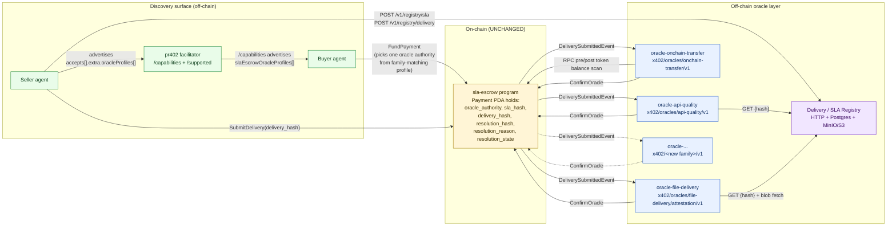
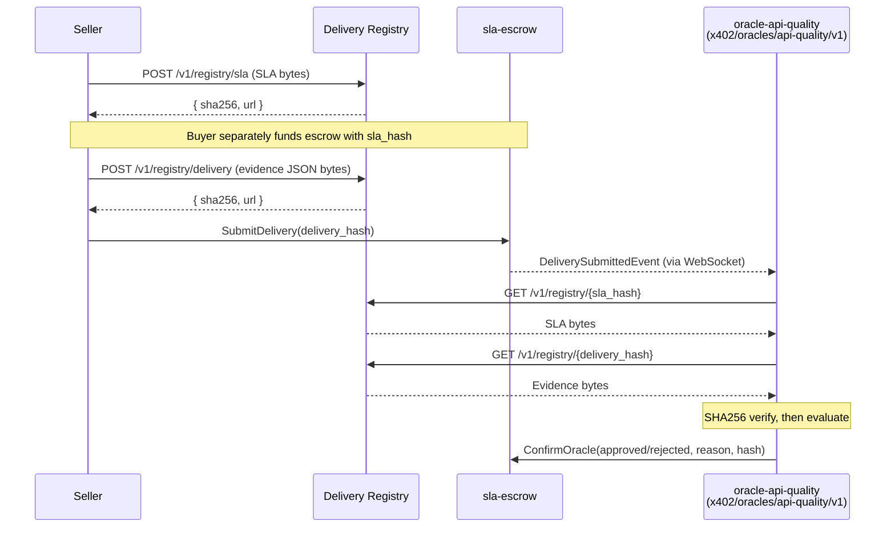
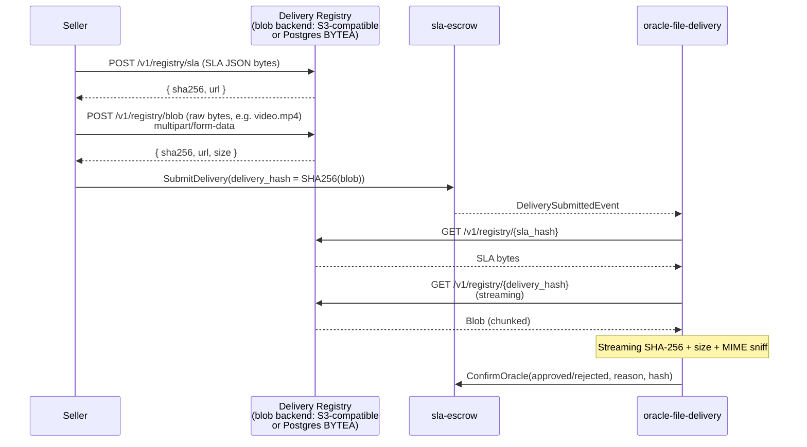
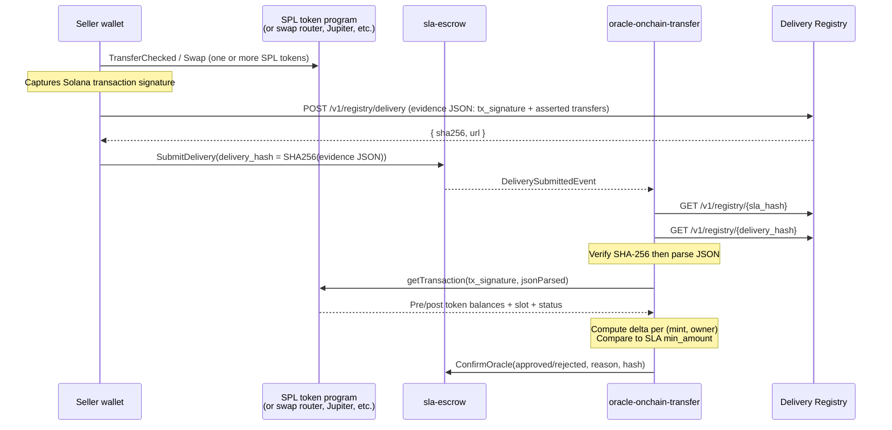

# Design Document: Multi-Category Oracle Architecture

## Overview

This design generalizes the x402 SLA-escrow oracle layer from a single-purpose API-quality oracle into a **multi-category oracle ecosystem**. The on-chain `sla-escrow` program already commits only opaque hashes (`sla_hash`, `delivery_hash`, `resolution_hash`) plus a single `oracle_authority` pubkey, and uses a split resolution-reason space (standard `0..255`, custom `≥256`); it is intentionally agnostic to what those hashes mean. All new structure therefore lives **off-chain** — in shared oracle libraries, per-family oracle binaries, sellers' delivery registration, and pr402 discovery metadata.

The design introduces:

1. A **family / profile / version** taxonomy for oracles, mapped to the three concrete scenarios the user identified (simple JSON delivery, large-file delivery, on-chain SPL transfer/swap) plus an extension seam for a fourth.
2. A pluggable Rust trait surface (`OracleEvaluator<Sla, Evidence>`, `EvidenceFetcher`, `OracleProfile` registry) provided by a new shared `oracle-common` crate, consumed by three sibling oracle binaries: `oracle-api-quality` (the existing `oracle-qa` crate, renamed for naming consistency with the family taxonomy), `oracle-onchain-transfer`, `oracle-file-delivery`.
3. A first-class **seller delivery registration HTTP API** (sibling registry + Postgres + S3-compatible blob backend, with MinIO as the recommended default for self-hosted deployments) so new oracle types can be stood up by templating the same starter project.
4. A buyer/seller/oracle **discovery contract** that adds an `oracleProfiles[]` array to `accepts[].extra` and a `slaEscrowOracleProfiles[]` list to pr402 `/capabilities`. Each profile entry binds one `profile_id` to one operator pubkey.
5. An **operational story** for Ubuntu 24.04 + systemd: per-family services co-installed on one host with a templated unit (`oracle@<family>.service`), an `oracle.target` aggregator, and an idempotent `install.sh` / `upgrade.sh` / `uninstall.sh` script set plus a `bootstrap-minio.sh` helper for turnkey object storage.

The on-chain `sla-escrow` program is **not modified**. Because `oracle-qa` has not yet gone live, this design takes the cleanest possible shape rather than carrying compatibility baggage from any prior wire format.

## Design Goals and Hard Constraints

### Goals

1. **One vocabulary, many oracles.** Buyers, sellers, and oracles all use the same `profile_id` strings to describe what kind of work and proof a payment uses. A buyer who funds an SLA-escrow payment chooses an oracle authority *because* its advertised profiles match the seller's advertised family; the choice is auditable end-to-end.
2. **One starter template.** A new oracle category should be reachable in days: clone `oracle-common`, write a SLA struct + an evidence struct + an `OracleEvaluator` impl + an optional `EvidenceFetcher`, register a profile, ship a binary. Chain monitor, settler, ledger, registration HTTP, systemd, metrics, healthchecks are all reused.
3. **Trust model is explicit per family.** Each profile documents what it proves and what it does not, so both sides know exactly what guarantees they are buying or selling.
4. **Operational reuse.** One Postgres ledger schema, one health/metrics surface, one operator-token model, one systemd footprint — applied to every oracle type.

### Hard Constraints

| # | Constraint | Where it shows up in this design |
|---|---|---|
| C1 | **On-chain `sla-escrow` program does not change.** | Architecture (On-chain stays unchanged), Components (Settlement and Resolution Codes). Custom resolution reasons reuse `ResolutionReason::Custom(u16)` (≥256). Token-transfer verification happens off-chain via RPC. |
| C2 | **Pipeline shape is uniform across families** (chain monitor → fetch evidence → evaluate → settle). | Components and Interfaces (`oracle-common` is the parameterized pipeline). |
| C3 | **One Postgres schema** for all families (`oracle_jobs`, `oracle_verdicts`, `oracle_lifecycle_events`, `oracle_parameters`, plus new `oracle_seller_keys`, `oracle_deliveries`, `oracle_artifacts`, `oracle_registered_profiles`). | Data Models (Postgres Schema). |
| C4 | **`sla-escrow-api` from crates.io 0.3.x; no fork.** | Components and Interfaces (Cargo skeletons all depend on `sla-escrow-api = "0.3"`). |
| C5 | **Hash discipline.** `sla_hash = SHA256(SLA bytes)`, `delivery_hash = SHA256(delivery bytes)`, verify-before-parse. | Components and Interfaces, Correctness Properties P-HASH-1..P-HASH-3. |
| C6 | **Resolution reasons:** standard codes 0–255 reused; custom ≥256 partitioned per family. | Components and Interfaces (per-family code tables). |
| C7 | **Profile id convention:** `x402/<family>/<profile>/<version>` — three segments, lowercase kebab-case, single canonical id per profile (no aliases). | Architecture (Family / Profile / Version Taxonomy). |
| C8 | **`profile_id` is REQUIRED in every SLA document** so dispatch is deterministic and misrouted SLAs fail fast. | Architecture (Family / Profile / Version Taxonomy), Property P-DISP-1. |
| C9 | **One canonical `resolution_hash` recipe** (`x402/oracles/resolution-envelope/v1`) shared by all families. No legacy mode. | Components and Interfaces (Resolution-Hash Recipe). |
| C10 | **One binary per family in v1.** Multi-profile-per-binary is deferred to a future revision. | Architecture (Operational Architecture), Components and Interfaces (Chain Monitor Behavior). |
| C11 | **No Anchor; use Steel.** Crates follow `api/` (types only) + binary pattern where applicable. | Components and Interfaces (crate plan). |
| C12 | **Ubuntu 24.04 + systemd.** No Docker/K8s assumed. MinIO is the recommended self-hosted blob backend; AWS S3 / Cloudflare R2 / Backblaze B2 / Wasabi all work via the same S3-compatible API. | Architecture (Operational Architecture). |
| C13 | **No backward compatibility constraints.** `oracle-qa` is pre-launch, so the design takes the cleanest shape and the existing crate is renamed `oracle-api-quality` for naming consistency with the taxonomy. | Throughout. |

## Architecture

### Cross-Family System Diagram

The end-to-end view of the multi-category oracle ecosystem. Per-family deviations are shown in *Per-Family Architecture* below.



**Key boundaries:**
- The chain stays oracle-agnostic. It only validates that the signer of `ConfirmOracle` matches `payment.oracle_authority` and that the verdict's `delivery_hash` matches `payment.delivery_hash`.
- Each oracle process runs **exactly one profile** in v1. A buyer's choice of `oracle_authority` deterministically selects the family because each authority key advertises one profile id only.
- The "registry" is one logical service. In a single-host deployment it lives inside each oracle binary as a co-mounted Axum router; multi-host deployments can run it as a sibling `oracle-registry` binary fronting a shared Postgres + MinIO bucket.

### On-Chain Stays Unchanged

Recap of the existing on-chain surface (from `sla-escrow/api/src/state/payment.rs`, `instruction.rs`, `resolution.rs`):

- `Payment` PDA already carries everything an oracle needs to do its job: `oracle_authority: Pubkey`, `sla_hash: [u8;32]`, `delivery_hash: [u8;32]`, `resolution_hash: [u8;32]`, `resolution_reason: u16`, `resolution_state: u8`, plus seller/buyer/mint/amount/expiries.
- `ConfirmOracle` accepts any 32-byte `resolution_hash` and any `u16` `resolution_reason`. The program does **no semantic interpretation** of those values; it only enforces that the oracle signer matches `payment.oracle_authority`, that delivery has been submitted (`delivery_timestamp != 0`), that the verdict's `delivery_hash` matches the seller's `payment.delivery_hash`, and that the payment is in `Funded / Pending` state.
- `ResolutionReason` already partitions the `u16` space into standard codes (`0..255`, interoperable across oracles) and `Custom(u16)` (`≥256`, per-oracle/per-family). This is the opt-in extensibility seam the multi-family ecosystem needs.

What the chain does **not** model:

- It does not know what category of work a payment represents.
- It does not know what shape the SLA bytes or delivery bytes have.
- It does not know what an "approved" verdict means beyond "this oracle authority signed it".

This is intentional: the cost of generality is paid off-chain, and we are extending only off-chain. **No instruction, account layout, event, or constant in `sla-escrow` changes.** Custom resolution reasons for new families slot into the existing `ResolutionReason::Custom(code)` arm without touching the API crate.

### Family / Profile / Version Taxonomy

#### The Three-Level Identifier

Every oracle declares **exactly one** profile id, of the shape:

```
x402/<family>/<profile>/<version>
```

- **family**: a domain-level word naming the *kind of work* and *kind of proof* (e.g. `api-quality`, `onchain-transfer`, `file-delivery`). One family corresponds to one closed `(Sla, Evidence)` type pair.
- **profile**: a sub-rule-set inside the family. For families with one rule set today this can equal the family name (yielding a two-segment path under `x402/<family>/`); for families that intend to evolve in parallel directions (`file-delivery/attestation`, `file-delivery/handoff`) the profile name distinguishes them.
- **version**: a major version integer (`v1`, `v2`, ...). Bumped only for breaking changes to the SLA shape, evidence shape, or evaluation semantics.

**`profile_id` is REQUIRED in every SLA document.** The dispatcher reads it before any other parsing; an absent `profile_id`, or one whose value does not match the binary's registered profile, is a hard refusal (`UnknownProfile` ledger row, no settlement). This makes misrouted SLAs fail fast and removes any ambiguity about which evaluator handles which payment.

The full profile id is what sellers advertise in `accepts[].extra.oracleProfiles[]`, what buyers select against, and what the oracle binary registers itself under at boot.

#### Identifier Conventions

- Lowercase ASCII, kebab-case for multi-word components.
- Versions are `v<integer>`, never `1.0.0` or `1`.
- `family` MUST be unique across the ecosystem; `profile` MUST be unique within a family.
- Profile ids are **opaque to the on-chain program** — they live only in SLA bytes, registry metadata, and pr402 capability JSON. The chain stores only the resulting `sla_hash` and the oracle's `resolution_hash`.
- One canonical id per profile. **No aliases.**

#### Mapping the Scenarios

| Scenario from the user request | Family | Profile id |
|---|---|---|
| (a) Simple JSON-shaped delivery (HTTP API responses, factorization answers, etc.) | `api-quality` | `x402/oracles/api-quality/v1` |
| (b) Large file delivery (e.g., generated video) | `file-delivery` | `x402/oracles/file-delivery/attestation/v1` |
| (c) On-chain SPL token transfer / swap | `onchain-transfer` | `x402/oracles/onchain-transfer/v1` |
| (d) To-be-identified | `<TBD>` | future: `x402/<TBD>/v1` |

The `api-quality` family covers the existing `oracle-qa` use case (HTTP response quality) **and** any other JSON-shaped seller-attested delivery — including deterministic compute results like factorization where the SLA carries the input and the evaluator checks the answer field-by-field. The current evaluator's check battery (status code, latency, required fields, JSON Schema, body length) is a good fit for these too; the `endpoint` field is documentary metadata and the evaluator does not replay the HTTP call. A future profile under the same family (e.g. `x402/api-quality/v2` or a separate `compute-result` family) can specialize further if the JSON-shape semantics need different rules. That specialization is **out of scope** for this spec.

### Per-Family Architecture

Each family follows the same pipeline shape (chain monitor → fetch evidence → evaluate → settle), parameterized by:

- The SLA struct.
- The evidence struct.
- The `EvidenceFetcher` strategy (registry-by-hash, blob-by-URL, on-chain-RPC, or a composition).
- The `OracleEvaluator` impl.
- An optional storage adapter for blobs.
- A custom `ResolutionReason` code range.

The diagrams below show how each scenario instantiates that template.

#### Scenario (a) `x402/oracles/api-quality/v1` — JSON-shaped seller-attested delivery

This is the canonical reference family. It covers HTTP API quality (the original `oracle-qa` use case) **and** any other JSON-shaped delivery where the seller submits an evidence document for the oracle to compare against the SLA — including deterministic compute results.



**SLA shape**: `endpoint`, `method`, `min/max_status_code`, `max_latency_ms`, `required_fields`, optional `response_schema`, optional `min_body_length`, **required** `profile_id: "x402/oracles/api-quality/v1"`.

**Evidence shape**: `status_code`, `latency_ms`, `response_body`, optional `response_headers`, `timestamp`.

For non-HTTP applications of this family (e.g. factorization where the SLA describes the input and the evidence carries the result), `endpoint`/`method` remain documentary metadata, `status_code` may be set to `200`, and the buyer's verification logic lives in `response_schema` + `required_fields`. The evaluator does not replay any network call regardless of family scenario; it adjudicates the JSON shape only.

**Trust model**: hash-bound seller-attested JSON. The *Trust and Security Model* section details what this proves and what it does not.

#### Scenario (b) `x402/oracles/file-delivery/attestation/v1` — Large-file delivery

Three trust models are possible (the design picks one default and leaves the others as future profiles):

- **(b.1) Attestation-only**: registry stores the file under SHA-256 keying. The oracle verifies the bytes hash to `delivery_hash` and that file size and MIME match SLA bounds. **It does not download or render the entire file** beyond what is needed to verify the hash; in practice the oracle streams the body through SHA-256 and discards bytes. Cheap, stateless, leaks nothing past hash equality. **This is the default profile in this design.**
- **(b.2) Deep semantic check**: oracle would fetch the file, decode it (e.g. probe a video container, run perceptual hash, run a model). Out of scope for v1; would be a new profile id like `x402/file-delivery/semantic/v1` later.
- **(b.3) Escrowed handoff with key release**: seller uploads a *ciphertext* keyed by SHA-256(ciphertext); buyer pays; oracle verifies the seller can produce a key whose application yields a plaintext whose declared properties match the SLA. Out of scope; future profile `x402/file-delivery/handoff/v1`.

Default model (b.1) flow:



**SLA fields** (`x402/oracles/file-delivery/attestation/v1`):

| Field | Type | Required | Notes |
|---|---|---|---|
| `version` | `u32` | yes | Always `1` for this profile. |
| `profile_id` | `string` | yes | MUST equal `x402/oracles/file-delivery/attestation/v1`. |
| `expected_size_bytes_min` | `u64` | yes | Lower bound on raw byte size. |
| `expected_size_bytes_max` | `u64` | yes | Upper bound; defends against a 1-byte file passing as a video. |
| `expected_mime` | `string` (optional) | no | If present, sniffed MIME of the first ~512 bytes must match (case-insensitive prefix match against IANA media types). |
| `expected_extension` | `string` (optional) | no | Audit-only; not enforced. |
| `attestor_pubkey` | `string` (Solana pubkey base58) | no | If present, evidence must include `seller_signature` over the message described below. |

**Evidence shape**: a small JSON object (this is what `delivery_hash` could *also* commit to — but in this profile **`delivery_hash` commits directly to the blob bytes**, not to a metadata wrapper, so the on-chain digest matches the file). The evidence-side metadata is fetched separately by URL inferred from the SLA, OR included in the SLA itself. The default of this profile is:

- `delivery_hash` on-chain = `SHA256(file_bytes)`.
- The oracle does not need a separate evidence JSON. The "evidence" is the file itself.
- A v2 profile could add a signed manifest if signatures are required.

This keeps the v1 surface minimal. The cost is that `expected_mime` and size gates are the only quality signals; that is by design (model b.1).

**Trust model and storage strategy**: see *Trust and Security Model* and *Storage Strategy for Blobs* in *Components and Interfaces*.

#### Scenario (c) `x402/oracles/onchain-transfer/v1` — On-chain SPL transfer / swap

Goal: prove that, after the seller "delivers", a specified SPL transfer (or swap) of at least `min_amount` of `mint` to `recipient` actually occurred on-chain on the same cluster the oracle runs against.



**SLA shape** (`x402/oracles/onchain-transfer/v1`):

| Field | Type | Required | Notes |
|---|---|---|---|
| `version` | `u32` | yes | Always `1`. |
| `profile_id` | `string` | yes | `x402/oracles/onchain-transfer/v1`. |
| `cluster` | `string` | yes | One of `mainnet-beta`, `devnet`, `testnet`. Oracle MUST be configured to run against the same cluster; mismatch is a hard reject. |
| `expected_transfers` | `array<ExpectedTransfer>` | yes | Each element specifies a single (mint, recipient_owner, min_amount) constraint. |
| `expected_transfers[].mint` | `string` (base58) | yes | SPL mint pubkey. |
| `expected_transfers[].recipient_owner` | `string` (base58) | yes | Owner pubkey of the destination ATA (NOT the ATA itself; oracle re-derives the ATA). |
| `expected_transfers[].min_amount` | `string` (decimal integer) | yes | Minimum **raw** token amount (pre-decimals); compared to `post_amount - pre_amount`. |
| `expected_transfers[].direction` | `"in"` \| `"out"` | yes | Direction relative to `recipient_owner`. `"in"` is the normal "buyer pays seller via SPL" case. |
| `swap_router` | `string` (base58) | optional | If set, a swap from a different mint may produce the transfer; oracle then matches by destination delta only. |
| `slippage_bps` | `u16` | optional | Cosmetic only in v1: oracle records but does not enforce. Future profile may use to validate against quoted swap rate. |
| `deadline_unix` | `i64` | optional | If set and `tx_block_time > deadline_unix`, reject. |

**Evidence shape**:

```json
{
  "version": 1,
  "profile_id": "x402/oracles/onchain-transfer/v1",
  "tx_signature": "5J7...",
  "asserted_transfers": [
    {
      "mint": "Es9vMFr...",
      "recipient_owner": "BuyerPubkey...",
      "claimed_delta": "1000000"
    }
  ],
  "submitted_at": 1770000000
}
```

The asserted block is informational; the oracle re-computes the delta from on-chain state and ignores the seller's claim if it disagrees.

**Why this is verifiable on-chain without changing `sla-escrow`**:

- The oracle uses `getTransaction(sig, jsonParsed)` against its configured RPC; the response includes `meta.preTokenBalances` and `meta.postTokenBalances`, each tagged with `mint`, `owner`, and `uiTokenAmount.amount`.
- The oracle computes `delta = post.amount - pre.amount` for the matching `(mint, owner)` and asserts `delta >= min_amount` in the requested direction.
- For a swap-via-aggregator, the oracle relaxes the source-side check and only checks the destination-side `(mint, recipient_owner)` delta — i.e. "the buyer received at least N units of the agreed mint regardless of what the seller paid in".
- `tx_signature` must be `Confirmed` or `Finalized`; failed transactions reject.

**Trust model**: cryptographically strong on the *transfer happened* axis; the oracle still trusts that the SLA chose the right recipient/mint/amount. See *Trust and Security Model*.

**Custom resolution codes**: see *Settlement and Resolution Codes* under *Components and Interfaces*.

#### Scenario (d) Placeholder

Reserved for a future family. Adding a new family is by design a no-code change to `oracle-common`, and a new sibling crate.

### Operational Architecture (Ubuntu 24.04 + systemd)

#### Topology Choices

| Topology | Description | When to use |
|---|---|---|
| **Single-family host** | One VPS, one binary, one templated systemd unit, one keypair, one Postgres DB, one MinIO bucket. | Dedicated production for any single oracle (api-quality / onchain-transfer / file-delivery). |
| **Multi-family host** | One VPS, multiple binaries (each with its own keypair), one templated systemd unit per family, one Postgres DB per family, one shared MinIO instance with per-bucket isolation. | Mid-traffic operators standing up two or three families. |
| **Sharded host** | Multiple VPSes, one family per host, per-family Postgres and MinIO. | High-traffic operators or per-cluster transfer oracles. |

The systemd installer supports all three transparently because the unit file is templated by family name and each family ships its own `.env`.

In v1, **one binary serves exactly one profile id**. The buyer's choice of `oracle_authority` deterministically selects the family because that pubkey advertises one profile only in `accepts[].extra.oracleProfiles[]`. Multi-profile-per-binary is deferred — operators who need that pattern run multiple binaries on one host (recommended) or wait for a future revision.

#### Templated systemd Unit

`/etc/systemd/system/oracle@.service` (one file, instantiated per family):

```ini
[Unit]
Description=oracle-%i (x402 SLA-Escrow %i family oracle)
After=network-online.target
Wants=network-online.target
PartOf=oracle.target

[Service]
Type=simple
User=oracle
Group=oracle
WorkingDirectory=/opt/oracle/%i
EnvironmentFile=/etc/oracle/%i.env
ExecStart=/opt/oracle/%i/oracle-%i
Restart=on-failure
RestartSec=5
LimitNOFILE=65535

# Hardening (kept conservative; expanded in production deployments)
NoNewPrivileges=true
ProtectSystem=full
ProtectHome=true
PrivateTmp=true
StateDirectory=oracle/%i
LogsDirectory=oracle/%i

[Install]
WantedBy=multi-user.target
```

Activation:

```bash
sudo systemctl enable --now oracle@api-quality.service
sudo systemctl enable --now oracle@onchain-transfer.service
sudo systemctl enable --now oracle@file-delivery.service
```

A dedicated `oracle.target` aggregates them so an operator can `systemctl restart oracle.target` to bounce all families together.

```ini
# /etc/systemd/system/oracle.target
[Unit]
Description=All x402 SLA-Escrow oracle services
Wants=oracle@api-quality.service oracle@onchain-transfer.service oracle@file-delivery.service
After=network-online.target
AllowIsolate=no

[Install]
WantedBy=multi-user.target
```

Operators who run only a subset of families simply skip the corresponding `enable --now` lines; `oracle.target` activates whatever family units exist as `Wants=` entries (units that aren't installed are silently skipped).

#### Filesystem Layout

```
/opt/oracle/
├── api-quality/                  # oracle-api-quality binary + per-family assets
│   ├── oracle-api-quality        # built binary
│   └── spec/                     # NORMATIVE.md + JSON Schemas
├── onchain-transfer/
│   ├── oracle-onchain-transfer
│   └── spec/
└── file-delivery/
    ├── oracle-file-delivery
    └── spec/

/etc/oracle/
├── api-quality.env               # 600, owned by oracle:oracle
├── onchain-transfer.env
└── file-delivery.env

/var/lib/oracle/
└── <family>/                     # StateDirectory; for transient state if any

/srv/minio/                       # MinIO data dir (when self-hosted)

/var/log/journal/                 # journald handles oracle logs natively
```

#### Installer / Manager Scripts

`scripts/install.sh` (idempotent; safe to re-run):

```bash
#!/usr/bin/env bash
set -euo pipefail

FAMILY="${1:?family name required, e.g. api-quality, onchain-transfer, file-delivery}"
BINARY="${2:?path to compiled binary}"
ENV_TEMPLATE="${3:-./.env.example}"

# 1. user / group
if ! id -u oracle >/dev/null 2>&1; then
  sudo useradd --system --home /var/lib/oracle --shell /usr/sbin/nologin oracle
fi

# 2. directories
sudo install -d -o oracle -g oracle /opt/oracle/"$FAMILY"
sudo install -d -o oracle -g oracle /var/lib/oracle/"$FAMILY"
sudo install -d -o root   -g root   -m 0755 /etc/oracle

# 3. binary
sudo install -m 0755 -o oracle -g oracle "$BINARY" /opt/oracle/"$FAMILY"/oracle-"$FAMILY"

# 4. env file (only if absent; never overwrite a live one)
if [[ ! -f /etc/oracle/"$FAMILY".env ]]; then
  sudo install -m 0600 -o oracle -g oracle "$ENV_TEMPLATE" /etc/oracle/"$FAMILY".env
  echo "Wrote /etc/oracle/$FAMILY.env from template; edit before starting."
fi

# 5. systemd unit and target (templated; written once)
if [[ ! -f /etc/systemd/system/oracle@.service ]]; then
  sudo cp ./scripts/oracle@.service /etc/systemd/system/oracle@.service
fi
if [[ ! -f /etc/systemd/system/oracle.target ]]; then
  sudo cp ./scripts/oracle.target /etc/systemd/system/oracle.target
  sudo systemctl enable oracle.target
fi

# 6. activate
sudo systemctl daemon-reload
sudo systemctl enable --now oracle@"$FAMILY".service
sudo systemctl status oracle@"$FAMILY".service --no-pager
```

`scripts/upgrade.sh`:

```bash
#!/usr/bin/env bash
set -euo pipefail

FAMILY="${1:?family name required}"
NEW_BINARY="${2:?path to new binary}"

sudo install -m 0755 -o oracle -g oracle "$NEW_BINARY" /opt/oracle/"$FAMILY"/oracle-"$FAMILY".new
sudo mv /opt/oracle/"$FAMILY"/oracle-"$FAMILY".new /opt/oracle/"$FAMILY"/oracle-"$FAMILY"
sudo systemctl restart oracle@"$FAMILY".service

# Health probe (try the bind addr from the env file)
PORT=$(grep -E '^BIND_ADDR=' /etc/oracle/"$FAMILY".env | cut -d= -f2- | awk -F: '{print $2}')
PORT="${PORT:-4020}"
for i in 1 2 3 4 5; do
  if curl -fsS "http://127.0.0.1:$PORT/health" >/dev/null; then
    echo "oracle-$FAMILY healthy on port $PORT"
    exit 0
  fi
  sleep 2
done
echo "oracle-$FAMILY did NOT come up healthy; check journalctl -u oracle@$FAMILY"
exit 1
```

`scripts/uninstall.sh`:

```bash
#!/usr/bin/env bash
set -euo pipefail

FAMILY="${1:?family name required}"
PRESERVE_ENV="${PRESERVE_ENV:-1}"

sudo systemctl disable --now oracle@"$FAMILY".service || true
sudo rm -f /opt/oracle/"$FAMILY"/oracle-"$FAMILY"
sudo rmdir /opt/oracle/"$FAMILY" 2>/dev/null || true
sudo rmdir /var/lib/oracle/"$FAMILY" 2>/dev/null || true

if [[ "$PRESERVE_ENV" != "1" ]]; then
  sudo rm -f /etc/oracle/"$FAMILY".env
fi

echo "Removed oracle-$FAMILY (env preserved=$PRESERVE_ENV)"
```

#### MinIO Bootstrap (Optional Helper)

`scripts/bootstrap-minio.sh` provisions a self-hosted MinIO server suitable for `oracle-file-delivery` and any `oracle-common`-based registry that needs S3-compatible blob storage. Idempotent and safe to re-run.

```bash
#!/usr/bin/env bash
set -euo pipefail

# Inputs (override via env)
MINIO_ROOT_USER="${MINIO_ROOT_USER:?MINIO_ROOT_USER required}"
MINIO_ROOT_PASSWORD="${MINIO_ROOT_PASSWORD:?MINIO_ROOT_PASSWORD required}"
MINIO_BUCKET="${MINIO_BUCKET:-oracle-blobs}"
MINIO_ADDR="${MINIO_ADDR:-127.0.0.1:9000}"
MINIO_CONSOLE_ADDR="${MINIO_CONSOLE_ADDR:-127.0.0.1:9001}"
MINIO_DATA_DIR="${MINIO_DATA_DIR:-/srv/minio}"

# 1. install MinIO server + mc client (Ubuntu 24.04)
if ! command -v minio >/dev/null; then
  curl -fsSL -o /tmp/minio https://dl.min.io/server/minio/release/linux-amd64/minio
  sudo install -m 0755 /tmp/minio /usr/local/bin/minio
fi
if ! command -v mc >/dev/null; then
  curl -fsSL -o /tmp/mc https://dl.min.io/client/mc/release/linux-amd64/mc
  sudo install -m 0755 /tmp/mc /usr/local/bin/mc
fi

# 2. user / dirs
if ! id -u minio >/dev/null 2>&1; then
  sudo useradd --system --home "$MINIO_DATA_DIR" --shell /usr/sbin/nologin minio
fi
sudo install -d -o minio -g minio "$MINIO_DATA_DIR"

# 3. environment file (0600)
sudo tee /etc/minio.env >/dev/null <<EOF
MINIO_ROOT_USER=$MINIO_ROOT_USER
MINIO_ROOT_PASSWORD=$MINIO_ROOT_PASSWORD
MINIO_VOLUMES=$MINIO_DATA_DIR
MINIO_OPTS="--address $MINIO_ADDR --console-address $MINIO_CONSOLE_ADDR"
EOF
sudo chmod 600 /etc/minio.env
sudo chown root:root /etc/minio.env

# 4. systemd unit
sudo tee /etc/systemd/system/minio.service >/dev/null <<'EOF'
[Unit]
Description=MinIO object storage (oracle blob backend)
After=network-online.target
Wants=network-online.target

[Service]
Type=simple
User=minio
Group=minio
EnvironmentFile=/etc/minio.env
ExecStart=/usr/local/bin/minio server $MINIO_VOLUMES $MINIO_OPTS
Restart=on-failure
RestartSec=5
LimitNOFILE=65535
ProtectSystem=full
ProtectHome=true
PrivateTmp=true

[Install]
WantedBy=multi-user.target
EOF

sudo systemctl daemon-reload
sudo systemctl enable --now minio.service

# 5. wait for server, then create bucket
for i in 1 2 3 4 5 6 7 8 9 10; do
  if curl -fsS "http://$MINIO_ADDR/minio/health/live" >/dev/null; then
    break
  fi
  sleep 2
done

mc alias set oracle-local "http://$MINIO_ADDR" "$MINIO_ROOT_USER" "$MINIO_ROOT_PASSWORD"
mc mb --ignore-existing "oracle-local/$MINIO_BUCKET"
mc anonymous set none "oracle-local/$MINIO_BUCKET"

echo "MinIO ready: bucket=$MINIO_BUCKET endpoint=http://$MINIO_ADDR"
echo "Set in oracle .env:"
echo "  ORACLE_REGISTRY_BACKEND=s3"
echo "  ORACLE_REGISTRY_S3_ENDPOINT=http://$MINIO_ADDR"
echo "  ORACLE_REGISTRY_S3_BUCKET=$MINIO_BUCKET"
echo "  ORACLE_REGISTRY_S3_ACCESS_KEY=$MINIO_ROOT_USER"
echo "  ORACLE_REGISTRY_S3_SECRET_KEY=<from /etc/minio.env>"
```

The same `ORACLE_REGISTRY_*` env vars work against AWS S3 / Cloudflare R2 / Backblaze B2 / Wasabi: change `ORACLE_REGISTRY_S3_ENDPOINT` and the credentials, leave the bucket layout alone. Operators who already run an object store skip this script entirely.

#### Logs and Observability

Each binary writes to stdout/stderr; journald collects per unit. The HTTP `/metrics` endpoint exposes Prometheus text exposition; per-family services bind to different ports configured in their respective `.env` (`BIND_ADDR=127.0.0.1:4020` for `api-quality`, `127.0.0.1:4021` for `onchain-transfer`, `127.0.0.1:4022` for `file-delivery`). A reverse proxy is recommended to terminate TLS and gate `POST /evaluate` (operator-only manual re-run path).

#### Defaults the Installer Must Get Right

- `oracle:oracle` is created with `--system` (no login, no home shell).
- `/etc/oracle/<family>.env` is `0600` and owned by `oracle:oracle` (operators editing it must `sudo`).
- The binary is owned by `oracle:oracle` (not root), `0755`.
- The unit uses `Type=simple`, `Restart=on-failure`, `RestartSec=5`.
- `LimitNOFILE=65535`.

## Components and Interfaces

### Component Decomposition: `oracle-common` and Friends

#### Crate Plan

```
oracle-common/                  ← shared library (NEW)
  src/
    lib.rs
    chain.rs                    ← WebSocket logsSubscribe + DeliverySubmittedEvent decode
    config.rs                   ← per-binary config (extends via newtype pattern)
    db.rs                       ← Postgres ledger access (incl. registry tables)
    error.rs                    ← OracleError taxonomy
    evaluator.rs                ← OracleEvaluator trait + EvaluationContext
    fetcher.rs                  ← EvidenceFetcher trait + RegistryJsonFetcher / RegistryStreamingFetcher
    pipeline.rs                 ← generic over evaluator + fetcher; profile dispatch
    profile.rs                  ← ProfileRegistry, ProfileBinding, ProfileRunner
    registry/                   ← seller delivery registration HTTP API
      mod.rs
      api.rs
      auth.rs                   ← seller HMAC challenge + bearer
      storage.rs                ← StorageBackend trait + Postgres + S3 + Local impls
    server.rs                   ← Axum router skeleton (health, stats, metrics, evaluate)
    settler.rs                  ← Single canonical resolution-hash recipe + ConfirmOracle settler
    systemd.rs                  ← unit-template helpers (optional)
    types.rs                    ← shared types (EvaluationJob, EvaluationOutcome, RuntimeHealth)

oracle-api-quality/             ← NEW (replaces the standalone oracle-qa crate)
  src/
    sla.rs                      ← SlaDocument struct
    evidence.rs                 ← DeliveryEvidence struct
    evaluator.rs                ← Evaluator impl (status / latency / fields / schema / length)
    main.rs                     ← profile registration + boot
  spec/api-quality-v1/
    NORMATIVE.md
    schema/sla-document.schema.json
    schema/delivery-evidence.schema.json
    examples/

oracle-onchain-transfer/        ← NEW
  src/
    sla.rs                      ← TransferSla struct
    evidence.rs                 ← TransferEvidence struct
    evaluator.rs                ← TransferEvaluator (verifies tx via getTransaction)
    fetcher.rs                  ← optional: combined registry+RPC fetcher
    main.rs
  spec/onchain-transfer-v1/
    NORMATIVE.md
    schema/sla-document.schema.json
    schema/delivery-evidence.schema.json
    examples/

oracle-file-delivery/           ← NEW
  src/
    sla.rs                      ← FileDeliverySla struct
    evidence.rs                 ← FileDeliveryEvidence (streaming-fetch outcome)
    evaluator.rs                ← FileDeliveryEvaluator (size + sniffed MIME)
    fetcher.rs                  ← StreamingBlobFetcher
    main.rs
  spec/file-delivery-attestation-v1/
    NORMATIVE.md
    schema/sla-document.schema.json
    examples/
```

The current `oracle-qa` crate becomes `oracle-api-quality` for naming consistency with the family taxonomy. Everything inside it (the evaluator logic, the spec docs under `spec/api-quality-v1/`, the JSON Schemas, the systemd guidance) is preserved verbatim — only the crate name and the binary name (`oracle-api-quality`) change. There is no live deployment to migrate, so this is a no-cost rename.

#### `oracle-common/Cargo.toml` Skeleton

```toml
[package]
name = "oracle-common"
version = "0.1.0"
edition = "2021"
license = "Apache-2.0"
description = "Shared library for x402 SLA-Escrow oracle implementations"
repository = "https://github.com/miraland-labs/x402"
keywords = ["x402", "oracle", "sla", "solana"]

[dependencies]
# Web server / async
axum = "0.8"
tower-http = { version = "0.6", features = ["cors", "trace"] }
tokio = { version = "1.45", features = ["full"] }
async-trait = "0.1"

# Solana chain interaction
solana-client = "2.3"
solana-pubsub-client = "2.3"
solana-sdk = "2.3"
solana-program = "2.3"
solana-transaction-status = "2.3"
solana-transaction-status-client-types = "2.3"
spl-token = { version = "4", features = ["no-entrypoint"] }
spl-associated-token-account = { version = "7", features = ["no-entrypoint"] }

# SLA-Escrow API (shared across all oracle binaries)
sla-escrow-api = "0.3"

# Storage
deadpool-postgres = { version = "0.14", features = ["serde"] }
tokio-postgres = { version = "0.7", features = ["with-serde_json-1", "with-chrono-0_4"] }
postgres-openssl = "0.5"
openssl = "0.10"
aws-sdk-s3 = { version = "1", default-features = false, features = ["rustls", "rt-tokio"] }
aws-config = { version = "1", default-features = false, features = ["rustls", "rt-tokio"] }

# HTTP client
reqwest = { version = "0.12", default-features = false, features = ["json", "rustls-tls", "stream"] }
futures-util = "0.3"
bytes = "1"

# Serialization / hashing
serde = { version = "1.0", features = ["derive"] }
serde_json = "1.0"
bytemuck = "1.16"
bs58 = "0.5"
base64 = "0.22"
hex = "0.4"
sha2 = "0.10"

# Config / logging / errors
dotenvy = "0.15"
tracing = "0.1"
tracing-subscriber = { version = "0.3", features = ["env-filter"] }
anyhow = "1.0"
thiserror = "2.0"

# JSON Schema (used by api-quality evaluator; available to others)
jsonschema = "0.28"

# Time
chrono = "0.4"

# Steel framework (event/account compat with sla-escrow-api)
steel = { package = "miraland-steel", version = "4.0.3" }
```

The S3-compatible client (`aws-sdk-s3`) is a default dependency — any deployment can choose at runtime between the Postgres `BYTEA` backend (small payloads), the S3-compatible backend (large blobs; works against AWS S3, Cloudflare R2, Backblaze B2, Wasabi, **and** the recommended self-hosted MinIO), and the local-filesystem backend (development only). Operators select the backend via `ORACLE_REGISTRY_BACKEND={postgres|s3|local}`. There is no Cargo feature gate; the client is small and including it unconditionally avoids a class of build-config bugs.

#### `oracle-api-quality/Cargo.toml`

```toml
[package]
name = "oracle-api-quality"
version = "0.1.0"
edition = "2021"
license = "Apache-2.0"
description = "JSON-shaped SLA quality oracle (x402/oracles/api-quality/v1)"

[[bin]]
name = "oracle-api-quality"
path = "src/main.rs"

[dependencies]
oracle-common = { path = "../oracle-common", version = "0.1" }
sla-escrow-api = "0.3"
serde = { version = "1.0", features = ["derive"] }
serde_json = "1.0"
sha2 = "0.10"
hex = "0.4"
tokio = { version = "1.45", features = ["full"] }
async-trait = "0.1"
anyhow = "1.0"
tracing = "0.1"
jsonschema = "0.28"
```

#### `oracle-onchain-transfer/Cargo.toml`

```toml
[package]
name = "oracle-onchain-transfer"
version = "0.1.0"
edition = "2021"
license = "Apache-2.0"
description = "On-chain SPL transfer / swap oracle (x402/oracles/onchain-transfer/v1)"

[[bin]]
name = "oracle-onchain-transfer"
path = "src/main.rs"

[dependencies]
oracle-common = { path = "../oracle-common", version = "0.1" }
sla-escrow-api = "0.3"
solana-client = "2.3"
solana-sdk = "2.3"
solana-transaction-status = "2.3"
solana-transaction-status-client-types = "2.3"
spl-token = { version = "4", features = ["no-entrypoint"] }
spl-associated-token-account = { version = "7", features = ["no-entrypoint"] }
serde = { version = "1.0", features = ["derive"] }
serde_json = "1.0"
sha2 = "0.10"
hex = "0.4"
bs58 = "0.5"
tokio = { version = "1.45", features = ["full"] }
async-trait = "0.1"
anyhow = "1.0"
tracing = "0.1"
```

#### `oracle-file-delivery/Cargo.toml`

```toml
[package]
name = "oracle-file-delivery"
version = "0.1.0"
edition = "2021"
license = "Apache-2.0"
description = "File delivery attestation oracle (x402/oracles/file-delivery/attestation/v1)"

[[bin]]
name = "oracle-file-delivery"
path = "src/main.rs"

[dependencies]
oracle-common = { path = "../oracle-common", version = "0.1" }
sla-escrow-api = "0.3"
serde = { version = "1.0", features = ["derive"] }
serde_json = "1.0"
sha2 = "0.10"
hex = "0.4"
infer = "0.16"   # MIME sniffing for the default profile
tokio = { version = "1.45", features = ["full"] }
futures-util = "0.3"
async-trait = "0.1"
anyhow = "1.0"
tracing = "0.1"
```

#### What Each Crate Owns vs. Reuses

| Concern | `oracle-common` | Per-family crate |
|---|---|---|
| Chain monitor (WebSocket logsSubscribe + backfill) | ✓ | — |
| Settler (`ConfirmOracle` tx build + send + Clock-aware eligibility) | ✓ | — |
| Postgres ledger schema and access (`oracle_jobs`, `oracle_verdicts`, `oracle_lifecycle_events`, `oracle_parameters`, plus new `oracle_deliveries`, `oracle_artifacts`, `oracle_seller_keys`) | ✓ | — |
| HTTP server skeleton (`/`, `/health`, `/stats`, `/metrics`, `POST /evaluate`) | ✓ | — |
| Operator-token authentication & rate limiting | ✓ | — |
| Registration HTTP routes (`/v1/registry/sla`, `/v1/registry/delivery`, `/v1/registry/blob`, `GET /v1/registry/{hash}`) | ✓ | — |
| Storage backend abstraction (Postgres BYTEA, S3-compatible, future) | ✓ | — |
| `OracleEvaluator<Sla, Evidence>` trait | ✓ | implements |
| `EvidenceFetcher<Out>` trait + default registry-by-hash impl | ✓ | optional override |
| `OracleProfile` registry & `profile_id` resolution | ✓ | populates at boot |
| Resolution-hash recipe (per-profile deterministic JSON) | ✓ | provides profile-specific fields |
| SLA struct + Evidence struct | — | ✓ |
| Evaluation logic (per-family checks) | — | ✓ |
| Family-specific resolution-reason codes | — | ✓ (registers with `oracle-common`) |
| Family-specific RPC calls (e.g. `getTransaction` for transfer family) | — | ✓ |
| systemd unit template installation | ✓ (one templated file) | per-binary `EnvironmentFile` |

The boundary keeps `oracle-common` general (no domain types beyond `EvaluationJob` and `RuntimeHealth`) and per-family crates tiny (~3 files of types + 1 evaluator).

### Storage Strategy for Blobs

Three concrete backends; one is configurable per deployment via env. None of them changes the on-chain commitment shape (always `SHA256(bytes)` of the raw blob).

#### Backends

| Backend | When to use | Notes |
|---|---|---|
| **Postgres `BYTEA`** (default for small files, ≤4 MiB) | api-quality and onchain-transfer evidence JSON; SLA bytes regardless of family | Simplest. One Postgres dependency only. Toast tables handle compression. Hard limit imposed by config (`ORACLE_REGISTRY_MAX_BYTEA_BYTES`, default 4 MiB). |
| **S3-compatible** (default for large files) | `oracle-file-delivery` and any deployment storing >4 MiB | Recommended self-hosted backend: **MinIO** (single binary, fits the systemd footprint). Also works as-is against AWS S3, Cloudflare R2, Backblaze B2, Wasabi. Bucket key is `oracle-blobs/<sha256_hex>`; the registry returns presigned read URLs or proxies the object. |
| **Local filesystem** (single-host, for development) | E2E local testing | `/var/lib/oracle/blobs/<hash[0..2]>/<hash>`; not recommended for production. |

The choice is governed by a `StorageBackend` trait:

```rust
#[async_trait::async_trait]
pub trait StorageBackend: Send + Sync {
    /// Stream-store a blob, returning the SHA-256 digest computed during write.
    async fn put_streaming(
        &self,
        body: impl Stream<Item = Result<Bytes, std::io::Error>> + Send + Unpin,
        max_bytes: u64,
    ) -> Result<StoredObject, StorageError>;

    /// Fetch a blob by its hex-encoded SHA-256.
    async fn get(&self, hash_hex: &str) -> Result<Bytes, StorageError>;

    /// Stream-fetch a blob (used by the file-delivery oracle for >4 MiB blobs).
    async fn get_streaming(
        &self,
        hash_hex: &str,
    ) -> Result<Box<dyn Stream<Item = Result<Bytes, StorageError>> + Send + Unpin>, StorageError>;

    /// HEAD / metadata.
    async fn stat(&self, hash_hex: &str) -> Result<Option<ObjectStat>, StorageError>;
}

pub struct StoredObject {
    pub hash_hex: String,
    pub size_bytes: u64,
    pub content_type: Option<String>,
}

pub struct ObjectStat {
    pub size_bytes: u64,
    pub content_type: Option<String>,
    pub created_at: chrono::DateTime<chrono::Utc>,
}
```

Default implementations: `PostgresBackend`, `S3Backend` (works against MinIO and any S3-compatible endpoint), `LocalFsBackend`.

#### Access Control

The registry is the single read/write boundary. Three roles, three surfaces:

| Role | Endpoint | Auth |
|---|---|---|
| Seller (write) | `POST /v1/registry/sla`, `POST /v1/registry/delivery`, `POST /v1/registry/blob` | Bearer token issued at seller registration time (see *Registration HTTP API* below). Scoped to the seller's `wallet_pubkey`. |
| Oracle (read) | `GET /v1/registry/{hash}` | Optional bearer (operator token); GETs are content-addressed, so leaking a URL leaks the bytes only to readers who *already know the hash*. The on-chain hash is public, so authentication of GET is **defense in depth** rather than confidentiality. |
| Buyer (read) | `GET /v1/registry/{hash}` | Same as oracle. Buyers typically learn the URL out-of-band (the seller's 402 response) and use the public path. |

For the file-delivery profile specifically, the SLA can specify an `attestor_pubkey` and the evidence MAY carry an Ed25519 signature over the blob hash; this is optional in v1.

**Confidentiality stance**: this is content-addressed storage. Anyone who has `delivery_hash` can fetch the bytes. If a deployment needs the bytes to be confidential (e.g. proprietary video before payment), use **profile (b.3) handoff with key release** in a future version, not this one. The registry MUST document this prominently in its README so sellers do not surprise themselves.

#### Storage Schema Decision

- For SLA bytes and small evidence JSON, **default to Postgres `BYTEA`** with a 4 MiB cap (`ORACLE_REGISTRY_MAX_BYTEA_BYTES`). Operationally simpler than running an object store on day one for the JSON-only families.
- For `file-delivery`, **default to S3-compatible** with content-addressed keys (`oracle-blobs/<sha256_hex>`). Postgres still holds the metadata row (`oracle_deliveries`) for fast lookup and access logging.
- The recommended self-hosted backend is **MinIO**: single binary, fits the same Ubuntu 24.04 + systemd footprint as the oracle binaries, and exposes the AWS S3 API verbatim. Operators who already run AWS S3, Cloudflare R2, Backblaze B2, or Wasabi point `ORACLE_REGISTRY_S3_ENDPOINT` at their endpoint and `ORACLE_REGISTRY_S3_BUCKET` at their bucket — same codepath.
- The choice is global to a deployment via `ORACLE_REGISTRY_BACKEND=postgres|s3|local` and is invisible to sellers (they always POST to the same path; the registry chooses where to write).

### Buyer ↔ Oracle Discovery Contract

This section specifies the *off-chain* JSON shapes that sellers, buyers, and pr402 use to find oracle authorities for a given family. Implementation in pr402 is out of scope for this spec; the design fixes the contract so the implementation can follow.

#### `accepts[].extra` Shape

A seller's 402 response (or pr402 `/supported`) includes for `sla-escrow`:

```json
"extra": {
  "feePayer": "...",
  "oracleAuthorities": ["Pubkey1", "Pubkey2", "Pubkey3"],
  "oracleProfiles": [
    {
      "profileId": "x402/oracles/api-quality/v1",
      "operatorPubkey": "Pubkey1",
      "normativeSpecUrl": "https://github.com/miraland-labs/oracles/blob/main/oracle-api-quality/spec/api-quality-v1/NORMATIVE.md",
      "registryBaseUrl": "https://registry.example.com/v1/registry"
    },
    {
      "profileId": "x402/oracles/onchain-transfer/v1",
      "operatorPubkey": "Pubkey2",
      "normativeSpecUrl": "https://github.com/miraland-labs/oracles/blob/main/oracle-onchain-transfer/spec/onchain-transfer-v1/NORMATIVE.md",
      "supportedClusters": ["mainnet-beta", "devnet"],
      "supportedMints": ["Es9vMFr...", "USDT..."]
    },
    {
      "profileId": "x402/oracles/file-delivery/attestation/v1",
      "operatorPubkey": "Pubkey3",
      "normativeSpecUrl": "https://github.com/miraland-labs/oracles/blob/main/oracle-file-delivery/spec/file-delivery-attestation-v1/NORMATIVE.md",
      "registryBaseUrl": "https://registry.example.com/v1/registry",
      "maxBlobBytes": 5368709120
    }
  ],
  "escrowProgramId": "...",
  "bankAddress": "..."
}
```

Rules:

1. `oracleAuthorities` is the authoritative flat list of pubkeys allowed to settle for this seller; pr402 enforces buyer choice against it at build- and verify-time.
2. `oracleProfiles[]` is the rich descriptor: each entry binds **one** `profile_id` to **one** `operatorPubkey`. In v1, an `operatorPubkey` appears in at most one entry.
3. Every `operatorPubkey` in `oracleProfiles[]` MUST also appear in `oracleAuthorities[]`. pr402 enforces this invariant at advertisement time.
4. A buyer that wants a *specific* family looks up the entry by `profileId`, takes the `operatorPubkey`, and passes that as `oracleAuthority` to `build-sla-escrow-payment-tx`.
5. New optional fields per profile (`supportedMints`, `supportedClusters`, `maxBlobBytes`, `registryBaseUrl`) are advisory; the oracle is still authoritative when it rejects a payment.

#### pr402 `/capabilities` Shape (Specification Only)

```json
"slaEscrowOracleProfiles": [
  {
    "profileId": "x402/oracles/api-quality/v1",
    "normativeSpecUrl": "...",
    "defaultOperatorPubkey": "Pubkey1",
    "repositoryPath": "oracle-api-quality"
  },
  {
    "profileId": "x402/oracles/onchain-transfer/v1",
    "normativeSpecUrl": "...",
    "defaultOperatorPubkey": "Pubkey2",
    "repositoryPath": "oracle-onchain-transfer"
  },
  {
    "profileId": "x402/oracles/file-delivery/attestation/v1",
    "normativeSpecUrl": "...",
    "defaultOperatorPubkey": "Pubkey3",
    "repositoryPath": "oracle-file-delivery"
  }
]
```

This is documented here but **not implemented** in pr402 by this work. pr402 will get its own spec.

#### Buyer Selection Algorithm (recommended)

```rust
fn select_oracle(seller_extra: &SellerExtra, desired_profile_id: &str) -> Option<Pubkey> {
    seller_extra
        .oracle_profiles
        .iter()
        .find(|p| p.profile_id == desired_profile_id)
        .map(|p| p.operator_pubkey)
}
```

Profile id matching is **exact**. There is no prefix logic and no fallback list — buyers know which family they want, and an oracle authority is bound to one profile id.

### Trust and Security Model — Per Family

This subsection is normative for what each family's verdict actually proves. Sellers and buyers should read the relevant entry before opting into a family.

#### `x402/oracles/api-quality/v1`

**Proves**: hash equality between on-chain `sla_hash` / `delivery_hash` and the registry-served bytes; that the **parsed delivery JSON** (status code, latency, body) satisfies the **parsed SLA rules**.

**Does not prove**: that the seller actually performed the HTTP call described in the SLA (or actually computed the answer described in the SLA, for non-HTTP applications of this family). The delivery JSON is **seller-attested**.

**Recommended for**: low-stakes JSON-shaped SLAs between trusted counterparties; bootstrap.

**Migration path to stronger guarantees**: future profile `x402/api-quality/v2` (signed delivery — Ed25519 signature over a canonical message) is the explicit roadmap item. Out of scope for this spec.

#### `x402/oracles/onchain-transfer/v1`

**Proves**: that on the cluster the oracle runs against, transaction `tx_signature` was confirmed (or finalized), did not fail, and produced a token-balance delta of at least `min_amount` for the SLA-specified `(mint, recipient_owner, direction)` pair within the allowed deadline. This is verified directly from `getTransaction(jsonParsed)` pre/post token balances on the same cluster.

**Does not prove**:
- That the source of funds is the seller's wallet specifically (in the swap case, the oracle only checks destination delta).
- That the payment is "for" any particular off-chain service. The oracle takes the SLA at face value; it is the buyer's responsibility to put the right `recipient_owner`/`mint`/`min_amount` in the SLA bytes before funding.
- That the oracle's RPC node is honest (any single trusted RPC has classical infra-trust assumptions). Operators SHOULD configure multiple RPCs and require quorum (`ORACLE_RPC_QUORUM=N`).

**Recommended for**: token-for-token SLAs where the buyer wants a verifiable on-chain proof that the seller's promised SPL transfer happened.

#### `x402/oracles/file-delivery/attestation/v1`

**Proves**: that the bytes the oracle fetched from the registry hash to `delivery_hash`; that the byte size lies in `[expected_size_bytes_min, expected_size_bytes_max]`; that (if specified) the sniffed MIME of the leading window matches `expected_mime`.

**Does not prove**:
- That the file is "good" by any human or perceptual definition (no decoding, no model inference).
- That the file is unique to this delivery (the same cat video can be hashed once and resold; the SLA's `endpoint`/`task_details` fields are documentary only).
- That the file was delivered confidentially — once `delivery_hash` is on-chain, anyone can fetch the bytes from the registry. (Use the future `handoff/v1` profile if confidentiality matters.)

**Recommended for**: bulk-content delivery where the buyer mainly wants to be sure the file exists, has the right size and format, and is committed on-chain.

**Migration path**: profiles `semantic/v1` and `handoff/v1` are explicit roadmap items.

#### Cross-Family Invariants

Independent of family, the following always hold (and are PBT-tested in *Correctness Properties*):

- The oracle never approves a verdict whose `delivery_hash` differs from `payment.delivery_hash` (chain enforces this; oracle should refuse to send the tx in the first place if hashes do not match because the payment would be ineligible).
- The oracle never settles for a payment that is not assigned to its `oracle_authority` (chain rejects with `Unauthorized`; oracle's `is_eligible` short-circuits).
- The oracle's `resolution_hash` is a deterministic function of inputs that does not include any wall-clock time on the oracle (replay-safe audit).

#### Single-Writer / Failover Across Families

The operational rule "one primary oracle per authority pubkey" extends per family: each family runs as its own systemd unit with its own keypair. A multi-family host runs N oracle binaries, each with its own pubkey, each listed once under the correct profile. The Postgres ledger is per-oracle (separate `DATABASE_URL`s) for blast-radius isolation; the registry's content-addressed storage is shared (one MinIO instance, one bucket per family or one global bucket with content-addressed keys).

### Registration HTTP API (Sellers ↔ Registry)

#### Routes

All routes are served by `oracle-common::registry`, which a binary mounts onto its main Axum router (or runs as a sibling `oracle-registry` service when scaled). They form the reusable starter template the user asked for.

| Method | Path | Auth | Purpose |
|---|---|---|---|
| `POST` | `/v1/registry/sla` | seller bearer | Upload SLA JSON bytes; returns SHA-256 hash + retrieval URL. |
| `POST` | `/v1/registry/delivery` | seller bearer | Upload delivery JSON bytes (small evidence). |
| `POST` | `/v1/registry/blob` | seller bearer | Upload arbitrary binary blob (large file delivery). `multipart/form-data` or raw octet-stream; oracle streams the body to the configured backend while computing SHA-256. |
| `GET` | `/v1/registry/{sha256_hex}` | optional bearer | Fetch the bytes. Identical-shape response across SLA / evidence / blob; backend disambiguates by metadata. Range requests supported for large blobs. |
| `HEAD` | `/v1/registry/{sha256_hex}` | optional bearer | Stat. |
| `POST` | `/v1/registry/seller/register` | none (HMAC challenge flow) | Seller wallet registers a public key; receives a bearer token scoped to their wallet. |
| `POST` | `/v1/registry/seller/rotate` | seller bearer | Rotate the bearer token. |
| `GET` | `/v1/registry/info` | none | Service-level info (max blob size, supported backends, profile ids hosted by this oracle). |

#### Request / Response Shapes

`POST /v1/registry/sla` and `/v1/registry/delivery`:

Request: `Content-Type: application/json` (raw JSON body — what gets hashed).

Response `200 OK`:

```json
{
  "sha256": "abc123...",
  "url": "https://registry.example.com/v1/registry/abc123...",
  "size_bytes": 412,
  "stored_at": "2026-04-06T12:00:00Z",
  "kind": "sla" | "delivery"
}
```

The registry **rejects** any submission that:
- Exceeds `ORACLE_REGISTRY_MAX_BYTEA_BYTES` (Postgres backend) or `ORACLE_REGISTRY_MAX_BLOB_BYTES` (S3 backend).
- Cannot be parsed as JSON when the route is `/sla` or `/delivery` (these are documentary-only checks; the actual hash is over raw bytes).

Idempotency: re-uploading the same bytes returns the same hash and a `200 OK`. The registry MAY return `200 OK` rather than `201 Created` on duplicates so retries are safe.

`POST /v1/registry/blob`:

Request: `Content-Type: application/octet-stream` OR `multipart/form-data` with field `file`.

Response `200 OK`:

```json
{
  "sha256": "def456...",
  "url": "https://registry.example.com/v1/registry/def456...",
  "size_bytes": 5242880,
  "content_type": "video/mp4",
  "stored_at": "2026-04-06T12:00:00Z",
  "kind": "blob"
}
```

`GET /v1/registry/{sha256_hex}`:

Response `200 OK` with raw bytes; `Content-Type` either matches the original upload or defaults to `application/octet-stream`. The body's SHA-256 MUST equal the path component (oracle re-verifies; this is the fail-closed line).

`404 Not Found` if absent. `416 Range Not Satisfiable` for invalid Range headers. No response body manipulation; what was uploaded is what gets returned.

#### Seller Authentication

Two-step registration, modeled on the existing pr402 onboard challenge flow so operators have a familiar pattern:

1. `GET /v1/registry/seller/challenge?wallet=<pubkey>` returns `{ "challenge": "<random>", "expires_at": "..." }`.
2. Seller signs `challenge` with the wallet keypair, calls `POST /v1/registry/seller/register` with `{ wallet, signature, challenge }`.
3. Registry verifies the Ed25519 signature, records the wallet in `oracle_seller_keys`, and issues a long-lived bearer token (`oracle_seller_keys.bearer_sha256` stores the SHA-256, never the raw token).
4. Subsequent uploads include `Authorization: Bearer <token>`. The registry binds each upload to `oracle_seller_keys.id` for audit/revocation.

Optional mTLS is supported as a wrapping layer (`OPERATOR_MTLS_REQUIRED=true`) for deployments where the registry is also operator-internal.

#### Why This Is the Starter Template

A new oracle family clones any of `oracle-api-quality`, `oracle-onchain-transfer`, or `oracle-file-delivery`, swaps in its own `OracleEvaluator` impl + SLA/Evidence types, registers a new `profile_id`, and inherits:

- the registration API surface (`/v1/registry/...`),
- the storage backends,
- the Postgres ledger schema,
- the chain monitor / settler / metrics,
- the systemd unit shape.

The "delta" to write a new oracle is the SLA struct, the evidence struct, and the evaluator — typically <500 lines of Rust.

### Pluggable Trait Surface (Rust Signatures)

This is the LLD-level Rust API for the shared library.

#### `OracleEvaluator<Sla, Evidence>`

```rust
// oracle-common/src/evaluator.rs

use crate::error::OracleError;
use crate::types::EvaluationResult;

/// An oracle's evaluation contract, parameterized by its SLA and evidence types.
///
/// In v1 each binary registers exactly one evaluator for its single profile id.
/// The trait is parameterized over the SLA and Evidence shapes so the chain
/// monitor, fetcher, settler, and ledger remain the same; only this trait
/// varies per family.
#[async_trait::async_trait]
pub trait OracleEvaluator: Send + Sync {
    /// SLA shape for this profile. MUST be Deserialize and Serialize so it can be
    /// fetched from the registry (raw bytes -> Sla via serde_json::from_slice) and
    /// fingerprinted into the resolution hash.
    type Sla: serde::de::DeserializeOwned + serde::Serialize + Send + Sync;

    /// Evidence shape for this profile. Same constraints as Sla.
    type Evidence: serde::de::DeserializeOwned + serde::Serialize + Send + Sync;

    /// Stable, canonical profile identifier: e.g. "x402/oracles/api-quality/v1". Used by
    /// the registry dispatcher and the resolution-hash recipe. There is exactly
    /// one canonical id per profile; aliases are not supported.
    fn profile_id(&self) -> &'static str;

    /// Evaluate a fetched, hash-verified SLA against fetched, hash-verified evidence.
    /// Implementations MUST return a deterministic EvaluationResult with reasons drawn
    /// from `sla_escrow_api::resolution::ResolutionReason` (standard ≤255 or Custom ≥256).
    async fn evaluate(
        &self,
        ctx: &EvaluationContext<'_>,
        sla: &Self::Sla,
        evidence: &Self::Evidence,
    ) -> Result<EvaluationResult, OracleError>;
}

/// Context handed to evaluators for cross-cutting concerns (RPC clients, HTTP, clock).
pub struct EvaluationContext<'a> {
    pub rpc: &'a solana_client::nonblocking::rpc_client::RpcClient,
    pub http: &'a reqwest::Client,
    pub job: &'a crate::types::EvaluationJob,
    pub strict: bool,
}
```

The trait is `async` so on-chain-verifying evaluators (transfer family) can perform `getTransaction` calls inside `evaluate()` without spawning their own runtime.

#### `EvidenceFetcher<Out>`

```rust
// oracle-common/src/fetcher.rs

#[async_trait::async_trait]
pub trait EvidenceFetcher: Send + Sync {
    /// What this fetcher returns. Most fetchers return parsed JSON via serde, but
    /// blob-heavy families may return e.g. a (size, mime, hash-verified-stream) tuple.
    type Output: Send + Sync;

    /// Fetch and hash-verify the artifact identified by hash, returning the parsed
    /// representation. Implementations MUST verify SHA256(raw) == hash before parsing.
    async fn fetch(
        &self,
        hash: &[u8; 32],
        kind: ArtifactKind,
    ) -> Result<Self::Output, crate::error::OracleError>;
}

#[derive(Clone, Copy, Debug, PartialEq, Eq)]
pub enum ArtifactKind {
    Sla,
    Delivery,
    Blob,
}
```

`oracle-common` provides:

- `RegistryJsonFetcher<T>`: the existing JSON-by-hash fetcher (mirrors, retries, hash verify) generalized over any `T: DeserializeOwned`.
- `RegistryStreamingFetcher`: streams the body, computes SHA-256 incrementally, returns size + sniffed MIME (no parse).

#### `OracleProfile` Registry

```rust
// oracle-common/src/profile.rs

use std::sync::Arc;
use std::collections::HashMap;

/// Type-erased evaluator + fetcher wired together for one profile id.
///
/// At boot, each binary builds one RegisteredProfile (v1 supports a single profile
/// per binary) and hands it to the pipeline. The registry maps `profile_id` ->
/// the runner that should execute.
pub struct RegisteredProfile {
    pub profile_id: &'static str,
    pub run: Arc<dyn ProfileRunner>,
}

/// Trait-objectified pipeline step that hides Sla/Evidence behind the dispatcher.
#[async_trait::async_trait]
pub trait ProfileRunner: Send + Sync {
    async fn run(
        &self,
        ctx: &crate::evaluator::EvaluationContext<'_>,
    ) -> Result<crate::types::EvaluationOutcome, crate::error::OracleError>;
}

/// Helper that adapts a typed (Evaluator + Fetcher) pair into a ProfileRunner.
pub struct ProfileBinding<E: crate::evaluator::OracleEvaluator> {
    pub evaluator: Arc<E>,
    pub sla_fetcher: Arc<dyn crate::fetcher::EvidenceFetcher<Output = E::Sla>>,
    pub evidence_fetcher: Arc<dyn crate::fetcher::EvidenceFetcher<Output = E::Evidence>>,
}

#[async_trait::async_trait]
impl<E: crate::evaluator::OracleEvaluator + 'static> ProfileRunner for ProfileBinding<E> {
    async fn run(
        &self,
        ctx: &crate::evaluator::EvaluationContext<'_>,
    ) -> Result<crate::types::EvaluationOutcome, crate::error::OracleError> {
        let sla = self
            .sla_fetcher
            .fetch(&ctx.job.sla_hash, crate::fetcher::ArtifactKind::Sla)
            .await?;
        let evidence = self
            .evidence_fetcher
            .fetch(&ctx.job.delivery_hash, crate::fetcher::ArtifactKind::Delivery)
            .await?;
        let result = self.evaluator.evaluate(ctx, &sla, &evidence).await?;
        // resolution_hash uses the evaluator's profile_id and the typed sla snapshot
        let resolution_hash = crate::settler::compute_resolution_hash_typed(
            ctx.job,
            self.evaluator.profile_id(),
            &sla,
            &result,
        )?;
        Ok(crate::types::EvaluationOutcome {
            result,
            resolution_hash,
            // signature filled in after settle
            signature: None,
        })
    }
}

#[derive(Default)]
pub struct ProfileRegistry {
    by_id: HashMap<String, Arc<dyn ProfileRunner>>,
}

impl ProfileRegistry {
    pub fn register(&mut self, profile: RegisteredProfile) {
        self.by_id
            .insert(profile.profile_id.to_string(), profile.run.clone());
    }

    pub fn resolve(&self, profile_id: &str) -> Option<Arc<dyn ProfileRunner>> {
        self.by_id.get(profile_id).cloned()
    }

    pub fn known_ids(&self) -> Vec<String> {
        self.by_id.keys().cloned().collect()
    }
}
```

#### Profile Resolution at Pipeline Time

The pipeline:

1. Receives `EvaluationJob` from the chain monitor (which already attached `sla_bytes` to the job).
2. Parses the small `SlaEnvelope` from `sla_bytes` to read `profile_id`.
3. Asserts the `profile_id` equals the binary's registered profile; refuses with `UnknownProfile` otherwise.
4. Hands control to the runner, which fully parses the SLA, fetches evidence with the family-appropriate fetcher, and evaluates.

Pseudocode:

```rust
async fn run_pipeline(state: &Arc<AppState>, job: &EvaluationJob)
    -> Result<EvaluationOutcome, OracleError>
{
    // Step 1: SLA was fetched by the monitor; parse the envelope.
    let envelope: SlaEnvelope = serde_json::from_slice(&job.sla_bytes)
        .map_err(|e| OracleError::SlaParse(format!("envelope parse: {e}")))?;
    let profile_id = envelope.profile_id.ok_or_else(|| {
        OracleError::UnknownProfile("SLA missing required profile_id".into())
    })?;

    // Step 2: dispatch — exact match against the binary's registered profile.
    let runner = state.profiles.resolve(&profile_id).ok_or_else(|| {
        OracleError::UnknownProfile(format!("unsupported profile_id: {profile_id}"))
    })?;
    let ctx = EvaluationContext {
        rpc: &state.rpc,
        http: &state.http,
        job,
        strict: state.config.strict_profile,
    };
    let outcome = runner.run(&ctx).await?;

    // Step 3: settle on-chain.
    let sig = settler::settle(state, job, outcome.result.approved,
                              outcome.result.resolution_reason,
                              outcome.resolution_hash).await?;
    Ok(EvaluationOutcome { signature: Some(sig), ..outcome })
}
```

`SlaEnvelope` is intentionally minimal — it only deserializes `profile_id` so dispatch never depends on family-specific shapes.

### Chain Monitor Behavior

The chain monitor reuses the existing pattern: WebSocket `logsSubscribe` against `escrow_program_id`, parse `DeliverySubmittedEvent` from `Program data:` lines, derive the payment PDA from the matching `SubmitDelivery` instruction's `accounts[4]`, read the `Payment` account, build an `EvaluationJob`. Backfill on startup via `getSignaturesForAddress` bounded by `oracle_parameters.chain.last_seen_slot`. Strict event match (`ORACLE_REQUIRE_EVENT_MATCH=true`) recommended for mainnet.

In v1 each binary serves **exactly one** profile id. The monitor then peeks at the SLA's `profile_id` field before dispatching to the worker:

- If the SLA's `profile_id` matches the binary's registered profile, the worker proceeds.
- Otherwise the binary refuses the job — it writes a ledger row with status `failed` and reason `unknown_profile` (no `ConfirmOracle` is sent).

This refusal path matters because a single oracle authority is bound to one profile in `accepts[].extra.oracleProfiles[]`, so receiving an SLA with a different `profile_id` indicates a misconfigured seller advertisement or a malicious buyer trying to reuse the authority. Failing fast at the monitor (with a precise ledger row) is the right behavior; the buyer's payment will eventually expire and refund.

Implementation detail: the monitor reads SLA bytes once and includes them in the `EvaluationJob` (`sla_bytes: Bytes` field) so the worker does not re-fetch. This single read is cheap; SLA documents are typically <2 KiB.

### Settlement and Resolution Codes

#### Generic Settler Behavior

`oracle-common::settler` builds `EscrowSdk::confirm_oracle(...)`, signs with the oracle keypair, and sends + confirms via the shared RPC client. Eligibility is checked first via `is_eligible(state, job)`, which reads the `Payment` PDA, verifies `payment.oracle_authority == self.pubkey`, asserts `delivery_timestamp != 0`, asserts `resolution_state == 0`, and compares the on-chain `Clock` sysvar against `expires_at`. The transfer family additionally checks the `tx_signature` is confirmed *before* sending `ConfirmOracle` so it never wastes the oracle's SOL on a doomed verdict.

#### Single Canonical Resolution-Hash Recipe

All families share **one** deterministic resolution-hash recipe. There is no legacy mode. The recipe is:

```json
{
  "profile": "x402/oracles/resolution-envelope/v1",
  "evaluatorProfile": "<profile_id>",
  "paymentUid": "<hex>",
  "paymentPubkey": "<base58>",
  "slaHash": "<hex>",
  "deliveryHash": "<hex>",
  "approved": <bool>,
  "resolutionReason": <u16>,
  "details": <profile-specific JSON>
}
```

For `x402/oracles/api-quality/v1`, `details` is:

```json
{
  "slaVersion": 1,
  "checks": [
    { "name": "status_code", "passed": true,  "detail": "Got 200 (expected 200-299)" },
    { "name": "latency",     "passed": true,  "detail": "42ms (max 5000ms)" }
  ]
}
```

For `x402/oracles/onchain-transfer/v1`:

```json
{
  "txSignature": "<base58>",
  "cluster": "mainnet-beta",
  "verifiedTransfers": [
    { "mint": "...", "recipientOwner": "...", "delta": "1000000", "satisfied": true }
  ],
  "blockTime": 1770000000,
  "slot": 287654321
}
```

For `x402/oracles/file-delivery/attestation/v1`:

```json
{
  "blobSha256": "<hex>",
  "sizeBytes": 5242880,
  "sniffedMime": "video/mp4",
  "checks": [
    { "name": "size", "passed": true, "detail": "5242880 bytes (min 1048576, max 10485760)" },
    { "name": "mime", "passed": true, "detail": "video/mp4" }
  ]
}
```

The recipe is computed by:

1. Build the JSON object exactly as above (key order is fixed: the `compute_resolution_hash` helper writes via `serde_json::Value` with explicit key ordering — `profile`, `evaluatorProfile`, `paymentUid`, `paymentPubkey`, `slaHash`, `deliveryHash`, `approved`, `resolutionReason`, `details`).
2. Serialize with `serde_json::to_vec` (no whitespace, no newline).
3. Compute SHA-256 over the resulting bytes.
4. Pass the 32-byte digest to `ConfirmOracle.resolution_hash`.

The envelope id `x402/oracles/resolution-envelope/v1` lets indexers identify and replay the recipe without parsing the per-family `details` block.

#### Resolution Reasons Per Family

Standard codes (existing in `sla_escrow_api::resolution::ResolutionReason`):

| Code | Variant | Used by |
|---|---|---|
| 0 | None | all (approval) |
| 1 | StatusCodeOutOfRange | api-quality |
| 2 | LatencyExceeded | api-quality |
| 3 | SchemaValidationFailed | api-quality |
| 4 | RequiredFieldsMissing | api-quality |
| 5 | BodyTooShort | api-quality |
| 6 | HashMismatch | all (rare; usually surfaces as a fetch error before settle) |
| 7 | EvidenceUnavailable | all (rare; usually surfaces as a fetch error) |
| 255 | GeneralRejection | all (catch-all) |

New per-family custom codes (≥256), all `Custom(u16)`:

`x402/oracles/onchain-transfer/v1` — codes 256–263:

| Code | Constant name | Meaning |
|---|---|---|
| 256 | `TransferTxNotFound` | RPC returned no tx for `tx_signature`. |
| 257 | `TransferTxFailed` | Tx is on-chain but failed (`meta.err != None`). |
| 258 | `TransferAmountInsufficient` | Verified delta < `min_amount`. |
| 259 | `TransferMintMismatch` | No matching `(mint, recipient_owner)` pair in pre/post balances. |
| 260 | `TransferDeadlineExceeded` | `block_time > deadline_unix`. |
| 261 | `TransferClusterMismatch` | SLA `cluster` differs from oracle's configured cluster. |
| 262 | `TransferRecipientNotResolvable` | Recipient owner has no ATA for the mint, even after derivation. |
| 263 | `TransferDirectionMismatch` | Delta has the wrong sign for SLA `direction`. |

`x402/oracles/file-delivery/attestation/v1` — codes 320–323:

| Code | Constant name | Meaning |
|---|---|---|
| 320 | `BlobSizeOutOfRange` | Streamed size < `expected_size_bytes_min` or > `expected_size_bytes_max`. |
| 321 | `BlobMimeMismatch` | Sniffed MIME != `expected_mime`. |
| 322 | `BlobAttestorSignatureInvalid` | If `attestor_pubkey` set, signature verification failed. |
| 323 | `BlobUploadIncomplete` | Streaming fetch ended before reaching declared size. |

Reserved ranges (locked):

| Range | Family |
|---|---|
| 256–319 | `x402/onchain-transfer/*` |
| 320–383 | `x402/file-delivery/*` |
| 384–447 | reserved for future `x402/compute-result/*` (out of scope for this spec) |
| 448–511 | reserved for ecosystem-wide additions |
| 512+ | per-deployment customization |

These ranges are conventions documented in `oracle-common`'s reason-code registry; the chain accepts any `u16`.

#### Settler Eligibility Reuse

`is_eligible(state, job)` from `oracle-common::settler` is shared verbatim across families.

### pr402 Capability Shape (Specification Only)

Already covered in *Buyer ↔ Oracle Discovery Contract* above. Restated as a contract for pr402's future implementation:

```ts
// GET /api/v1/facilitator/capabilities
{
  // ... existing fields ...
  "slaEscrowOracleProfiles": [
    {
      "profileId": string,                       // "x402/<family>/<profile>/<version>"
      "normativeSpecUrl": string,
      "defaultOperatorPubkey": string,           // base58 Solana pubkey
      "repositoryPath": string,                  // GitHub-relative path to oracle binary repo
      "supportedClusters"?: string[],
      "supportedMints"?: string[],
      "maxBlobBytes"?: number,
      "registryBaseUrl"?: string                 // for registry-driven oracles
    }
  ]
}
```

pr402 does NOT enforce that the oracle is reachable — that is a probe step the buyer or seller can run separately. pr402 only guarantees that any `defaultOperatorPubkey` it advertises is present in its `ORACLE_AUTHORITIES` env config.

## Data Models

### Per-Family Type Definitions (Rust)

```rust
// oracle-onchain-transfer/src/sla.rs

use serde::{Deserialize, Serialize};

#[derive(Debug, Clone, Serialize, Deserialize)]
pub struct TransferSla {
    pub version: u32,
    pub profile_id: String,
    pub cluster: TransferCluster,
    pub expected_transfers: Vec<ExpectedTransfer>,
    #[serde(default)]
    pub swap_router: Option<String>,
    #[serde(default)]
    pub slippage_bps: Option<u16>,
    #[serde(default)]
    pub deadline_unix: Option<i64>,
}

#[derive(Debug, Clone, Copy, Serialize, Deserialize, PartialEq, Eq)]
#[serde(rename_all = "kebab-case")]
pub enum TransferCluster {
    MainnetBeta,
    Devnet,
    Testnet,
}

#[derive(Debug, Clone, Serialize, Deserialize)]
pub struct ExpectedTransfer {
    pub mint: String,             // base58 pubkey
    pub recipient_owner: String,  // base58 pubkey of owner (oracle re-derives ATA)
    pub min_amount: String,       // raw integer as string for >2^53 safety
    pub direction: TransferDirection,
}

#[derive(Debug, Clone, Copy, Serialize, Deserialize, PartialEq, Eq)]
#[serde(rename_all = "lowercase")]
pub enum TransferDirection { In, Out }
```

```rust
// oracle-onchain-transfer/src/evidence.rs

use serde::{Deserialize, Serialize};

#[derive(Debug, Clone, Serialize, Deserialize)]
pub struct TransferEvidence {
    pub version: u32,
    pub profile_id: String,
    pub tx_signature: String,            // base58 signature
    pub asserted_transfers: Vec<AssertedTransfer>,
    pub submitted_at: i64,
}

#[derive(Debug, Clone, Serialize, Deserialize)]
pub struct AssertedTransfer {
    pub mint: String,
    pub recipient_owner: String,
    pub claimed_delta: String,
}
```

```rust
// oracle-file-delivery/src/sla.rs

use serde::{Deserialize, Serialize};

#[derive(Debug, Clone, Serialize, Deserialize)]
pub struct FileDeliverySla {
    pub version: u32,
    pub profile_id: String,
    pub expected_size_bytes_min: u64,
    pub expected_size_bytes_max: u64,
    #[serde(default)]
    pub expected_mime: Option<String>,
    #[serde(default)]
    pub expected_extension: Option<String>,
    #[serde(default)]
    pub attestor_pubkey: Option<String>,  // optional Ed25519 attestor
}
```

```rust
// oracle-file-delivery/src/evidence.rs
//
// In the default attestation profile, evidence is the blob itself; the on-chain
// `delivery_hash` commits to SHA256(blob). This struct exists only to carry the
// streaming-fetch outcome around the pipeline.

use serde::{Deserialize, Serialize};

#[derive(Debug, Clone, Serialize, Deserialize)]
pub struct FileDeliveryEvidence {
    pub size_bytes: u64,
    pub sniffed_mime: Option<String>,
    /// SHA-256 verified by the streaming fetcher; on-chain delivery_hash MUST equal this.
    pub blob_sha256_hex: String,
}
```

The `oracle-api-quality` evaluator implements `OracleEvaluator` with `Sla = SlaDocument` and `Evidence = DeliveryEvidence`, both defined under `oracle-api-quality::sla` / `evidence`. The trait's `profile_id` returns `"x402/oracles/api-quality/v1"`.

### Per-Family JSON Schema Sketches

Full schemas live under each crate's `spec/<profile>/v<n>/schema/` directory. Below are the key shapes (TypeScript-style notation for brevity; canonical JSON Schemas are produced by the implementation).

`x402/oracles/api-quality/v1`:

```ts
// SLA
type ApiQualitySla = {
  version: 1;
  profile_id: "x402/oracles/api-quality/v1";   // REQUIRED
  endpoint: string;
  method: string;
  required_fields?: string[];
  max_latency_ms?: number;        // default 5000
  min_status_code?: number;       // default 200
  max_status_code?: number;       // default 299
  response_schema?: object;       // JSON Schema, draft 7+
  min_body_length?: number;
};

// Evidence
type ApiQualityEvidence = {
  status_code: number;
  latency_ms: number;
  response_body: unknown;
  response_headers?: Record<string, unknown>;
  timestamp: number;
};
```

`x402/oracles/onchain-transfer/v1`:

```ts
type TransferSla = {
  version: 1;
  profile_id: "x402/oracles/onchain-transfer/v1";
  cluster: "mainnet-beta" | "devnet" | "testnet";
  expected_transfers: Array<{
    mint: string;             // base58 pubkey, 32-44 chars
    recipient_owner: string;  // base58 pubkey
    min_amount: string;       // raw integer as decimal string
    direction: "in" | "out";
  }>;
  swap_router?: string;
  slippage_bps?: number;
  deadline_unix?: number;
};

type TransferEvidence = {
  version: 1;
  profile_id: "x402/oracles/onchain-transfer/v1";
  tx_signature: string;       // base58, valid Solana signature
  asserted_transfers: Array<{
    mint: string;
    recipient_owner: string;
    claimed_delta: string;
  }>;
  submitted_at: number;
};
```

`x402/oracles/file-delivery/attestation/v1` (default model b.1):

```ts
type FileDeliverySla = {
  version: 1;
  profile_id: "x402/oracles/file-delivery/attestation/v1";
  expected_size_bytes_min: number;
  expected_size_bytes_max: number;
  expected_mime?: string;            // e.g. "video/mp4"
  expected_extension?: string;       // documentary
  attestor_pubkey?: string;          // optional Ed25519 attestor
};

// Evidence on-chain commits to file bytes themselves; this evidence object
// is internal to the oracle and not re-uploaded.
```

### Postgres Schema

The full Postgres schema for any oracle binary (any family) consists of the seven tables below. There is no migration story — this is a green-field deployment, so `migrations/init.sql` ships the complete schema in one file.

```sql
-- migrations/init.sql

-- Job ledger: one row per on-chain payment_uid this oracle has been asked to settle.
CREATE TABLE IF NOT EXISTS oracle_jobs (
    id                    BIGSERIAL PRIMARY KEY,
    payment_uid           TEXT NOT NULL UNIQUE,
    payment_pubkey        TEXT NOT NULL,
    mint                  TEXT NOT NULL,
    amount                BIGINT NOT NULL,
    sla_hash              TEXT NOT NULL,
    delivery_hash         TEXT NOT NULL,
    oracle_authority      TEXT NOT NULL,
    profile_id            TEXT,                    -- recorded at queue time for audit
    expires_at            TIMESTAMPTZ NOT NULL,
    status                TEXT NOT NULL DEFAULT 'detected',
    attempts              INTEGER NOT NULL DEFAULT 0,
    locked_at             TIMESTAMPTZ,
    started_at            TIMESTAMPTZ,
    completed_at          TIMESTAMPTZ,
    last_error            TEXT,
    settlement_signature  TEXT,
    resolution_hash       TEXT,
    created_at            TIMESTAMPTZ NOT NULL DEFAULT NOW(),
    updated_at            TIMESTAMPTZ NOT NULL DEFAULT NOW()
);

CREATE INDEX IF NOT EXISTS idx_oracle_jobs_status
    ON oracle_jobs (status ASC, updated_at ASC);
CREATE INDEX IF NOT EXISTS idx_oracle_jobs_payment_pubkey
    ON oracle_jobs (payment_pubkey ASC);
CREATE INDEX IF NOT EXISTS idx_oracle_jobs_oracle_authority
    ON oracle_jobs (oracle_authority ASC);
CREATE INDEX IF NOT EXISTS idx_oracle_jobs_profile_id
    ON oracle_jobs (profile_id ASC);

-- Verdicts: one-to-one with oracle_jobs once settled.
CREATE TABLE IF NOT EXISTS oracle_verdicts (
    id                    BIGSERIAL PRIMARY KEY,
    oracle_job_id         BIGINT NOT NULL REFERENCES oracle_jobs (id) ON DELETE CASCADE,
    approved              BOOLEAN NOT NULL,
    resolution_reason     INTEGER NOT NULL,
    resolution_hash       TEXT NOT NULL,
    checks                JSONB NOT NULL,
    registry_sources      JSONB,
    settlement_signature  TEXT,
    created_at            TIMESTAMPTZ NOT NULL DEFAULT NOW(),
    CONSTRAINT oracle_verdicts_one_row_per_job UNIQUE (oracle_job_id)
);

CREATE INDEX IF NOT EXISTS idx_oracle_verdicts_resolution_hash
    ON oracle_verdicts (resolution_hash ASC);

-- Lifecycle audit (append-only).
CREATE TABLE IF NOT EXISTS oracle_lifecycle_events (
    id             BIGSERIAL PRIMARY KEY,
    oracle_job_id  BIGINT REFERENCES oracle_jobs (id) ON DELETE CASCADE,
    payment_uid    TEXT NOT NULL,
    event          TEXT NOT NULL,
    payload        JSONB,
    created_at     TIMESTAMPTZ NOT NULL DEFAULT NOW()
);

CREATE INDEX IF NOT EXISTS idx_oracle_lifecycle_events_job
    ON oracle_lifecycle_events (oracle_job_id ASC, created_at ASC);
CREATE INDEX IF NOT EXISTS idx_oracle_lifecycle_events_payment_uid
    ON oracle_lifecycle_events (payment_uid ASC, created_at ASC);
CREATE INDEX IF NOT EXISTS idx_oracle_lifecycle_events_event
    ON oracle_lifecycle_events (event ASC);

-- k/v store for runtime state (e.g., chain.last_seen_slot).
CREATE TABLE IF NOT EXISTS oracle_parameters (
    id             BIGSERIAL PRIMARY KEY,
    param_name     TEXT NOT NULL,
    param_value    TEXT NOT NULL,
    inactive       BOOLEAN NOT NULL DEFAULT FALSE,
    effective_from TIMESTAMPTZ,
    expires_at     TIMESTAMPTZ,
    created_at     TIMESTAMPTZ NOT NULL DEFAULT NOW(),
    updated_at     TIMESTAMPTZ NOT NULL DEFAULT NOW()
);

CREATE UNIQUE INDEX IF NOT EXISTS uniq_oracle_parameters_param_name
    ON oracle_parameters (param_name ASC);

-- Sellers registered with the oracle's registry. Bearer tokens are stored as
-- SHA-256 digests; the raw token is returned only at create / rotate time.
CREATE TABLE IF NOT EXISTS oracle_seller_keys (
    id              BIGSERIAL PRIMARY KEY,
    wallet_pubkey   TEXT NOT NULL,
    bearer_sha256   TEXT NOT NULL,
    label           TEXT,
    revoked         BOOLEAN NOT NULL DEFAULT FALSE,
    created_at      TIMESTAMPTZ NOT NULL DEFAULT NOW(),
    last_used_at    TIMESTAMPTZ,
    CONSTRAINT oracle_seller_keys_unique UNIQUE (wallet_pubkey, bearer_sha256)
);

CREATE INDEX IF NOT EXISTS idx_oracle_seller_keys_wallet
    ON oracle_seller_keys (wallet_pubkey ASC);

-- Catalog of sla / delivery / blob registrations. Content addressing makes
-- (sha256_hex, kind) globally unique.
CREATE TABLE IF NOT EXISTS oracle_deliveries (
    id              BIGSERIAL PRIMARY KEY,
    sha256_hex      TEXT NOT NULL,
    kind            TEXT NOT NULL CHECK (kind IN ('sla', 'delivery', 'blob')),
    size_bytes      BIGINT NOT NULL,
    content_type    TEXT,
    seller_key_id   BIGINT REFERENCES oracle_seller_keys (id) ON DELETE SET NULL,
    profile_id      TEXT,                    -- sniffed from JSON when kind in (sla, delivery)
    storage_backend TEXT NOT NULL,           -- 'postgres' | 's3' | 'local'
    storage_key     TEXT NOT NULL,           -- backend-specific (S3 key / fs path / db row id)
    created_at      TIMESTAMPTZ NOT NULL DEFAULT NOW(),
    CONSTRAINT oracle_deliveries_unique UNIQUE (sha256_hex, kind)
);

CREATE INDEX IF NOT EXISTS idx_oracle_deliveries_seller
    ON oracle_deliveries (seller_key_id ASC, created_at DESC);
CREATE INDEX IF NOT EXISTS idx_oracle_deliveries_profile_id
    ON oracle_deliveries (profile_id ASC);

-- Inline storage for the postgres backend (small SLA / evidence bytes).
-- For the s3 / local backends this table is unused.
CREATE TABLE IF NOT EXISTS oracle_artifacts (
    sha256_hex      TEXT PRIMARY KEY,
    bytes           BYTEA NOT NULL,
    created_at      TIMESTAMPTZ NOT NULL DEFAULT NOW()
);

-- Convenience cache of profiles registered by the running binary at startup.
-- Truth is in code; this row supports `/registry/info` introspection.
CREATE TABLE IF NOT EXISTS oracle_registered_profiles (
    profile_id      TEXT PRIMARY KEY,
    operator_pubkey TEXT NOT NULL,
    normative_url   TEXT,
    binary_version  TEXT,
    last_seen_at    TIMESTAMPTZ NOT NULL DEFAULT NOW()
);
```

Bootstrap:

```bash
psql "$DATABASE_URL" -f migrations/init.sql
```

A future tooling step (out of scope for this spec) may adopt `sqlx migrate` or a similar tool. For day one, `psql -f` is sufficient.

#### Per-Family Postgres Isolation

Each family's binary runs against its own `DATABASE_URL`. A multi-family host runs three Postgres databases (or three schemas in one instance) so `oracle_jobs.payment_uid UNIQUE` cannot leak across families (different oracle authorities settle different payments — they should never collide on UIDs, but isolation is cheap insurance). The schema file is identical for every family; only the connection string differs.

## Error Handling

### Error Taxonomy

The shared `oracle_common::error::OracleError` enum:

```rust
#[derive(Debug, thiserror::Error)]
pub enum OracleError {
    #[error("Chain error: {0}")]
    Chain(String),
    #[error("Evidence not found for hash: {0}")]
    EvidenceNotFound(String),
    #[error("SLA document parse error: {0}")]
    SlaParse(String),
    #[error("Delivery evidence parse error: {0}")]
    DeliveryParse(String),
    #[error("Evaluation failed: {0}")]
    Evaluation(String),
    #[error("Settlement failed: {0}")]
    Settlement(String),
    #[error("Database failed: {0}")]
    Database(String),
    #[error("Unknown profile id: {0}")]
    UnknownProfile(String),
    #[error("Storage error: {0}")]
    Storage(String),
    #[error("Registry error: {0}")]
    Registry(String),
    #[error("Authentication failed: {0}")]
    Auth(String),
    #[error("RPC verification failed: {0}")]
    RpcVerification(String),
}
```

### Error → Resolution Mapping

The pipeline distinguishes errors that **prevent settlement** from errors that **produce a rejection verdict**:

| Error condition | Pipeline behavior |
|---|---|
| Hash mismatch on SLA or evidence | Refuse to settle; mark job `failed` (or `dead_letter` after retries). Do NOT send `ConfirmOracle` because there is no valid input. The standard `EvidenceUnavailable` (`reason=7`) reason is *only* used if explicit settlement of "we couldn't fetch" is desired — this is rare and reserved for governance/dispute paths. |
| Registry returns 5xx after retries | Same as above. |
| Profile id unknown | `UnknownProfile`; mark job `failed`; the binary clearly cannot serve this payment. |
| RPC `getTransaction` fails for transfer family | `RpcVerification`; retry (existing dead-letter mechanism). After retries: rejection with `Custom(256)` is also possible if the tx really doesn't exist — the evaluator decides. |
| SLA validates and evaluates → Approval | `ConfirmOracle(approved=true, reason=None)`. |
| SLA validates and evaluates → Rejection | `ConfirmOracle(approved=false, reason=...)` with the family-specific code. |
| Settlement RPC fails (chain congestion) | Pipeline-level error; retry with exponential backoff up to `ORACLE_DEAD_LETTER_MAX_ATTEMPTS`. |

### Per-Family Error Scenarios

**`api-quality/v1`** — checks `status_code` ∈ range, `latency_ms` ≤ max, required-fields, JSON-Schema validation, body-length floor (in that order). Per *Property 11*, the `resolution_reason` is the standard code corresponding to the first failing check.

**`onchain-transfer/v1`**:

| Scenario | Condition | Response | Recovery |
|---|---|---|---|
| Transaction not yet confirmed | `getTransaction` returns `None` and the SLA's optional `min_confirmations` (future) is not met | Retry up to `EVALUATION_TIMEOUT_MS` then mark failed; the chain-monitor can re-emit the job when the tx finalizes (and the payment is still eligible). | If the tx is permanently lost (RPC pruning), reject with `Custom(256)` after a deadline. |
| Tx failed on-chain | `meta.err.is_some()` | Reject with `Custom(257)`. Settlement is sent immediately. | None; this is a real failure. |
| Cluster mismatch | SLA `cluster` ≠ oracle's configured cluster | Reject with `Custom(261)`. | Operator must run a different binary against the right cluster. |
| Recipient ATA does not exist for mint | After ATA derivation, no row in `postTokenBalances` | Reject with `Custom(262)`. | None; the SLA was likely incorrectly authored. |

**`file-delivery/attestation/v1`**:

| Scenario | Condition | Response | Recovery |
|---|---|---|---|
| Streaming fetch hash mismatch | Computed SHA-256 ≠ `delivery_hash` | Refuse to settle; mark `failed`. | The seller must re-upload the correct file bytes. |
| Size out of range | Streamed `n` ∉ `[min, max]` | Reject with `Custom(320)`. | None. |
| MIME mismatch | Sniffed MIME ≠ `expected_mime` | Reject with `Custom(321)`. | None. |
| Stream truncated | Connection closed before declared size | Reject with `Custom(323)`. | Re-upload + re-submit-delivery. |

### Refusal vs Rejection (Important)

Approving for an ineligible payment is impossible by chain design (`ConfirmOracle` will fail). The oracle's choice is:

1. **Refuse to settle** (no on-chain effect; ledger row marks the job `failed` or `dead_letter`). Used when the oracle *cannot evaluate* because hashes don't match or evidence is missing.
2. **Settle with rejection** (`ConfirmOracle` with `resolution_state=2`). Used when the oracle *evaluated* and decided "no".

The choice is family-specific but follows a simple rule: if the oracle has all inputs and the evaluation rules say the inputs do not satisfy the SLA, it sends a rejection on-chain (so the buyer's refund cooldown can begin). If the oracle does not have all inputs (registry down, hash mismatch, RPC missing), it does not settle and lets the dispute / refund machinery (TTL expiry, oracle rotation) take over.

## Testing Strategy

### Unit Testing Approach

Each crate has unit tests at module level. New tests target:

- `oracle-common::profile::ProfileRegistry`: lookup by exact id, unknown profile yields `None`.
- `oracle-common::fetcher::RegistryStreamingFetcher`: streaming SHA-256 against synthetic payloads (small, large, truncated).
- `oracle-common::registry::storage::*`: round-trip put/get for each backend (Postgres backend tested with `tokio-postgres` against a local Postgres; S3 backend tested against a MinIO test container).
- `oracle-api-quality::evaluator`: status / latency / required-fields / JSON-Schema / body-length boundary cases.
- `oracle-onchain-transfer::evaluator`: mocked `RpcClient` returning crafted `getTransaction` responses; asserts each `Custom(256..263)` code is reachable.
- `oracle-file-delivery::evaluator`: streaming fetch against in-memory blobs; size and MIME boundary cases.

### Property-Based Testing Approach

**Property Test Library**: `proptest` for Rust (existing convention in the workspace; consistent with `quickcheck`-like testing across crates). The properties from the *Correctness Properties* section are turned into `proptest!` blocks.

Per-family property tests live in the per-family crate (`oracle-onchain-transfer/tests/properties.rs`, etc.). Cross-family invariants live in `oracle-common/tests/properties.rs`.

Shrinking: `proptest`'s default shrinkers cover most cases. Custom shrinkers for SHA-256-shaped inputs (`[u8; 32]`) generate "almost matching" hashes to ensure the verify-before-parse property triggers correctly.

Shape of a typical property test (sketch):

```rust
proptest! {
    #[test]
    fn p_hash_1_sla_proceeds_iff_match(
        sla_bytes in prop::collection::vec(any::<u8>(), 0..2048),
        salt in any::<u8>(),
    ) {
        let computed = sha256(&sla_bytes);
        let claimed_match = computed;                          // honest case
        let claimed_mismatch = {
            let mut h = computed; h[0] ^= salt | 1; h          // forced different
        };
        // Two scenarios: oracle should proceed in honest case, refuse in mismatch case.
        let registry = MockRegistry::new(sla_bytes.clone());
        let job_match = test_job_with_sla_hash(claimed_match);
        let job_mismatch = test_job_with_sla_hash(claimed_mismatch);

        prop_assert!(run_pipeline(&state(), &job_match).await.is_ok());
        prop_assert!(matches!(
            run_pipeline(&state(), &job_mismatch).await,
            Err(OracleError::EvidenceNotFound(_))
        ));
    }
}
```

### Integration Testing Approach

Integration tests follow the existing `DEVNET_E2E_RUNBOOK.md` shape, parameterized per family:

- `oracle-api-quality/tests/devnet/api_quality_v1.sh`: SLA + JSON evidence flow.
- `oracle-onchain-transfer/tests/devnet/transfer_v1.sh`: seller broadcasts a real `TransferChecked`, captures the signature, posts evidence, submits delivery, verifies oracle approves.
- `oracle-file-delivery/tests/devnet/file_v1.sh`: seller uploads a 5-MiB blob, submits delivery, verifies oracle approves with size+MIME checks.

These run against a Devnet deployment of `sla-escrow` with a fresh oracle keypair per family. The pr402 facilitator side is unchanged for the duration of this spec's implementation; integration tests use direct CLI calls to `sla-escrow` instead of going through pr402 to keep blast radius small.

### CI Smoke Tests

GitHub Actions matrix:

- `cargo build --all-targets` on each crate.
- `cargo test --workspace` against a service container running Postgres + MinIO.
- A "schema lint" job that validates each profile's JSON Schema with `jsonschema` and asserts the example SLA / evidence under `<crate>/spec/<profile>-v<n>/examples/` validates.

## Design Decisions Locked In

The following decisions are fixed by this design and do not require further confirmation in the requirements phase. They are listed here so reviewers can check them against the constraints.

| Decision | Choice | Rationale |
|---|---|---|
| Scenario (b) trust model for v1 | `attestation/v1` (size + sniffed-MIME, no decoding) | Cheapest model that still gates on the file's existence and shape; stronger profiles (`semantic/v1`, `handoff/v1`) are explicit roadmap items. |
| Default blob backend (self-hosted) | **MinIO** (S3-compatible) | Single binary, fits the Ubuntu 24.04 + systemd footprint, identical API as AWS S3 / R2 / B2 / Wasabi for vendor flexibility. |
| Resolution-hash recipe | One canonical envelope `x402/oracles/resolution-envelope/v1` for all families | Pre-launch, no compatibility burden; one recipe is easier to audit than per-family recipes. |
| Postgres ledger isolation | One database (or one schema) per family | Blast-radius isolation; trivial cost. |
| Cluster scope for transfer family | One binary serves one cluster | Operationally simplest; multi-cluster operators run multiple binaries. |
| Swap router / slippage in v1 | Recorded but not enforced | Quote-validation requires off-chain quote oracle data; out of scope for v1. |
| mTLS on registry | Optional (operator deployment choice) | Bearer tokens + reverse proxy is the day-one path; operators who need mTLS wrap with nginx / Caddy. |
| `oracle.target` aggregator | Shipped | One unit to bounce the whole stack is a small file with clear value. |
| Resolution-reason ranges | 256–319 transfer, 320–383 file-delivery, 384–447 reserved (future compute-result), 448–511 ecosystem-wide, 512+ deployment-local | Locked. |
| `compute-result/v1` | Out of scope; covered by `api-quality/v1` for JSON-shaped deterministic answers | A future spec will add a dedicated profile if specialization is needed. |
| Profile id format | Three segments only (`x402/<family>/<profile>/<version>`); single canonical id per profile; no aliases | No backward compat baggage since `oracle-qa` is pre-launch. |
| `profile_id` in SLA | REQUIRED, not optional | Deterministic dispatch; misrouted SLAs fail fast. |
| Existing crate name | Renamed `oracle-qa` → `oracle-api-quality` | Naming consistency with the family taxonomy. |
| One binary per family in v1 | Yes; multi-profile-per-binary deferred | Operationally cleanest; per-family blast-radius isolation. |

## Performance Considerations

- **WebSocket reconnect**: exponential backoff in `oracle-common::chain` is the same per binary; one chain-monitor task per binary, not per profile.
- **Streaming SHA-256 for blobs**: `oracle-file-delivery` uses streaming hashing with a fixed 64 KiB read buffer to avoid loading multi-GiB files into memory. Memory ceiling per fetch is bounded by the buffer size + `infer` MIME-sniff window (~512 bytes).
- **RPC calls in transfer family**: each evaluation makes one `getTransaction` plus an optional `getSignatureStatuses` retry. Operators with high-volume transfer oracles SHOULD configure a dedicated RPC endpoint (not a shared public one) and consider `ORACLE_RPC_QUORUM` to spread reads across mirrors.
- **Postgres write amplification**: `oracle_deliveries` and `oracle_artifacts` add one row per registration. Indexes are `UNIQUE (sha256_hex, kind)` so duplicate uploads are O(1) lookups.
- **HTTP server**: registration routes share the same Axum router as `/health` and `/evaluate`. For very high traffic, the registry can be split into a sibling `oracle-registry` binary that mounts only `oracle_common::registry::router()` and is fronted by all the family oracles.
- **Channel sizing**: `ORACLE_JOB_CHANNEL_CAPACITY=256` per family. Multi-family hosts run separate channels per binary, no cross-talk.

## Security Considerations

- **Operator token surface**: each binary's `POST /evaluate` and registry write routes are gated by `ORACLE_OPERATOR_TOKEN_SHA256` plus a per-seller bearer for registration writes. Tokens are never logged; only their SHA-256 digests are stored.
- **Oracle key compromise blast radius**: per-family binaries with separate keypairs limit blast radius. A compromised `oracle-file-delivery` keypair cannot sign approvals for `api-quality` payments because each authority is registered under a single profile in seller `accepts[].extra.oracleProfiles[]` and the dispatcher refuses any SLA whose `profile_id` does not match.
- **Replay safety**: `resolution_hash` is deterministic and includes `paymentUid`; on-chain `Payment` PDA prevents double-settle (`resolution_state` becomes nonzero). The Postgres ledger's `oracle_jobs.payment_uid UNIQUE` index further prevents internal double-issue.
- **Registry confidentiality**: content-addressed storage is public-by-default. The design documents this in seller-facing docs (registry README) so sellers do not upload secrets thinking they are protected.
- **DoS surface for blob registry**: the `POST /v1/registry/blob` route is rate-limited per seller bearer (`ORACLE_REGISTRY_BLOB_RATE_LIMIT=N` per minute) and per IP behind the reverse proxy. Max blob size enforced by both the registry and the storage backend.
- **TLS for Postgres**: existing `postgres-openssl` stays; SSL verification mode kept as `NONE` matching the existing default (operators set their own CA bundle if they want full verification).
- **No new on-chain attack surface**: the chain program is unchanged. All new code runs off-chain in user-space binaries on the operator's hosts.
- **Cluster pinning for transfer oracle**: the `cluster` SLA field plus the binary's RPC config form a two-key match. Mismatch is a fail-closed reject.
- **Auditability**: the resolution-hash recipe envelope (`evaluatorProfile` field) lets indexers know which profile produced a verdict without parsing per-family details. This makes cross-oracle audit trivially navigable.

## Correctness Properties

These properties are the executable contract the implementation will be tested against in the requirements + tasks phase. They are family-agnostic where possible; per-family additions are listed under their headings. Each property has a stable label (e.g. `P-HASH-1`) used for cross-reference; the `Property N:` heading is the canonical Kiro identifier.

### Property 1: Hash discipline — SLA bytes round-trip

ID: `P-HASH-1`. For all SLA byte sequences `B_sla` and on-chain hashes `H`, the oracle proceeds to evaluate iff `SHA256(B_sla) = H`. Hash mismatch causes `EvidenceNotFound` and refusal to settle, never an approval. Family scope: cross-family.

**Validates: Requirements 10.2, 31.3, 33.1, 33.2, 34.1**

### Property 2: Hash discipline — delivery bytes round-trip

ID: `P-HASH-2`. For all delivery byte sequences `B_del` and on-chain hashes `H`, the oracle proceeds to evaluate iff `SHA256(B_del) = H`. Family scope: cross-family.

**Validates: Requirements 10.2, 31.3, 33.1, 33.2, 34.1**

### Property 3: Hash discipline — streaming blob digest

ID: `P-HASH-3`. For all blob byte sequences `B_blob` (file-delivery family), the streaming fetcher's reported digest equals `SHA256(B_blob)`. If any chunk is corrupted in transit so the streamed digest differs, the oracle rejects with `BlobUploadIncomplete` or `EvidenceNotFound`. Family scope: file-delivery.

**Validates: Requirements 10.2, 24.1, 33.1, 33.2**

### Property 4: Authority — pubkey match required

ID: `P-AUTH-1`. For any payment whose on-chain `oracle_authority` does not equal the running oracle's pubkey, the oracle never produces a `ConfirmOracle` transaction (eligibility check returns `false`). Family scope: cross-family.

**Validates: Requirements 9.2, 19.5, 35.6**

### Property 5: Eligibility — delivery must be submitted

ID: `P-AUTH-2`. For any payment whose `delivery_timestamp == 0`, the oracle never produces a `ConfirmOracle` transaction. Family scope: cross-family.

**Validates: Requirements 35.4**

### Property 6: Eligibility — verdict cannot override

ID: `P-AUTH-3`. For any payment whose `resolution_state != 0`, the oracle never produces a `ConfirmOracle` transaction. Family scope: cross-family.

**Validates: Requirements 35.5**

### Property 7: Eligibility — expiry uses on-chain Clock

ID: `P-AUTH-4`. For any payment with `now > expires_at` (using the Solana `Clock` sysvar, not wall clock), the oracle never produces a `ConfirmOracle` transaction. Family scope: cross-family.

**Validates: Requirements 35.1, 35.2**

### Property 8: Determinism — evaluator output stable

ID: `P-DET-1`. For fixed inputs `(job, sla, evidence)`, two independent invocations of the same evaluator produce identical `EvaluationResult` (`approved`, `resolution_reason`, and `checks` items in the same order with the same `passed` flags). Family scope: cross-family.

**Validates: Requirements 23.2**

### Property 9: Determinism — resolution hash is pure

ID: `P-DET-2`. For fixed inputs, `compute_resolution_hash` produces identical 32-byte outputs across runs. The recipe MUST NOT include any clock or random component. Family scope: cross-family.

**Validates: Requirements 11.1, 11.2, 32.1, 32.2**

### Property 10: Soundness — approval requires all checks pass

ID: `P-VER-1`. If the evaluator returns `approved=true`, every check in the family's check battery must have `passed=true`. Family scope: cross-family.

**Validates: Requirements 23.3**

### Property 11: Soundness — rejection requires a failing check, with first-failure reason

ID: `P-VER-2`. If the evaluator returns `approved=false`, at least one check must have `passed=false`, and `resolution_reason` is the standard or custom code corresponding to the **first** failing check in the family's documented ordering. Family scope: cross-family.

**Validates: Requirements 11.4, 23.4**

### Property 12: Soundness — approvals carry reason None

ID: `P-VER-3`. For any approval, `resolution_reason == 0` (`ResolutionReason::None`). Family scope: cross-family.

**Validates: Requirements 11.3, 23.5**

### Property 13: Profile dispatch — required `profile_id`, exact match

ID: `P-DISP-1`. For any SLA bytes whose parsed `profile_id` is missing, OR is present but does not exactly equal the binary's registered `profile_id`, the oracle refuses the job at dispatch (`OracleError::UnknownProfile`); no `ConfirmOracle` transaction is produced and the ledger row is recorded with status `failed`. There are no aliases, prefixes, or fallbacks. Family scope: cross-family.

**Validates: Requirements 6.2, 21.1, 21.2, 22.3, 25.3, 34.4**

### Property 14: API-quality profile_id discipline

ID: `P-AQ-1`. For SLA `S` and evidence `E`, the evaluator approves only if `S.profile_id == "x402/oracles/api-quality/v1"`. Missing or mismatched `profile_id` is a hard refusal at dispatch (no settlement). Family scope: `x402/oracles/api-quality/v1`.

**Validates: Requirements 21.1, 25.3, 36.3**

### Property 15: API-quality conjunction of checks

ID: `P-AQ-2`. For SLA `S` and evidence `E`, the evaluator approves iff:
- `E.status_code ∈ [S.min_status_code, S.max_status_code]`, AND
- `E.latency_ms ≤ S.max_latency_ms`, AND
- every name in `S.required_fields` is present in `E.response_body` (when it is an object), AND
- if `S.response_schema` is provided, `E.response_body` validates against it, AND
- if `S.min_body_length` is set, `len(serialize(E.response_body)) ≥ S.min_body_length`.

Family scope: `x402/oracles/api-quality/v1`.

**Validates: Requirements 23.3, 23.4, 36.3**

### Property 16: Onchain-transfer cluster pinning

ID: `P-OT-1`. For SLA `S` whose `cluster` differs from the oracle's configured cluster, the verdict is `Rejected` with `Custom(261)` (`TransferClusterMismatch`); the evaluator never produces an approval. Family scope: `x402/oracles/onchain-transfer/v1`.

**Validates: Requirements 36.1**

### Property 17: Onchain-transfer transaction must exist

ID: `P-OT-2`. For evidence `E` whose `tx_signature` returns `None` from `getTransaction`, the verdict is `Rejected` with `Custom(256)` (`TransferTxNotFound`). Family scope: `x402/oracles/onchain-transfer/v1`.

**Validates: Requirements 34.2, 36.1**

### Property 18: Onchain-transfer failed transactions reject

ID: `P-OT-3`. For evidence `E` whose tx is on-chain but `meta.err.is_some()`, the verdict is `Rejected` with `Custom(257)` (`TransferTxFailed`). Family scope: `x402/oracles/onchain-transfer/v1`.

**Validates: Requirements 34.3, 36.1**

### Property 19: Onchain-transfer delta gates approval

ID: `P-OT-4`. For SLA expecting a transfer of `(mint, recipient_owner, min_amount, "in")` and a tx whose `(mint, owner) == (mint, recipient_owner)` post-token-balance entry has `post.amount - pre.amount = delta`, the evaluator approves iff `delta ≥ min_amount`. If `delta < min_amount`, reject with `Custom(258)` (`TransferAmountInsufficient`). Family scope: `x402/oracles/onchain-transfer/v1`.

**Validates: Requirements 23.4, 36.1**

### Property 20: Onchain-transfer direction enforced

ID: `P-OT-5`. For SLA with `direction="in"` but the matching delta is negative, reject with `Custom(263)` (`TransferDirectionMismatch`); analogous rule for `direction="out"`. Family scope: `x402/oracles/onchain-transfer/v1`.

**Validates: Requirements 23.4, 36.1**

### Property 21: Onchain-transfer deadline enforced

ID: `P-OT-6`. For SLA with `deadline_unix` and a tx whose `block_time > deadline_unix`, reject with `Custom(260)` (`TransferDeadlineExceeded`). Family scope: `x402/oracles/onchain-transfer/v1`.

**Validates: Requirements 23.4, 36.1**

### Property 22: File-delivery size bounds

ID: `P-FD-1`. For SLA `S` and a streaming fetch whose final size `n` satisfies `n ∈ [S.expected_size_bytes_min, S.expected_size_bytes_max]`, the size check passes; otherwise reject with `Custom(320)` (`BlobSizeOutOfRange`). Family scope: `x402/oracles/file-delivery/attestation/v1`.

**Validates: Requirements 23.4, 36.2**

### Property 23: File-delivery MIME match

ID: `P-FD-2`. For SLA `S` with `expected_mime` set and a streaming fetch whose sniffed MIME prefix equals `expected_mime` (case-insensitive), the MIME check passes; otherwise reject with `Custom(321)` (`BlobMimeMismatch`). Family scope: `x402/oracles/file-delivery/attestation/v1`.

**Validates: Requirements 23.4, 36.2**

### Property 24: File-delivery attestor signature

ID: `P-FD-3`. For SLA `S` with `attestor_pubkey` set, the verdict approves only if a signed manifest (Ed25519 over the blob hash) verifies under that pubkey; reject with `Custom(322)` otherwise. When `attestor_pubkey` is unset this property holds vacuously. Family scope: `x402/oracles/file-delivery/attestation/v1`.

**Validates: Requirements 23.4, 36.2**

### Property 25: Idempotency — terminal state blocks rerun

ID: `P-IDEM-1`. For any `payment_uid` whose ledger state is `settled` or `dead_letter`, re-emitting the same delivery event causes the worker to skip the job; no second `ConfirmOracle` is sent. Family scope: cross-family.

**Validates: Requirements 15.4, 20.2, 38.2, 38.3**

### Property 26: Idempotency — duplicate in-flight events absorbed

ID: `P-IDEM-2`. For any in-flight job, a duplicate delivery event for the same `(payment_uid, delivery_hash)` is absorbed without spawning a parallel evaluation. Family scope: cross-family.

**Validates: Requirements 20.3**

### Property 27: Idempotency — restart preserves settled jobs

ID: `P-IDEM-3`. After a process restart, a previously-completed job's ledger entry remains `settled` and is not re-run. Postgres `oracle_jobs.payment_uid` UNIQUE index enforces this at the storage layer. Family scope: cross-family.

**Validates: Requirements 15.4, 20.1, 38.2**

### Property 28: Registry round-trip integrity

ID: `P-REG-1`. For any uploaded SLA / delivery JSON `B`, `POST /v1/registry/{kind}` returns a hash `H = SHA256(B)`; subsequently `GET /v1/registry/{H}` returns bytes `B'` with `SHA256(B') = H`. Family scope: registry.

**Validates: Requirements 2.2, 10.1, 31.1, 31.3**

### Property 29: Registry size limit enforcement

ID: `P-REG-2`. The registry rejects Postgres-backend uploads exceeding `ORACLE_REGISTRY_MAX_BYTEA_BYTES` with `413 Payload Too Large`; analogous rule for S3 backend with `ORACLE_REGISTRY_MAX_BLOB_BYTES`. Family scope: registry.

**Validates: Requirements 2.4, 3.3, 4.2**

### Property 30: Registry auth — revoked tokens fail

ID: `P-REG-3`. For any seller `S` whose bearer token is revoked (`oracle_seller_keys.revoked = true`), registry write endpoints return `401 Unauthorized`. Family scope: registry.

**Validates: Requirements 2.5, 3.3, 4.5, 7.1, 7.2**

### Property 31: Registry idempotency — concurrent identical uploads dedup

ID: `P-REG-4`. For any concurrent uploads of identical bytes by two distinct sellers, both succeed and the catalog has exactly one row for `(sha256_hex, kind)` (idempotent dedup; UNIQUE index does the heavy lifting). Family scope: registry.

**Validates: Requirements 2.2, 3.4, 31.2**

### Property 32: Discovery — operatorPubkey listed in oracleAuthorities

ID: `P-CAP-1`. For any seller `accepts[].extra` containing `oracleProfiles[]`, every `operatorPubkey` is also present in `oracleAuthorities[]`. pr402 enforces; this property is listed here for cross-team awareness because the design fixes the contract pr402 will adopt. Family scope: discovery contract.

**Validates: Requirements 5.3, 9.3, 28.1**

### Property 33: Discovery — capabilities advertise only configured authorities

ID: `P-CAP-2`. For any pr402 `/capabilities.slaEscrowOracleProfiles` entry, its `defaultOperatorPubkey` is in pr402's configured `ORACLE_AUTHORITIES`. Family scope: discovery contract.

**Validates: Requirements 29.2**

## Dependencies

| Dependency | Version | Purpose |
|---|---|---|
| `sla-escrow-api` (crates.io) | 0.3.x | On-chain instruction layouts, events, account decoding. NOT changed. |
| `solana-client` | 2.3 | Non-blocking RPC + WebSocket subscriptions. |
| `solana-sdk` / `solana-program` | 2.3 | Pubkey, Keypair, Transaction. |
| `solana-transaction-status` | 2.3 | `getTransaction(jsonParsed)` for transfer-family RPC verification. |
| `axum` | 0.8 | HTTP server. |
| `tower-http` | 0.6 | CORS, tracing layers. |
| `tokio` | 1.45 | Async runtime. |
| `reqwest` | 0.12 | HTTP client (registry fetches, optional health probes). |
| `deadpool-postgres` + `tokio-postgres` | 0.14 / 0.7 | Postgres ledger pool. |
| `postgres-openssl` + `openssl` | 0.5 / 0.10 | TLS for hosted Postgres. |
| `aws-sdk-s3` (optional, behind `s3` feature) | 1.x | S3-compatible blob backend. |
| `infer` | 0.16 | MIME sniffing in file-delivery oracle. |
| `serde` / `serde_json` | 1.0 | JSON SLA / evidence (de)serialization. |
| `sha2` | 0.10 | SHA-256 of bytes (existing). |
| `bytemuck` | 1.16 | Zero-copy decode of `Payment` and event structs (existing). |
| `bs58` / `base64` / `hex` | various | Pubkey + signature + hash encodings (existing). |
| `jsonschema` | 0.28 | JSON Schema validation in the api-quality evaluator. |
| `chrono` | 0.4 | Timestamps (existing). |
| `tracing` / `tracing-subscriber` | 0.1 / 0.3 | Logging (existing). |
| `anyhow` / `thiserror` | 1 / 2 | Errors (existing). |
| `steel` (`miraland-steel`) | 4.0.3 | Event/account macros for `sla-escrow-api` compat. |
| `async-trait` | 0.1 | Async traits in `oracle-common`. |
| `dotenvy` | 0.15 | Env file loading (existing). |
| `proptest` | 1.x | Property-based testing in `tests/` (used in property tests for evaluators and registry). |

System dependencies (Ubuntu 24.04):

- `build-essential`, `pkg-config`, `libssl-dev` (existing build prereqs).
- `postgresql-client` (for `psql`-based migrations).
- Optional: a reverse proxy (nginx, Caddy) for TLS termination of the operator HTTP surface.
- Optional: an S3-compatible store (AWS S3, Cloudflare R2, MinIO) for `oracle-file-delivery` deployments.

No Anchor, no Docker, no K8s. Steel only.
