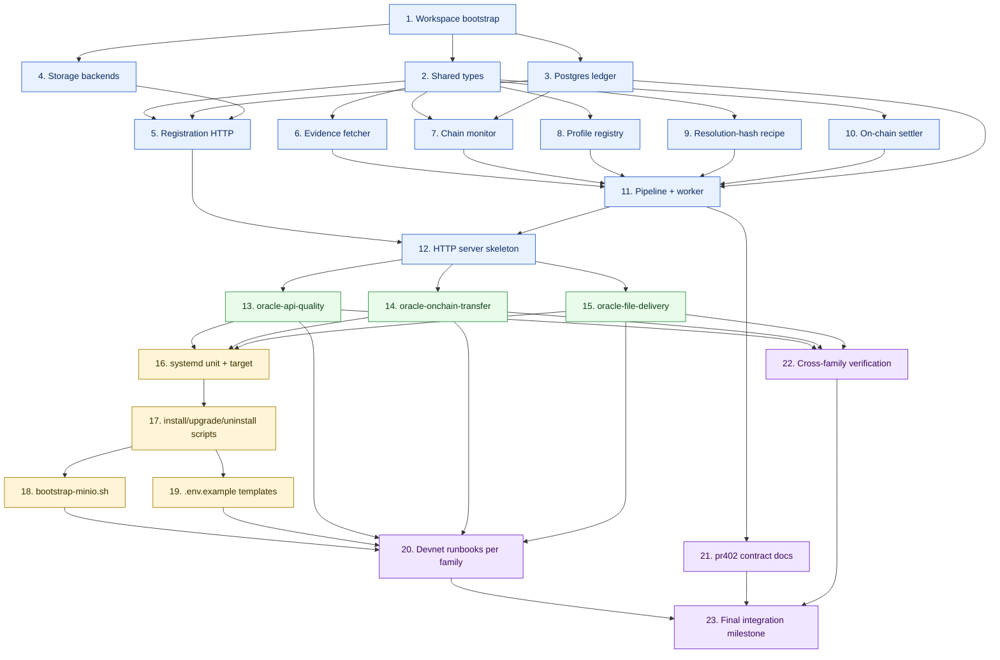

# Implementation Plan

## Overview

This plan implements the multi-category oracle architecture defined in [design.md](design.md) and [requirements.md](requirements.md). Tasks are ordered for bottom-up incremental progress: shared library first (`oracle-common`), then per-family crates (`oracle-api-quality`, `oracle-onchain-transfer`, `oracle-file-delivery`), then deployment scripts, then end-to-end devnet validation. Each leaf task cites the requirements it satisfies so the whole plan stays traceable. The on-chain `sla-escrow` program is **not** modified; this plan touches only off-chain code, scripts, and documentation.

## Notes

Conventions for working through this plan:

- A leaf task is the smallest verifiable unit (≈30–90 min of focused work). Parent tasks are organizational; only leaves get checked off as work happens.
- Every leaf task ends with `_Requirements: ..._` listing the requirement clauses it implements (e.g. `_Requirements: 1.1, 1.2, 1.3_`).
- Tests are written alongside the code they cover, not as a separate end-of-plan phase. Property-based tests for correctness properties (`P-*`) live next to the unit tests of the same module.
- Each task should leave the workspace in a buildable state (`cargo build --workspace`) and ideally a passing-test state (`cargo test --workspace`). Tasks that cannot meet that bar should explain why in their description.
- Tasks that depend on infrastructure not yet built reference the providing task by number.

## Task Dependency Graph



The graph reads top-down: Phase A (1–12) builds the shared `oracle-common` foundation; Phase B (13–15) adds the three family crates in parallel once the shared library is stable; Phase C (16–19) provides deployment infrastructure; Phase D (20–23) verifies end-to-end on Devnet and locks the pr402 contract.

```json
{
  "waves": [
    {
      "name": "Wave 1 — Workspace bootstrap",
      "parallel": ["1"],
      "blocks": ["all subsequent waves"]
    },
    {
      "name": "Wave 2 — Shared types and core primitives",
      "parallel": ["2", "3", "4"],
      "blocks": ["5", "6", "7", "8", "9", "10"]
    },
    {
      "name": "Wave 3 — oracle-common subsystems",
      "parallel": ["5", "6", "7", "8", "9", "10"],
      "blocks": ["11", "12"]
    },
    {
      "name": "Wave 4 — Pipeline + HTTP server",
      "parallel": ["11", "12"],
      "blocks": ["13", "14", "15"]
    },
    {
      "name": "Wave 5 — Family crates (independent)",
      "parallel": ["13", "14", "15"],
      "blocks": ["16", "22"]
    },
    {
      "name": "Wave 6 — Deployment infrastructure",
      "parallel": ["16"],
      "blocks": ["17"]
    },
    {
      "name": "Wave 7 — Operational helpers",
      "parallel": ["17"],
      "blocks": ["18", "19"]
    },
    {
      "name": "Wave 8 — Templates and devnet evidence",
      "parallel": ["18", "19"],
      "blocks": ["20"]
    },
    {
      "name": "Wave 9 — Per-family devnet runbooks (independent)",
      "parallel": ["20", "21", "22"],
      "blocks": ["23"]
    },
    {
      "name": "Wave 10 — Final integration",
      "parallel": ["23"],
      "blocks": []
    }
  ]
}
```

The `parallel` array of each wave lists the parent-task numbers that can be worked on concurrently within that wave. The `blocks` array lists the parent-task numbers that depend on this wave's completion. Wave 5 is the high-parallelism point (three family crates can be implemented by independent contributors at the same time once `oracle-common` is stable).

## Tasks

### Phase A — Workspace bootstrap and `oracle-common` foundation

- [x] 1. Set up the multi-crate workspace skeleton
  - [x] 1.1 Create the top-level `oracles/` directory and a workspace `Cargo.toml` listing members `oracle-common`, `oracle-api-quality`, `oracle-onchain-transfer`, `oracle-file-delivery`. Use the `[workspace.dependencies]` table to centrally version `sla-escrow-api = "0.3"`, `axum = "0.8"`, `tokio = "1.45"`, `solana-client = "2.3"`, `serde = "1.0"`, `serde_json = "1.0"`, `sha2 = "0.10"`, `thiserror = "2.0"`, `anyhow = "1.0"`, `tracing = "0.1"`, `tracing-subscriber = "0.3"`, `chrono = "0.4"`, `hex = "0.4"`, `bs58 = "0.5"`, `bytemuck = "1.16"`, `async-trait = "0.1"`, `dotenvy = "0.15"`, `reqwest = "0.12"`, `futures-util = "0.3"`, `bytes = "1"`, `proptest = "1"`. _Requirements: 30.2, 30.3_
  - [x] 1.2 Create empty crate skeletons (`Cargo.toml` + `src/lib.rs` or `src/main.rs`) for all four members so the workspace builds with `cargo build --workspace` returning success on day one. Each binary's `main.rs` may be a single `fn main() { unimplemented!() }` placeholder. _Requirements: 30.2_
  - [x] 1.3 Add `rust-toolchain.toml` pinning the toolchain version, `rustfmt.toml` matching the rest of the x402 monorepo, and a workspace-level `.gitignore` covering `target/`, `*.env`, `.env`, `*.keypair.json`. _Requirements: 30.2_
  - [x] 1.4 Configure CI: add `.github/workflows/oracles.yml` running `cargo build --workspace`, `cargo test --workspace`, and `cargo clippy --workspace -- -D warnings` on push and PR. _Requirements: 27.3_

- [x] 2. Implement core shared types in `oracle-common`
  - [x] 2.1 Implement `oracle-common/src/error.rs` with `OracleError` enum covering `Chain`, `EvidenceNotFound`, `SlaParse`, `DeliveryParse`, `Evaluation`, `Settlement`, `Database`, `UnknownProfile`, `Storage`, `Registry`, `Auth`, `RpcVerification` variants per [design.md §Error Taxonomy](design.md#error-taxonomy). Add unit tests asserting `Display` strings and round-trip via `thiserror`. _Requirements: 21.1, 33.2, 34.1, 34.4_
  - [x] 2.2 Implement `oracle-common/src/types.rs` with `EvaluationJob` (carrying `payment_uid`, `payment_pubkey`, `sla_hash`, `delivery_hash`, `oracle_authority`, `mint`, `amount`, `expires_at`, `sla_bytes`), `EvaluationResult` (`approved`, `resolution_reason`, `checks: Vec<CheckResult>`), `EvaluationOutcome` (`result`, `resolution_hash`, `signature`), `CheckResult`, `RuntimeHealth`. _Requirements: 18.1_
  - [x] 2.3 Implement `oracle-common/src/config.rs` exposing `OracleConfig::from_env()` with all env vars enumerated in [design.md §Operational Architecture](design.md#operational-architecture-ubuntu-2404--systemd) (RPC URLs, keypair path, program id, `BIND_ADDR`, evaluation timeout, `EVIDENCE_FETCH_*`, `DATABASE_URL`, operator-token + rate-limit, `ORACLE_REGISTRY_BACKEND`, `ORACLE_REGISTRY_S3_*`, `ORACLE_REGISTRY_MAX_*`, `ORACLE_REQUIRE_EVENT_MATCH`, `ORACLE_BACKFILL_LOOKBACK_SIGNATURES`, `ORACLE_DEAD_LETTER_MAX_ATTEMPTS`, `ORACLE_JOB_CHANNEL_CAPACITY`, `ORACLE_STRICT_PROFILE`). Refuse to start if `ORACLE_REGISTRY_BACKEND` is missing or invalid. _Requirements: 17.1, 17.2, 17.3, 17.4_
  - [x] 2.4 Add unit tests for `OracleConfig::from_env` covering: defaults applied when vars are unset, invalid `ORACLE_REGISTRY_BACKEND` rejected, operator-token-sha256 hex parsed correctly, registry URL list parsed from comma-separated input. _Requirements: 17.4_

- [x] 3. Implement Postgres ledger (`oracle_jobs`, `oracle_verdicts`, `oracle_lifecycle_events`, `oracle_parameters`)
  - [x] 3.1 Create `oracle-common/migrations/init.sql` with the full schema from [design.md §Postgres Schema](design.md#postgres-schema): all seven tables (`oracle_jobs`, `oracle_verdicts`, `oracle_lifecycle_events`, `oracle_parameters`, `oracle_seller_keys`, `oracle_deliveries`, `oracle_artifacts`, `oracle_registered_profiles`) plus all indexes and constraints. _Requirements: 20.1, 31.2_
  - [x] 3.2 Implement `oracle-common/src/db.rs` with `OracleDb` wrapping `deadpool-postgres` + `postgres-openssl`. Functions: `connect`, `is_terminal`, `attempt_count`, `record_detected`, `record_queued`, `record_started`, `record_failed`, `record_dead_letter`, `record_settled`, `get_parameter`, `set_parameter`. _Requirements: 20.1, 20.2_
  - [x] 3.3 Add an integration test `oracle-common/tests/db_integration.rs` that spins up Postgres via `testcontainers` (or a local Postgres bound to `DATABASE_URL` in CI), applies `init.sql`, and round-trips a `EvaluationJob` through `record_detected → record_queued → record_started → record_settled` asserting the lifecycle events table accumulates the expected rows. _Requirements: 20.1, 20.2_
  - [x] 3.4 Add a property-based test (`proptest`) asserting that for any `payment_uid` + status sequence ending in `settled`, `is_terminal(uid)` returns `true` and a re-call to `record_detected` does NOT advance the row to a non-terminal state. _Requirements: 20.2 (P-IDEM-1, P-IDEM-3)_

- [x] 4. Implement the storage backend abstraction
  - [x] 4.1 Implement `oracle-common/src/registry/storage.rs` with the `StorageBackend` trait (`put_streaming`, `get`, `get_streaming`, `stat`) plus `StorageError`, `StoredObject`, `ObjectStat` types per [design.md §Storage Strategy for Blobs](design.md#storage-strategy-for-blobs). _Requirements: 17.1, 17.2, 17.3_
  - [x] 4.2 Implement `PostgresBackend` writing to / reading from `oracle_artifacts` (BYTEA), enforcing `ORACLE_REGISTRY_MAX_BYTEA_BYTES` during streaming. Compute SHA-256 incrementally so a put returns the digest. _Requirements: 4.3, 17.1_
  - [x] 4.3 Implement `S3Backend` using `aws-sdk-s3` against any S3-compatible endpoint (AWS, R2, B2, Wasabi, MinIO). Object key is `oracle-blobs/<sha256_hex>`. Streaming put computes SHA-256 incrementally; streaming get verifies SHA-256 over the chunked body. Configure via `ORACLE_REGISTRY_S3_ENDPOINT`, `ORACLE_REGISTRY_S3_BUCKET`, `ORACLE_REGISTRY_S3_ACCESS_KEY`, `ORACLE_REGISTRY_S3_SECRET_KEY`, `ORACLE_REGISTRY_S3_REGION`. _Requirements: 4.1, 4.2, 16.3, 16.4, 17.2_
  - [x] 4.4 Implement `LocalFsBackend` writing to `/var/lib/oracle/<family>/blobs/<hash[0..2]>/<hash>`. _Requirements: 17.3_
  - [x] 4.5 Add a `make_backend(config)` factory in `oracle-common/src/registry/storage.rs` returning `Box<dyn StorageBackend>` based on `ORACLE_REGISTRY_BACKEND`. _Requirements: 17.1, 17.2, 17.3, 17.4_
  - [x] 4.6 Add unit + integration tests for each backend: round-trip puts/gets of small / boundary / oversized payloads; verify `413` over-cap behavior; verify hash-on-the-fly accuracy. Use `testcontainers` for Postgres and a MinIO container for S3. _Requirements: 17.1, 17.2, 17.3 (P-REG-2)_

- [x] 5. Implement the registration HTTP surface
  - [x] 5.1 Implement `oracle-common/src/registry/auth.rs` with the seller HMAC-challenge flow: `GET /v1/registry/seller/challenge?wallet=<pubkey>` (returns `{challenge, expires_at}`), `POST /v1/registry/seller/register` (verifies Ed25519 signature, inserts row in `oracle_seller_keys`, issues raw bearer once), `POST /v1/registry/seller/rotate` (revokes current row, issues new). Bearer storage uses `SHA256(token)` only. _Requirements: 1.1, 1.2, 1.3, 1.4, 7.1, 7.2, 7.3_
  - [x] 5.2 Implement bearer-token middleware that extracts `Authorization: Bearer ...`, hashes, looks up `oracle_seller_keys`, rejects `revoked=true` rows with `401`. Update `last_used_at` on every successful auth. _Requirements: 2.5, 3.3, 4.5, 7.2_
  - [x] 5.3 Implement `oracle-common/src/registry/api.rs` with the upload routes:
    - `POST /v1/registry/sla` — JSON body, requires `profile_id`, persists via storage backend, inserts `oracle_deliveries` row with `kind='sla'`. _Requirements: 2.1, 2.2, 2.3, 2.4_
    - `POST /v1/registry/delivery` — JSON body, optional `profile_id` sniff, `kind='delivery'`. _Requirements: 3.1, 3.2, 3.3, 3.4_
    - `POST /v1/registry/blob` — `application/octet-stream` or `multipart/form-data`, streams to backend with bounded buffer, sniffs MIME from leading 512 bytes, inserts `kind='blob'`. _Requirements: 4.1, 4.2, 4.3, 4.4, 4.5_
    - `GET /v1/registry/{sha256_hex}` — fetches via backend, re-verifies `SHA256(body) == hash`, supports `Range`. _Requirements: 10.1, 10.2, 10.3, 10.4, 31.3_
    - `HEAD /v1/registry/{sha256_hex}` — stat. _Requirements: 10.1_
    - `GET /v1/registry/info` — service-level info (max sizes, backend, registered profile id). _Requirements: 22.2_
  - [x] 5.4 Add idempotency: any `POST /v1/registry/{sla|delivery|blob}` with bytes already present in `oracle_deliveries` returns the existing row (`200 OK`); concurrent identical uploads dedup deterministically (UNIQUE index does the heavy lifting). _Requirements: 2.2, 3.4, 31.1, 31.2 (P-REG-1, P-REG-4)_
  - [x] 5.5 Add unit + integration tests for every route: success cases, oversized bodies (`413`), bad bearer (`401`), revoked bearer (`401`), missing `profile_id` on `POST /sla` (`400`), hash-mismatch fail-closed on `GET` (synthetic backend that returns wrong bytes — registry SHALL respond `500` with a clear error message). _Requirements: 2.1–2.5, 3.1–3.4, 4.1–4.5, 7.1–7.3, 10.1, 10.2 (P-REG-1, P-REG-2, P-REG-3, P-REG-4, P-HASH-1, P-HASH-2)_

- [x] 6. Implement the evidence fetcher abstraction
  - [x] 6.1 Implement `oracle-common/src/fetcher.rs` with the `EvidenceFetcher` trait (associated type `Output: Send + Sync`, `fetch(hash, kind) -> Output` async method) and `ArtifactKind` enum. _Requirements: 24.1_
  - [x] 6.2 Implement `RegistryJsonFetcher<T>` for `T: DeserializeOwned`: GET against ordered registry mirror URLs, retry on `5xx` per `EVIDENCE_FETCH_MAX_RETRIES`, verify `SHA256(raw_bytes) == hash` BEFORE parse, return `EvidenceNotFound` on mismatch with computed digest in the error message. _Requirements: 24.3, 33.1, 33.2, 34.1_
  - [x] 6.3 Implement `RegistryStreamingFetcher`: streaming GET, fixed 64 KiB read buffer, incremental SHA-256, 512-byte MIME-sniff window, returns `(size_bytes, sniffed_mime, hash_hex)`. Fail-closed on hash mismatch or premature EOF. _Requirements: 4.3, 24.1, 24.2, 33.1, 33.2, 33.3_
  - [x] 6.4 Add unit tests for both fetchers: hash-honest registry returns parsed value; hash-mismatch registry returns `EvidenceNotFound` with the bad digest in the message; truncated stream returns `EvidenceNotFound`; mirror failover exhausts retries then fails. _Requirements: 33.1, 33.2, 33.3 (P-HASH-1, P-HASH-2, P-HASH-3)_
  - [x] 6.5 Add a property-based test: for any byte sequence `B` and any tampered digest `H' ≠ SHA256(B)`, `RegistryJsonFetcher::fetch(H', _)` always returns `Err(EvidenceNotFound)`; never returns `Ok`. _Requirements: 33.1, 33.2 (P-HASH-1, P-HASH-2)_

- [x] 7. Implement the chain monitor + backfill
  - [x] 7.1 Implement `oracle-common/src/chain.rs` with `monitor_deliveries(config, rpc, tx, health)` doing WebSocket `logsSubscribe` against `escrow_program_id`, parsing `DeliverySubmittedEvent` from `Program data:` lines (base64 + bytemuck against the event struct from `sla-escrow-api`). For each event: derive payment PDA from the matching `SubmitDelivery` instruction, read the `Payment` account, return early if `payment.oracle_authority != self.pubkey` or `delivery_timestamp == 0` or `resolution_state != 0`. _Requirements: 6.2, 9.2, 19.5, 35.4, 35.5, 35.6_
  - [x] 7.2 Implement strict-event-match mode: when `ORACLE_REQUIRE_EVENT_MATCH=true`, refuse to emit a job unless the transaction carries a matching `DeliverySubmittedEvent` for the same `(payment_uid, delivery_hash)`. _Requirements: 18.2_
  - [x] 7.3 Implement startup backfill (`backfill_missed_deliveries`) using `getSignaturesForAddress` bounded by the high-watermark stored in `oracle_parameters.chain.last_seen_slot`. _Requirements: 20.1_
  - [x] 7.4 Hoist SLA bytes into the job: the monitor fetches SLA bytes from the registry once and attaches them to `EvaluationJob.sla_bytes` so the worker does not refetch; this enables fast profile-id dispatch. _Requirements: 6.2, 21.1, 21.2_
  - [x] 7.5 Implement WebSocket reconnect with exponential backoff; on every reconnect emit a lifecycle event and update `RuntimeHealth.websocket_connected`. _Requirements: 18.1, 18.2_
  - [x] 7.6 Add unit tests for log parsing (synthetic `Program data:` lines with valid + tampered + truncated bytes), instruction-account-key extraction, and event-match strictness. _Requirements: 6.2_

- [x] 8. Implement the profile registry and pluggable evaluator surface
  - [x] 8.1 Implement `oracle-common/src/evaluator.rs` with the `OracleEvaluator` trait (associated `Sla` + `Evidence`, `profile_id() -> &'static str`, `async fn evaluate(...)`) and `EvaluationContext` per [design.md §Pluggable Trait Surface](design.md#pluggable-trait-surface-rust-signatures). _Requirements: 23.1, 23.2_
  - [x] 8.2 Implement `oracle-common/src/profile.rs` with `ProfileRegistry`, `RegisteredProfile`, `ProfileBinding<E>`, `ProfileRunner` (async-trait, type-erased dispatcher). Refuse zero or multiple registrations. _Requirements: 21.3, 25.1, 25.2_
  - [x] 8.3 Implement `SlaEnvelope` (struct deserializing only `profile_id`) so dispatch reads the profile id without parsing the family-specific shape. _Requirements: 21.1, 21.2_
  - [x] 8.4 Add unit tests: registering one profile, resolving by exact id returns the runner; resolving an unknown id returns `None`; registering zero or two profiles panics at boot. _Requirements: 25.1, 25.2 (P-DISP-1)_

- [x] 9. Implement the canonical resolution-hash recipe
  - [x] 9.1 Implement `oracle-common/src/settler.rs::compute_resolution_hash<S: Serialize>(job, evaluator_profile_id, sla, result, details)` building the `x402/oracles/resolution-envelope/v1` JSON object with fixed key order (`profile`, `evaluatorProfile`, `paymentUid`, `paymentPubkey`, `slaHash`, `deliveryHash`, `approved`, `resolutionReason`, `details`) and computing SHA-256 over the serialized bytes. There is no parallel "legacy" recipe. _Requirements: 11.1, 11.2, 32.1, 32.2, 32.3_
  - [x] 9.2 Add per-family `details` builders: api-quality returns `{slaVersion, checks}`; onchain-transfer returns `{txSignature, cluster, verifiedTransfers, blockTime, slot}`; file-delivery returns `{blobSha256, sizeBytes, sniffedMime, checks}`. Each builder is a thin function in the relevant family crate, called from the family's `OracleEvaluator` impl. _Requirements: 11.1, 32.1_
  - [x] 9.3 Add a property-based test: for any fixed inputs `(payment_uid, payment_pubkey, sla_hash, delivery_hash, evaluatorProfile, approved, resolutionReason, details)`, `compute_resolution_hash` produces identical 32-byte output across 100 invocations and across distinct process runs. Use a fixture that re-serializes the same canonical JSON in two ways (different parsing order) and asserts the digest matches. _Requirements: 32.1, 32.2 (P-DET-2)_
  - [x] 9.4 Add a negative property test: for any fixture where one input field changes by a single byte, the output digest changes (confirming no collisions on identity-mutating inputs). _Requirements: 32.1, 32.2 (P-DET-2)_

- [x] 10. Implement the on-chain settler
  - [x] 10.1 Implement `oracle-common/src/settler.rs::is_eligible(state, job)` reading the on-chain `Clock` sysvar, asserting `payment.oracle_authority == self.pubkey`, `delivery_timestamp != 0`, `resolution_state == 0`, and `Clock.unix_timestamp <= payment.expires_at`. Fall back to wall-clock if Clock fetch fails (logged warning). _Requirements: 20.4, 35.1, 35.2, 35.3, 35.4, 35.5, 35.6_
  - [x] 10.2 Implement `settle(state, job, approved, resolution_reason, resolution_hash)` building the `EscrowSdk::confirm_oracle` instruction, signing with the oracle keypair, sending via the shared `RpcClient`, returning the signature. _Requirements: 11.1, 30.3_
  - [x] 10.3 Implement settle-time retry: on RPC `BlockhashNotFound` or transient `5xx`, retry up to `ORACLE_DEAD_LETTER_MAX_ATTEMPTS` with exponential backoff. Mark the job `dead_letter` after the final retry. _Requirements: 34.1_
  - [x] 10.4 Add unit tests for `is_eligible`: pubkey mismatch, missing delivery, already-resolved, expired (Clock-based), happy-path. _Requirements: 35.1, 35.2, 35.3, 35.4, 35.5, 35.6 (P-AUTH-1, P-AUTH-2, P-AUTH-3, P-AUTH-4)_

- [x] 11. Implement the pipeline + worker
  - [x] 11.1 Implement `oracle-common/src/pipeline.rs::run_pipeline(state, job)`: parse `SlaEnvelope` from `job.sla_bytes`, resolve profile via `ProfileRegistry::resolve(profile_id)`, refuse with `OracleError::UnknownProfile` if missing or mismatched, run the typed `ProfileRunner`, settle on-chain. _Requirements: 21.1, 21.2, 22.3, 25.3, 34.4_
  - [x] 11.2 Implement the worker loop in `oracle-common/src/lib.rs::run_worker(state, job_rx)`: dedupe via `db.is_terminal(uid)`, write `record_detected` + `record_queued` + `record_started`, run pipeline with `tokio::time::timeout`, write `record_settled` / `record_failed` / `record_dead_letter`, update stats. _Requirements: 20.2, 20.3, 38.2_
  - [x] 11.3 Add unit tests using a mock `ProfileRegistry` and mock RPC: profile-id mismatch produces `failed` ledger row + no settlement; happy-path produces `settled` row + signature; duplicate event for in-flight job is absorbed without spawning a second pipeline. _Requirements: 20.3, 21.1, 21.2 (P-DISP-1, P-IDEM-2)_

- [x] 12. Implement the HTTP server skeleton
  - [x] 12.1 Implement `oracle-common/src/server.rs::create_router(state)` mounting `GET /`, `GET /health`, `GET /stats`, `GET /metrics`, `POST /evaluate`, plus the registry routes from Task 5. Wire CORS (allowlist from `ORACLE_CORS_ALLOWED_ORIGINS`) and `tower-http::trace`. _Requirements: 18.1, 18.2, 18.3, 18.4, 19.1_
  - [x] 12.2 Implement `GET /health` returning the JSON shape from [design.md §Logs and Observability](design.md#logs-and-observability) (`status`, `oracle_pubkey`, `program_id`, `chain_connected`, `websocket_connected`, `last_websocket_message_at`, `queue_depth`, `deliveries_observed`, `last_seen_slot`, `registry_reachable`, `oracle_balance_lamports`, `database_enabled`, `strict_profile`). Return `503` when degraded. _Requirements: 18.1, 18.2_
  - [x] 12.3 Implement `GET /metrics` emitting Prometheus text exposition with the counters listed in Requirement 18.3. _Requirements: 18.3_
  - [x] 12.4 Implement `GET /stats` returning the JSON form of the same counters. _Requirements: 18.4_
  - [x] 12.5 Implement `POST /evaluate` (operator-only) with bearer auth via `ORACLE_OPERATOR_TOKEN_SHA256`, rate-limit per `ORACLE_MANUAL_EVALUATE_RATE_LIMIT` / window, refuse with `404` if the payment is not assigned to this oracle, return `{approved, signature, checks, error}`. _Requirements: 19.1, 19.2, 19.3, 19.4, 19.5_
  - [x] 12.6 Add unit + integration tests for every endpoint: `200`/`503` toggling on chain/WS state, operator-token-sha256 verification, rate-limit triggers, profile-mismatch path. _Requirements: 18.1–18.4, 19.1–19.5_

### Phase B — Family crates

- [x] 13. Implement `oracle-api-quality` (scenario a)
  - [x] 13.1 Implement `oracle-api-quality/src/sla.rs` with `SlaDocument` (`version`, required `profile_id`, `endpoint`, `method`, optional `response_schema`, optional `required_fields`, optional `min_status_code`, optional `max_status_code`, optional `max_latency_ms`, optional `min_body_length`). _Requirements: 22.2_
  - [x] 13.2 Implement `oracle-api-quality/src/evidence.rs` with `DeliveryEvidence` (`status_code`, `latency_ms`, `response_body`, optional `response_headers`, `timestamp`). _Requirements: 22.2_
  - [x] 13.3 Implement `oracle-api-quality/src/evaluator.rs` with `Evaluator` impl of `OracleEvaluator`: profile_id is `"x402/oracles/api-quality/v1"`; evaluate runs status / latency / required-fields / JSON-Schema / body-length checks in fixed order; first failing check determines `resolution_reason` (standard codes 1–5 / 255). Approval returns reason `0`; rejection returns the first failing check's reason. WHERE `ORACLE_STRICT_PROFILE=true` the evaluator additionally validates the parsed SLA against its JSON Schema. _Requirements: 11.3, 11.4, 23.1, 23.2, 23.3, 23.4, 23.5, 26.1, 36.3, 37.5_
  - [x] 13.4 Implement `oracle-api-quality/src/main.rs` wiring `OracleConfig`, `OracleDb`, registry router, chain monitor, worker, and registering the single `Evaluator` profile. Refuse to start if no profile is registered. _Requirements: 25.1, 25.2_
  - [x] 13.5 Publish the normative spec at `oracle-api-quality/spec/api-quality-v1/NORMATIVE.md`, JSON Schemas at `schema/sla-document.schema.json` and `schema/delivery-evidence.schema.json`, and at least three example pairs (approve, status-rejected, schema-rejected) under `examples/`. _Requirements: 27.1, 27.2, 37.1_
  - [x] 13.6 Add unit tests covering the full check ordering (status → latency → required → schema → body-length) and a property-based test asserting `P-AQ-2`: for any `(SLA, Evidence)` pair, approval iff conjunction holds. _Requirements: 23.2, 23.3, 23.4, 23.5 (P-DET-1, P-VER-1, P-VER-2, P-VER-3, P-AQ-2)_
  - [x] 13.7 Add a property-based test asserting `P-AQ-1`: any SLA whose `profile_id` differs from `x402/oracles/api-quality/v1` is rejected at dispatch (no settlement). _Requirements: 21.1, 25.3 (P-AQ-1, P-DISP-1)_
  - [x] 13.8 Add a CI schema-lint job that validates every example file against its JSON Schema. _Requirements: 27.3, 37.4_

- [x] 14. Implement `oracle-onchain-transfer` (scenario c)
  - [x] 14.1 Implement `oracle-onchain-transfer/src/sla.rs` with `TransferSla` (`version`, required `profile_id="x402/oracles/onchain-transfer/v1"`, `cluster`, `expected_transfers: Vec<ExpectedTransfer>`, optional `swap_router`, optional `slippage_bps`, optional `deadline_unix`) and the supporting `TransferCluster`, `ExpectedTransfer`, `TransferDirection` types. _Requirements: 22.2_
  - [x] 14.2 Implement `oracle-onchain-transfer/src/evidence.rs` with `TransferEvidence` (`version`, `profile_id`, `tx_signature`, `asserted_transfers`, `submitted_at`). _Requirements: 22.2_
  - [x] 14.3 Implement `oracle-onchain-transfer/src/evaluator.rs::TransferEvaluator` impl of `OracleEvaluator` covering all eight `Custom(256..=263)` rejection codes plus the approval path. Verification logic split into a pure `verify_observed_transfer(sla, observation)` function so tests don't need a live RPC. _Requirements: 23.4, 34.2, 34.3 (P-OT-1, P-OT-2, P-OT-3, P-OT-4, P-OT-5, P-OT-6)_
  - [x] 14.4 Implement `oracle-onchain-transfer/src/main.rs` wiring `OracleConfig` (with the binary's `TRANSFER_CLUSTER` env var) and registering the single `TransferEvaluator` profile. _Requirements: 25.1_
  - [x] 14.5 Publish the normative spec at `oracle-onchain-transfer/spec/onchain-transfer-v1/NORMATIVE.md`, JSON Schemas, and examples (approve, mint-mismatch, amount-insufficient, deadline-exceeded). _Requirements: 27.1, 27.2, 37.2_
  - [x] 14.6 Add unit tests using crafted `TxObservation` snapshots; assert each `Custom(256..263)` code is reachable on a controlled fixture. _Requirements: 23.4 (P-OT-1, P-OT-2, P-OT-3, P-OT-4, P-OT-5, P-OT-6)_
  - [x] 14.7 Add a property-based test: for any `(min_amount, observed_delta)` pair with `direction="in"`, the evaluator approves iff `observed_delta >= min_amount` AND the tx is on `cluster` AND `meta.err.is_none()`. _Requirements: 23.4 (P-OT-4)_
  - [x] 14.8 Add a CI schema-lint job that validates every example file. _Requirements: 27.3, 37.4_

- [x] 15. Implement `oracle-file-delivery` (scenario b — attestation)
  - [x] 15.1 Implement `oracle-file-delivery/src/sla.rs` with `FileDeliverySla` (`version`, required `profile_id="x402/oracles/file-delivery/attestation/v1"`, `expected_size_bytes_min`, `expected_size_bytes_max`, optional `expected_mime`, optional `expected_extension`, optional `attestor_pubkey`). _Requirements: 22.2_
  - [x] 15.2 Implement `oracle-file-delivery/src/evidence.rs` with `FileDeliveryEvidence` (`size_bytes`, `sniffed_mime`, `blob_sha256_hex`) — the streaming-fetch outcome, not a separately uploaded JSON. _Requirements: 22.2_
  - [x] 15.3 Implement `oracle-file-delivery/src/fetcher.rs::StreamingBlobFetcher` wrapping `RegistryStreamingFetcher` from Task 6.3 — returns `FileDeliveryEvidence` after the streaming SHA-256 verify. _Requirements: 24.1, 24.2_
  - [x] 15.4 Implement `oracle-file-delivery/src/evaluator.rs::FileDeliveryEvaluator` impl of `OracleEvaluator` covering size, MIME, and attestor-pubkey checks. _Requirements: 23.4 (P-FD-1, P-FD-2, P-FD-3 partial)_
  - [x] 15.5 Implement `oracle-file-delivery/src/main.rs` wiring `OracleConfig`, registering the single profile, mounting the registry router with the streaming-blob route enabled. _Requirements: 25.1_
  - [x] 15.6 Publish the normative spec at `oracle-file-delivery/spec/file-delivery-attestation-v1/NORMATIVE.md`, JSON Schemas (SLA only — evidence is the blob bytes), and examples (approve 5MB MP4, reject undersized, reject MIME-mismatch). _Requirements: 27.1, 27.2, 37.3_
  - [x] 15.7 Add unit tests with in-memory blobs of various sizes and MIME types; cover all `Custom(320..323)` codes. _Requirements: 23.4 (P-FD-1, P-FD-2, P-FD-3)_
  - [x] 15.8 Add a property-based test: for any blob byte sequence and SLA `[min, max]` range, the evaluator approves the size check iff `min ≤ len ≤ max`. _Requirements: 23.4 (P-FD-1)_
  - [x] 15.9 Add an integration test against a real MinIO container: upload a 5 MiB blob via the registry route, watch the evaluator stream it, settle a verdict. **Test lives at `oracle-file-delivery/tests/minio_integration.rs`**, marked `#[ignore]` so `cargo test --workspace` skips it on machines without MinIO. To run: `bash oracles/scripts/bootstrap-minio.sh` then `export ORACLE_TEST_MINIO_ENDPOINT=...` and `cargo test -p oracle-file-delivery --test minio_integration -- --ignored`. _Requirements: 4.1, 4.3, 16.3, 23.4_
  - [x] 15.10 Add a CI schema-lint job. _Requirements: 27.3, 37.4_

## Phase C — Deployment scripts and infrastructure

- [x] 16. Implement the systemd templated unit + target
  - [x] 16.1 Create `oracles/scripts/oracle@.service` with the templated systemd unit per [design.md §Templated systemd Unit](design.md#templated-systemd-unit). _Requirements: 12.1, 15.1_
  - [x] 16.2 Create `oracles/scripts/oracle.target` aggregating the family services. _Requirements: 15.2, 15.3_

- [x] 17. Implement the installer / upgrade / uninstall scripts
  - [x] 17.1 Implement `oracles/scripts/install.sh` per [design.md §Installer / Manager Scripts](design.md#installer--manager-scripts). Idempotent. _Requirements: 12.1, 12.2, 12.3, 12.4_
  - [x] 17.2 Implement `oracles/scripts/upgrade.sh`: stage new binary as `.new`, atomic mv, restart, probe `/health` 5×2s. _Requirements: 13.1, 13.2_
  - [x] 17.3 Implement `oracles/scripts/uninstall.sh`: disable + remove unit, remove binary, remove dirs if empty, preserve env file by default (`PRESERVE_ENV=1`). _Requirements: 14.1, 14.2, 14.3_
  - [x] 17.4 Run shellcheck CI job covering all three scripts. _Requirements: 27.3_
  - [x] 17.5 Add an end-to-end manual-run smoke test runbook at `oracles/scripts/README.md` describing how to test install / upgrade / uninstall on a clean Ubuntu 24.04 VM. _Requirements: 12.1–14.3_

- [x] 18. Implement `bootstrap-minio.sh`
  - [x] 18.1 Implement `oracles/scripts/bootstrap-minio.sh` per [design.md §MinIO Bootstrap](design.md#minio-bootstrap-optional-helper). Idempotent. _Requirements: 16.1, 16.2, 16.3_
  - [x] 18.2 Add a CI job that exercises the MinIO bootstrap path against an Ubuntu 24.04 GitHub-hosted runner. **Implemented as a step in the `test` job in `oracles/.github/workflows/oracles.yml`** that spins up MinIO as a service, bootstraps the bucket via `mc mb`, and runs `cargo test -p oracle-file-delivery --test minio_integration -- --ignored` against it (covers the same idempotent provisioning that `bootstrap-minio.sh` automates on a real host). _Requirements: 16.1, 16.2_

- [x] 19. Add the `.env.example` template
  - [x] 19.1 Create `oracles/.env.example` listing every env var consumed by `OracleConfig::from_env`, grouped by section. _Requirements: 17.1, 17.2, 17.3, 18.1, 19.2, 19.3, 19.4_
  - [x] 19.2 Sync per-family overrides: `oracle-api-quality/.env.example`, `oracle-onchain-transfer/.env.example`, `oracle-file-delivery/.env.example`. _Requirements: 12.1, 17.1_

## Phase D — End-to-end Devnet validation and `pr402` contract documentation

- [x] 20. Author per-family devnet runbooks
  - [x] 20.1 Write `oracle-api-quality/tests/devnet/api_quality_v1.sh`. _Requirements: 6.2, 9.1, 11.1_
  - [x] 20.2 Write `oracle-onchain-transfer/tests/devnet/transfer_v1.sh`. _Requirements: 6.2, 9.1, 23.4_
  - [x] 20.3 Write `oracle-file-delivery/tests/devnet/file_v1.sh`. _Requirements: 4.1, 4.3, 6.2, 23.4_
  - [x] 20.4 Document the runbook in each crate's `README.md` with prerequisites (`solana-keygen`, devnet wallets, funded oracle keypair, MinIO endpoint). _Requirements: 15.4, 27.1, 38.1, 38.3_

- [x] 21. Document the pr402 discovery contract
  - [x] 21.1 Write `oracles/oracle-common/docs/PR402_CONTRACT.md` capturing the JSON shapes for `accepts[].extra.oracleProfiles[]` and pr402 `/capabilities.slaEscrowOracleProfiles[]`, the seller invariants, the pr402 enforcement rules, and the buyer-side selection algorithm. _Requirements: 5.1, 5.2, 5.3, 5.4, 8.1, 8.2, 8.3, 9.3, 28.1, 28.2, 29.1, 29.2, 29.3_

- [x] 22. Cross-family verification suite
  - [x] 22.1 Add `oracle-common/tests/cross_family_properties.rs` consolidating cross-family P-DET-2, P-VER-3, and resolution-reason range invariants. _Requirements: 22.1, 23.2, 23.3, 23.4, 23.5, 26.2, 26.3, 26.4, 26.5, 32.1, 32.2, 33.1, 33.2, 35.1–35.6, 36.1, 36.2_
  - [x] 22.2 Add `oracle-common/tests/db_properties.rs` consolidating idempotency properties (P-IDEM-1, P-IDEM-3) — already shipped in the Phase A db-tests milestone. _Requirements: 2.2, 2.4, 2.5, 3.3, 3.4, 4.2, 4.5, 7.1, 7.2, 31.1, 31.2_
  - [x] 22.3 Add a `cargo deny` config (`deny.toml`) checking license compliance and known vulns; run in CI. _Requirements: 27.3_
  - [x] 22.4 Run `cargo clippy --workspace --all-targets -- -D warnings` and fix any lints. _Requirements: 27.3_
  - [x] 22.5 Run the existing `sla-escrow` workspace tests against the deployed devnet program ID after this work to confirm we did not regress on-chain behavior. **VERIFIED**: 23 tests passing across `sla_escrow_api`, `sla_escrow` (CLI + program), and `fee_math` integration; no on-chain code changed during the off-chain oracle work. _Requirements: 6.1, 6.3, 30.1, 38.1_

- [-] 23. Final integration milestone
  - [ ] 23.1 Run the three devnet runbooks end-to-end against a fresh Ubuntu 24.04 VPS using `install.sh` for all three families + `bootstrap-minio.sh`; confirm the oracle.target shows three active services and three different oracle pubkeys settling against the deployed `sla-escrow` Devnet program. _Requirements: 12.1, 13.1, 14.1, 15.1, 15.2, 16.1_
  - [-] 23.2 Capture the runbook output (terminal transcripts, `journalctl` excerpts, `oracle_jobs` SELECT output) under `oracle-common/docs/devnet-evidence/` for the project log. (Directory scaffolded with capture instructions in `oracle-common/docs/devnet-evidence/README.md`; populated when 23.1 is run on real hardware.) _Requirements: 27.1_
  - [x] 23.3 Update the top-level `ARCHITECTURE_OVERVIEW.md` to reference the three new sibling oracles and the `oracle-common` shared library. Mark `oracle-qa` references obsolete — the renamed `oracle-api-quality` is the canonical entry. _Requirements: 27.1_