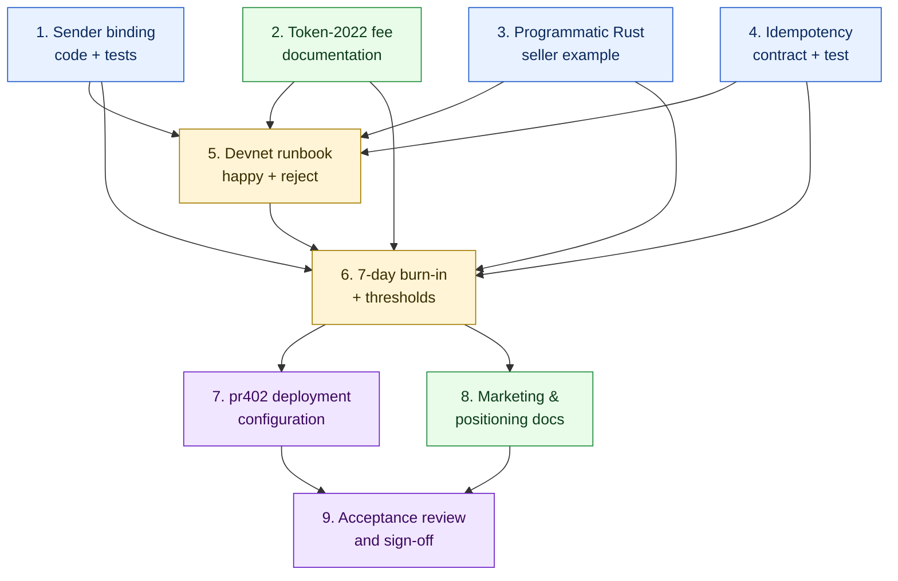

# Implementation Plan

## Overview

This plan ships the production-hardening work defined in
[requirements.md](requirements.md) for `oracle-onchain-transfer`. The
plan is **scoped tightly**: most tasks are documentation, three are
small code additions (one optional field, one resolution code, one
example), and the remaining gates are operational (devnet evidence,
burn-in, pr402 deployment configuration). The on-chain `sla-escrow`
program is NOT modified.

The reference scenario throughout is the AetherVane Zodiac-token wedge
(see requirements.md Introduction). Each FundPayment binds **exactly
one** Zodiac mint at a time per the user's product decision.

## Notes

- A leaf task is the smallest verifiable unit (≈30–90 min of focused
  work). Parent tasks are organizational; only leaves get checked off.
- Every leaf task ends with `_Requirements: ..._` listing the requirement
  clauses it implements (e.g. `_Requirements: 1.1, 1.2_`).
- Each task SHALL leave the workspace in a buildable state
  (`cargo build --workspace`) and a passing-test state
  (`cargo test --workspace`) after completion.
- `cargo clippy --workspace --all-targets -- -D warnings` SHALL stay
  clean throughout.
- Tasks that depend on production deployment evidence (Tasks 5, 6, 7)
  are gated until earlier code + doc tasks land.

## Task Dependency Graph



The graph reads top-down: code-touching work (Tasks 1, 3, 4) and
documentation (Task 2) execute first in parallel; devnet validation
(Task 5) consumes all four; burn-in (Task 6) consumes the validation;
pr402 deployment + marketing (Tasks 7, 8) lock the released state;
final review (Task 9) closes the spec.

```json
{
  "waves": [
    {
      "name": "Wave 1 — Independent code + doc work",
      "parallel": ["1", "2", "3", "4"],
      "blocks": ["5"]
    },
    {
      "name": "Wave 2 — Devnet validation",
      "parallel": ["5"],
      "blocks": ["6"]
    },
    {
      "name": "Wave 3 — Burn-in",
      "parallel": ["6"],
      "blocks": ["7", "8"]
    },
    {
      "name": "Wave 4 — Deployment + positioning",
      "parallel": ["7", "8"],
      "blocks": ["9"]
    },
    {
      "name": "Wave 5 — Acceptance",
      "parallel": ["9"],
      "blocks": []
    }
  ]
}
```

## Tasks

---

- [x] 1. Add optional `sender_owner` to `ExpectedTransfer` with full check coverage

  - [x] 1.1 Add `sender_owner: Option<String>` field to `ExpectedTransfer` in
    `oracle-onchain-transfer/src/sla.rs`. Use `#[serde(default, skip_serializing_if = "Option::is_none")]`
    so SLAs authored before this change continue to deserialize unchanged.
    Update the existing rustdoc to describe the field's semantics
    ("optional sender pubkey; when set, verify the same `(mint,
    sender_owner)` row appears in `pre_token_balances` with a negative
    delta whose magnitude is at least `min_amount`"). _Requirements: 1.1, 1.2_

  - [x] 1.2 Add `TRANSFER_SENDER_MISMATCH = 269` to the `onchain_transfer`
    module in `oracle-common/src/resolution_codes.rs` with rustdoc
    explaining when it fires (no matching `(mint, sender_owner)` pre-row,
    OR matching row but sender's signed delta is non-negative). Update
    the `ranges_do_not_overlap_and_cover_intended_space` test to add
    `TRANSFER_SENDER_MISMATCH` to the `onchain_transfer` for-loop assertions.
    _Requirements: 1.6_

  - [x] 1.3 Update `verify_observed_transfer` in
    `oracle-onchain-transfer/src/evaluator.rs` to perform the sender
    check **after** the existing recipient checks (so the existing first-
    failing-check ordering is preserved when `sender_owner` is unset).
    The check has two failure paths producing the same code with distinct
    `CheckResult.detail` strings: "no `(mint, sender_owner)` row in
    pre-balances" and "sender delta `{n}` >= 0; expected negative magnitude
    `≥ {min}`". _Requirements: 1.3, 1.4_

  - [x] 1.4 Add four unit tests in `oracle-onchain-transfer/src/evaluator.rs::tests`:
    `sender_set_correct_approves`, `sender_set_missing_pre_row_rejects`,
    `sender_set_wrong_direction_rejects`, `sender_unset_back_compat_skips_check`.
    Each constructs a synthetic `TxObservation` and exercises one branch.
    _Requirements: 1.7_

  - [x] 1.5 Add `sender_owner` to the JSON Schema at
    `oracle-onchain-transfer/spec/onchain-transfer-v1/schema/sla-document.schema.json`
    as an optional string (no `pattern` validation since base58 is
    application-level; the evaluator parses with `Pubkey::from_str` and
    rejects malformed values inline). Add a new example file under
    `spec/onchain-transfer-v1/examples/sla-with-sender-binding.json`
    showing the AetherVane Zodiac shape with `sender_owner` set to the
    seller's treasury pubkey. _Requirements: 1.5_

  - [x] 1.6 Update `oracle-onchain-transfer/spec/onchain-transfer-v1/NORMATIVE.md`
    §4.2 (Field semantics) with a new row for `sender_owner` and §6
    (Evaluation semantics) with one new step describing the check, in
    line with the existing tabular format. _Requirements: 1.1, 1.5_

  - [x] 1.7 Verify `cargo test -p oracle-onchain-transfer` passes (existing
    20 tests + 4 new = 24) and `cargo clippy --workspace --all-targets --
    -D warnings` is clean. _Requirements: 1.7_

- [x] 2. Document Token-2022 transfer-fee handling

  - [x] 2.1 Add §6.2 "Token-2022 transfer fees" to
    `oracle-onchain-transfer/spec/onchain-transfer-v1/NORMATIVE.md`
    explaining: (a) the oracle reads `meta.postTokenBalances` which is
    already post-fee, (b) for plain SPL Token mints there is no fee
    path, (c) for Token-2022 mints with a transfer-fee extension, the
    buyer's `min_amount` MUST be the post-fee amount the recipient
    receives. _Requirements: 2.1_

  - [x] 2.2 In the same NORMATIVE §6.2, include a worked example: gross
    100 raw, transfer-fee-bps 150 (1.5%), expected net = 98.5 → buyer
    declares `min_amount = 98` (passes), `min_amount = 100` (rejects).
    Note that fractional raw is rounded down by the on-chain fee
    calculation, so `98.5` raw is impossible and we use the floor (98).
    _Requirements: 2.2_

  - [x] 2.3 Add a callout to `oracles/docs/SELLER_GUIDE.md` §4.B
    pointing at NORMATIVE §6.2, with a one-line check sellers can run
    (`spl-token display $MINT_ADDRESS` to see whether a transfer-fee
    extension is configured). Position the callout right after the
    existing buyer-authored SLA shape comment block in the recipe.
    _Requirements: 2.3_

  - [x] 2.4 No code change. Acceptance is the diff-readable presence of
    the documentation in the two files plus a self-review against
    Requirement 2's worked example. _Requirements: 2.4_

- [ ] 3. Programmatic Rust seller example

  - [ ] 3.1 Create `oracle-onchain-transfer/examples/programmatic_seller.rs`
    with a single `#[tokio::main]` async entry point. Top-of-file doc
    comment SHALL declare devnet defaults, list every required env var
    (`SOLANA_RPC_URL`, `ORACLE_BASE_URL`, `SELLER_KEYPAIR_PATH`,
    `SELLER_BEARER`, `SLA_HASH_HEX`), and warn that overriding for
    mainnet requires explicit env-var review.
    _Requirements: 3.1, 3.5_

  - [ ] 3.2 In the example, fetch the SLA bytes by `sla_hash` from the
    oracle's registry (`GET /v1/registry/<sla_hash>`), parse into
    `TransferSla`, extract `(mint, recipient_owner, min_amount,
    sender_owner, payment_uid, buyer_nonce)`. Treat any deserialization
    error as an explicit panic with a message; this is example code,
    not a library. _Requirements: 3.1_

  - [ ] 3.3 Build a `TransferChecked` instruction using
    `spl_token::instruction::transfer_checked` against
    `(seller_keypair.pubkey(), seller_ata, recipient_ata, mint, decimals,
    quantity_raw)`, derive ATAs via `get_associated_token_address`,
    broadcast via `RpcClient::send_and_confirm_transaction`, capture the
    returned `Signature`. _Requirements: 3.1_

  - [ ] 3.4 Construct `TransferEvidence` JSON with the captured signature,
    the `payment_uid` from the SLA echoed verbatim, the `buyer_nonce`
    from the SLA echoed when present, `version: 1`, `profile_id`,
    `asserted_transfers` (informational; the oracle re-derives), and
    `submitted_at` (Unix epoch). POST to `<ORACLE>/v1/registry/delivery`
    with the seller bearer; capture the returned `delivery_hash`.
    _Requirements: 3.1_

  - [ ] 3.5 Submit `SubmitDelivery` on-chain using the
    `sla-escrow-api::sdk::EscrowSdk` (or equivalent client). Print all
    three signatures (TransferChecked, registry POST hash response,
    SubmitDelivery) to stdout for the operator to verify in an explorer.
    _Requirements: 3.1_

  - [ ] 3.6 Embed a clearly-marked comment block in the example showing
    where to insert the durable persistence call from Requirement 4
    (e.g. `// IDEMPOTENCY: persist (payment_uid, tx_signature) to your
    DB HERE before continuing to evidence upload`). Cross-reference it
    by name in the example's top doc comment. _Requirements: 4.3_

  - [ ] 3.7 Run `cargo build --example programmatic_seller -p oracle-onchain-transfer`
    and confirm it builds with no warnings. The example does NOT need
    runtime testing in this task (devnet validation in Task 5 exercises
    the same code path against real network). _Requirements: 3.2, 3.3_

  - [ ] 3.8 Update `SELLER_GUIDE.md` §4.B with a new "Programmatic seller
    path" subsection (10–15 lines) pointing at the example and one
    paragraph of context: when to use it (long-running daemons), what
    it shows (full loop), what's NOT shown (idempotency persistence
    storage choice, retry policy, dead-letter handling — those are
    integrator-specific). _Requirements: 3.4_

- [x] 4. Idempotency contract + regression-guard test

  - [x] 4.1 Add a new "Idempotency contract" subsection to
    `oracles/docs/SELLER_GUIDE.md` §4.B describing: (a) seller MUST
    durably persist `(payment_uid, tx_signature)` AFTER the broadcast
    call returns and BEFORE submitting evidence; (b) on restart with
    no persisted signature, seller MUST first query the chain for any
    pre-existing transfer matching `(mint, recipient_owner, payment_uid-
    derived ATA)` before re-broadcasting; (c) on-chain SubmitDelivery
    is idempotent at the program level so a retry after success is
    harmless, but a retry of broadcast + SubmitDelivery is not safe
    without persisted signature. _Requirements: 4.1_

  - [x] 4.2 In the same subsection, include 5–10 lines of pseudocode
    showing the persistence pattern (Postgres INSERT ON CONFLICT keyed
    by `payment_uid`, returning either the persisted signature or
    indicating "broadcast-needed"). _Requirements: 4.2_

  - [ ] 4.3 Add a property test to
    `oracle-onchain-transfer/src/evaluator.rs::tests` (or to
    `oracle-common/tests/cross_family_properties.rs` if it's
    genuinely cross-family) named e.g. `worker_skips_terminal_settled_jobs`
    that constructs an `OracleDb`-backed worker test confirming that
    when `is_terminal()` returns true for a `payment_uid`, the worker
    consumes the job-channel message but does NOT call the evaluator.
    Use a stub evaluator that panics if invoked; the test passes when
    the worker swallows the duplicate without panicking. This is the
    regression guard — if a future refactor accidentally drops the
    is_terminal check, this test fails. _Requirements: 4.4_

  - [x] 4.4 Verify `cargo test --workspace` passes (existing 124 + 4 new
    sender-owner unit tests from Task 1 + 1 new idempotency property
    test = 129) and clippy stays clean. _Requirements: 4.4_

- [ ] 5. End-to-end devnet validation runbook (happy + reject)

  - [ ] 5.1 Prepare a fresh devnet host with the latest `oracle-onchain-transfer`
    binary (with Tasks 1–4 landed) deployed via `oracles/scripts/install.sh`,
    a Postgres database with `oracle-common/migrations/init.sql` applied,
    a funded oracle keypair, and a buyer + seller test wallet pair.
    Capture `00-host-info.txt`. _Requirements: 5.1_

  - [ ] 5.2 Drive the happy-path runbook end-to-end:
    - Buyer authors SLA (devnet USDC mint, recipient = fresh test wallet,
      `min_amount = 1_000_000` raw = 1 USDC, `payment_uid` random,
      `buyer_nonce` random, optional `sender_owner` set to seller's
      treasury wallet to exercise the new check).
    - Buyer hashes locally; seller uploads to registry; both verify hash.
    - Buyer signs FundPayment via pr402 `/build-sla-escrow-payment-tx`.
    - Seller broadcasts TransferChecked, posts evidence, SubmitDelivery.
    - Oracle observes, fetches, evaluates, ConfirmOracle.
    - Anyone calls ReleasePayment.
    Capture explorer URLs for fund / broadcast / submit / confirm /
    release in
    `oracle-common/docs/devnet-evidence/<YYYY-MM-DD>-onchain-transfer-prod-burn-in/02..06-*-tx-explorer.txt`.
    _Requirements: 5.1, 5.2, 5.3_

  - [ ] 5.3 Capture the post-run Postgres state:
    `psql -c "SELECT payment_uid, status, settlement_signature,
    resolution_hash FROM oracle_jobs WHERE payment_uid = '<hex>'" >
    07-oracle-jobs-after.tsv` and the corresponding `oracle_verdicts`
    row to `08-oracle-verdicts-after.tsv`. Confirm `status='settled'`,
    `resolution_reason=0`, `approved=true`. _Requirements: 5.3_

  - [ ] 5.4 Independently recompute `resolution_hash` from the captured
    SLA bytes + delivery bytes + verdict envelope (using the canonical
    recipe documented in `SLA_ESCROW_PROTOCOL.md` §5 and the property
    test in `oracle-common/tests/cross_family_properties.rs` as the
    reference implementation). Confirm it matches the on-chain value.
    Save the recomputation transcript to `09-resolution-hash-recompute.txt`.
    _Requirements: 5.3_

  - [ ] 5.5 Drive the negative-path runbook in a separate evidence
    directory `<YYYY-MM-DD>-onchain-transfer-prod-burn-in-rejection/`:
    same buyer SLA but seller broadcasts a transfer with delta below
    `min_amount`. Confirm oracle rejects with `TRANSFER_AMOUNT_INSUFFICIENT
    (258)`, buyer calls RefundPayment, funds return. Capture the same
    set of artifacts (00–09). _Requirements: 5.4_

  - [ ] 5.6 Skim each evidence file for accuracy. If anything is missing
    (e.g. an explorer URL no longer resolves), regenerate. The
    devnet-evidence directories are the durable record any future
    integrator references. _Requirements: 5.2, 5.3, 5.4_

- [ ] 6. Seven-day burn-in + threshold update

  - [ ] 6.1 Stand up a synthetic-load driver against the same devnet
    deployment from Task 5. Target: ≥ 100 settlements/day (~ 1 every 14
    minutes), with a 70%/30% approve/reject mix to exercise both code
    paths. Driver may be a simple Bash loop calling a Rust client based
    on Task 3's example, or a Python `asyncio` script — the choice is
    operator-style, not architectural. Capture the driver script in
    `oracle-common/docs/devnet-evidence/<YYYY-MM-DD>-burn-in-driver.sh`
    (or `.py`) for reproducibility. _Requirements: 6.1_

  - [ ] 6.2 Run continuously for ≥ 7 calendar days. During the window,
    Prometheus (or any equivalent scrape) SHALL collect `/metrics` and
    `/health` at 30-second intervals; raw scrapes SHALL be archived
    (e.g. as `.tsv` exports from the operator's TSDB) for the post-run
    analysis. _Requirements: 6.1_

  - [ ] 6.3 At day-7, compute the following and write them to
    `oracle-common/docs/devnet-evidence/<YYYY-MM-DD>-burn-in-summary.md`:
    - p50 / p95 / p99 settlement latency (event observed → ConfirmOracle
      signature confirmed).
    - p50 / p95 / p99 evidence-fetch latency.
    - Mean and max SOL spend per settlement (lamports).
    - Queue-depth histogram (max queue depth observed; histogram of
      bucket counts).
    - Total `oracle_total_dead_letter` count + a one-line root-cause
      classification per dead-lettered job.
    - Total `oracle_total_evidence_fetch_failures` count + classification.
    - WebSocket reconnect count + longest gap (seconds without a chain
      message).
    _Requirements: 6.2_

  - [ ] 6.4 Update `oracles/docs/OPERATIONS.md` §2 alert thresholds based
    on the measurements:
    - Warning: `balance < 2 × measured_max_per_settlement × 100`
      (covers ~100 settlements with 2× margin).
    - Critical: `balance < 2 × measured_max_per_settlement × 10`
      (covers ~10 settlements).
    Round to clean values (e.g. nearest 0.05 SOL). Add a footnote in
    OPERATIONS.md citing the burn-in summary file path. _Requirements: 6.3_

  - [ ] 6.5 If the burn-in surfaces a regression (a counted dead-letter
    that wasn't the synthetic driver's intentional reject; a pipeline
    error rate ≥ 5/min sustained > 15 min; a queue-depth gauge that
    pegs at the 256-cap and stays there), STOP the burn-in, root-cause
    and fix, restart the burn-in window from day 0. _Requirements: 6.4_

  - [ ] 6.6 Confirm all 124+ workspace tests still pass and clippy is
    clean after any burn-in-driven fixes. _Requirements: 6.4_

- [ ] 7. pr402 deployment configuration for the built-in oracle

  - [ ] 7.1 On the production pr402 deployment, run one
    `oracle-onchain-transfer` instance per `oracles/docs/DEPLOYMENT.md`
    §1 (quickstart) plus §2.1 / §2.2 / §2.4 (TLS, prod Postgres, RPC
    provider). The oracle's keypair, Postgres database, and registry
    storage SHALL be operated entirely by the pr402 operator. The
    oracle's `BIND_ADDR` is bound to localhost; nginx (or equivalent)
    fronts it with TLS. _Requirements: 7.1_

  - [ ] 7.2 Insert (or update) two rows in the pr402 `parameters` table:
    - `PR402_SLA_ESCROW_ONCHAIN_TRANSFER_DEFAULT_PUBKEY` =
      `<oracle-keypair-pubkey-from-7.1>`.
    - `PR402_SLA_ESCROW_ONCHAIN_TRANSFER_REGISTRY_URL` =
      `https://<oracle-host>/v1/registry`.
    Use `INSERT ... ON CONFLICT DO UPDATE` per the pattern in
    `pr402/migrations/init.sql`. Within the parameters cache TTL
    (~60s), `GET /api/v1/facilitator/capabilities` SHALL include the
    profile in `slaEscrowOracleProfiles[]`. _Requirements: 7.2, 7.3_

  - [ ] 7.3 Curl `GET /api/v1/facilitator/capabilities | jq
    '.slaEscrowOracleProfiles[]'` and confirm the
    `x402/oracles/onchain-transfer/v1` entry is present with the
    expected `defaultOperatorPubkey`, `registryUrl`, `repositoryPath`.
    Save the curl output as evidence in
    `oracle-common/docs/devnet-evidence/<YYYY-MM-DD>-pr402-capabilities-after.json`.
    _Requirements: 7.2_

  - [ ] 7.4 With the operator's permission, optionally enable the
    health gate by setting `PR402_SLA_ESCROW_REQUIRE_ORACLE_HEALTHY =
    'true'`. Confirm:
    - When the oracle is healthy, `/capabilities` shows no `unhealthy`
      annotation; `/build-sla-escrow-payment-tx` succeeds for the
      built-in oracle.
    - Stop the oracle's systemd unit briefly and confirm
      `/build-sla-escrow-payment-tx` returns HTTP 503 oracle_unhealthy
      within the 30-second probe-cache window. Restart the oracle and
      confirm builds resume. Save evidence to
      `<YYYY-MM-DD>-pr402-health-gate.txt`.
    Re-enable the gate only if the oracle is reliable enough that
    operators are comfortable with a 503 path on transient outages.
    _Requirements: 7.3_

  - [x] 7.5 Add the new "Built-in oracle" section to
    `pr402/public/agent-integration.md` (one paragraph) explaining:
    pr402 ships and operates `x402/oracles/onchain-transfer/v1`; for
    other delivery shapes, sellers name their own oracle in
    `accepts[].extra.oracleProfiles[]`. Cross-link to
    `SLA_ESCROW_PROTOCOL.md` §1 actor responsibilities. _Requirements: 7.4_

  - [x] 7.6 Add a paragraph to the same agent-integration.md section
    noting that the built-in oracle is operationally distinct from
    the facilitator: a regression in the oracle does not regress the
    facilitator; the operator may disable the built-in oracle at any
    time by clearing the `*_DEFAULT_PUBKEY` parameter (the profile
    then disappears from `/capabilities`). _Requirements: 7.5_

- [x] 8. Marketing and integrator-facing positioning

  - [x] 8.1 Update `oracles/docs/marketing/oracle-intro-article.md` to
    add a paragraph (anchor before the "Three reference oracles" table
    or in a new "Built-in vs ecosystem" subsection) clarifying:
    - pr402 ships and operates `oracle-onchain-transfer` itself.
    - For other profiles (api-quality, file-delivery, future families),
      pr402 reviews and lists ecosystem oracles via the editorial
      registration template, but does NOT operate them.
    - Trust extended to the built-in oracle is trust extended to the
      pr402 operator; trust extended to ecosystem oracles is trust
      extended to that oracle's listed operator.
    _Requirements: 8.1_

  - [x] 8.2 Update `oracles/docs/BUYER_GUIDE.md` §2 ("Pick the right
    oracle") with a new bullet noting that pr402's `/capabilities`
    lists a built-in oracle as default for token-transfer scenarios;
    for other profiles, buyers SHOULD prefer an oracle the seller
    advertises in their HTTP-402 challenge. _Requirements: 8.2_

  - [x] 8.3 Update `oracles/docs/SELLER_GUIDE.md` §2 ("Find the oracle's
    address") with a callout that pr402 advertises a default
    onchain-transfer oracle. Sellers MAY use it directly without running
    their own; sellers MAY also point buyers at a different oracle
    (their own, or an ecosystem one) in `accepts[].extra.oracleProfiles[]`
    for trust or performance reasons. _Requirements: 8.3_

  - [x] 8.4 Self-review the three doc updates as a single commit, end
    to end, to ensure the language is consistent ("built-in" vs
    "ecosystem", consistent capitalization, no contradictory claims).
    _Requirements: 8.4_

- [ ] 9. Acceptance review and sign-off

  - [ ] 9.1 Walk through the eight requirements end-to-end and verify
    each acceptance criterion is met. For code-touching criteria, point
    at the specific test or function. For documentation criteria, point
    at the specific section. For operational criteria, point at the
    captured evidence file. _Requirements: 1.1, 1.2, 1.3, 1.4, 1.5, 1.6, 1.7, 2.1, 2.2, 2.3, 2.4, 3.1, 3.2, 3.3, 3.4, 3.5, 4.1, 4.2, 4.3, 4.4, 5.1, 5.2, 5.3, 5.4, 6.1, 6.2, 6.3, 6.4, 7.1, 7.2, 7.3, 7.4, 7.5, 7.6, 8.1, 8.2, 8.3, 8.4_

  - [ ] 9.2 Final test sweep: `cargo test --workspace` (all groups
    passing), `cargo clippy --workspace --all-targets -- -D warnings`
    (clean), no markdown spec-format diagnostics on any updated `.md`
    file, all referenced devnet-evidence files present and well-formed.
    _Requirements: all_

  - [ ] 9.3 Tag the codebase. Update `oracle-onchain-transfer/Cargo.toml`
    `version` to a meaningful semver bump (suggest `0.2.0` to mark the
    production-hardening line). Update `pr402/migrations/init.sql`
    seed if the operator wants the new oracle profile permanently
    seeded across DB resets. _Requirements: 7.2_

  - [ ] 9.4 Mark the spec complete: in this `tasks.md`, add a closing
    note "Production hardening complete on <YYYY-MM-DD>; built-in
    oracle live on pr402 mainnet/devnet at <pubkey>." This is the
    durable record of when production-readiness was claimed and on
    what evidence. _Requirements: 9 (acceptance summary in requirements.md)_
