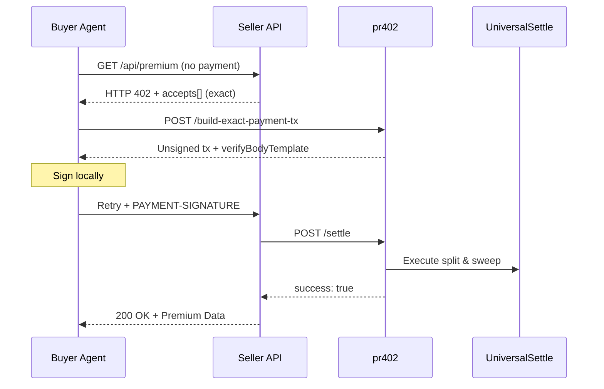
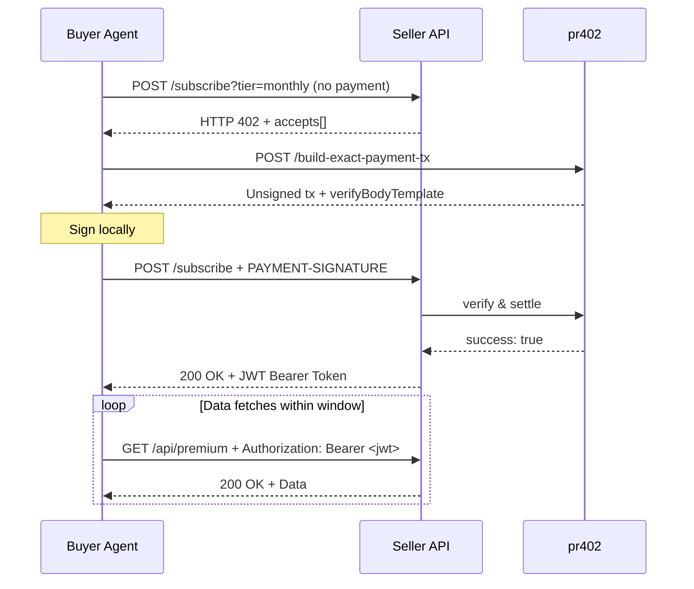
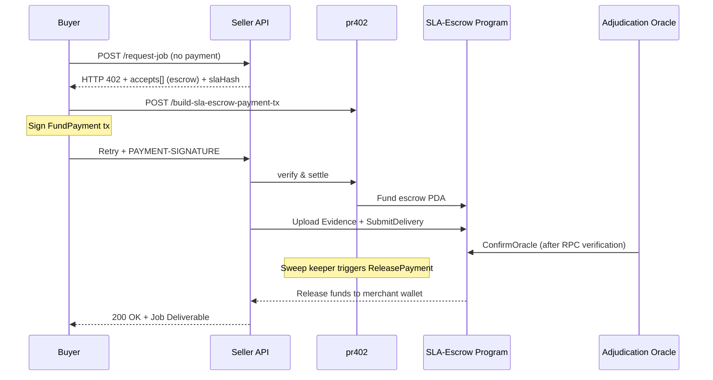

# 🌐 x402 Architecture Overview

**x402** is a modular, trustless, API-first financial stack built on the Solana blockchain. It bridges off-chain agentic systems with on-chain settlement engines.

---

## 🏛️ Architecture Pillars

The ecosystem consists of three main architectural layers:

```
                  ┌───────────────────────────────┐
                  │          Buyer Agent          │
                  └───────────────┬───────────────┘
                                  │ (HTTP 402, REST APIs)
                  ┌───────────────▼───────────────┐
                  │       pr402 Facilitator       │
                  └───────────────┬───────────────┘
                                  │ (Solana Instructions)
                  ┌───────────────▼───────────────┐
                  │      On-Chain Settlement      │
                  │   (UniversalSettle / Escrow)  │
                  └───────────────┬───────────────┘
                                  │ (Adjudication)
                  ┌───────────────▼───────────────┐
                  │        Oracle Network         │
                  └───────────────────────────────┘
```

1. **The Payer (Buyer Agent):** Off-chain agent consuming paid APIs and resources.
2. **The Facilitator (`pr402`):** A REST-to-Solana gateway running on Vercel Serverless. It builds, verifies, and broadcasts transactions, allowing buyers and sellers to remain stateless.
3. **On-Chain Settlement Engines:**
   * **UniversalSettle (`exact` rail):** For instant, high-velocity micropayments.
   * **SLA-Escrow (`sla-escrow` rail):** For conditional, oracle-verified deliveries.

---

## 🔄 Transaction Lifecycles

### 1. `exact` Rail (Per-call or Subscription)
Best for instant API calls (e.g., [solrisk](https://github.com/miralandlabs/solrisk)). Settles immediately via a `SplitVault` (Logic PDA + SOL Storage PDA + Token ATA) where payments are automatically split between the seller and the facilitator.



### 2. `exact` Rail (JWT Subscription Window)
Sellers can grant a time-window JWT for repeated access to high-volume resources.



### 3. `sla-escrow` Rail (Conditional Escrow)
Best for high-value or slow-fulfillment jobs. Payout is held in escrow until delivery evidence is uploaded and approved by a chosen oracle.



---

## 🛡️ Security & Trust Invariants

* **Non-Custodial Escrow:** All funds are locked on-chain within autonomous program PDAs.
* **Deterministic Verification:** Facilitator and oracle check transaction signatures, amounts, and destinations dynamically from the chain state.
* **Verdict-Neutral Tips:** Oracles are paid an `oracle_fee` upon confirming any verdict (approve or reject). This prevents alignment biases.
* **Refund Cooldowns:** Buyers can claw back funds if a seller fails to submit delivery before expiry, protected by an on-chain `refund_cooldown_seconds` gate.
