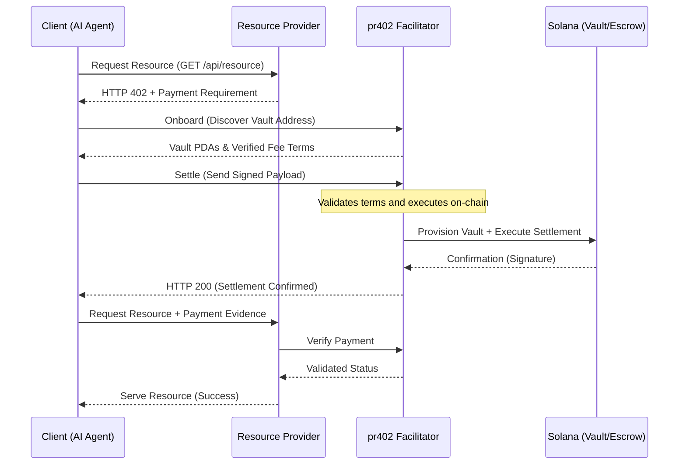

# 🌐 x402 Architecture Overview: The Solana Agentic Economy

**x402** is a modular, trustless, and API-first financial stack built on the Solana blockchain. It provides the protocol and infrastructure needed for AI-to-AI resource settlement, enabling purely autonomous agents to trade compute, data, and services with cryptographic certainty.

---

## 🏗️ The 4 Pillars of the x402 Ecosystem

The ecosystem consists of four specialized components that work together to provide a seamless "Payment-Required" (HTTP 402) experience for the autonomous machine age.

### 1. 🌉 The Bridge: `pr402` (The Facilitator)
*   **Role**: REST-to-Blockchain Gateway.
*   **Platform**: Vercel Serverless / Rust.
*   **What it does**: It acts as the "Interpreter" between off-chain AI agents (speaking JSON/REST) and on-chain programs (speaking Solana instructions).
*   **Key Features**:
    *   **Zero-Signature Onboarding**: Agents discover their vault PDAs with zero initial friction.
    *   **BYOG (Bring Your Own Gas)**: Default economic model where the Buyer Agent pays network fees, ensuring facilitator sustainability while allowing optional sponsorship for premium tiers.
    *   **Math-as-Trust**: Every address is re-derivable via PDA seeds (`wallet + facilitator_id`), allowing agents to verify terms locally.

### 2. ⚡ The Payout: `UniversalSettle` (SplitVault)
*   **Role**: High-Velocity Direct Payment.
*   **Scheme ID**: `exact` (x402 V2).
*   **What it does**: Handles immediate, fixed-fee settlements for low-latency tasks (e.g., pay-per-inference, API-call gating).
*   **The SplitVault Architecture**: 
    *   Uses a specialized **Triple-Vault** (Logic PDA + 0-Data SOL Storage + SPL ATA).
    *   Revenue is instantly and immutably split between the **Resource Provider** and the **Facilitator** upon receipt.
*   **Enriched Discovery**: Discloses `programId`, `configAddress`, and `feeBps` extracted directly from on-chain state.

### 3. 🛡️ The Enforcer: `SLA-Escrow` (Escrow Scheme)
*   **Role**: Service-Level Agreement (SLA) Trustee.
*   **Scheme ID**: `sla-escrow` (x402 V2).
*   **What it does**: Holds funds in escrow for high-stakes or long-running services (e.g., autonomous research, GPU training).
*   **Security & Agentic Hardening**:
    *   **Oracle-Confirmed Release**: Payments are only released (or refunded) when an authorized Oracle provides a verdict.
    *   **Verdict-Neutral Tipping**: Oracles receive a programmable tip (`oracle_fee_bps`) regardless of whether they approve or reject a claim, incentivizing honest adjudication rather than "payout bias".
    *   **Hardened Routing**: Immutably routes payouts and refunds to the original parties.
*   **Enriched Discovery**: Discloses `escrowProgramId`, `bankAddress`, `feeBps`, and `oracleAuthorities`.

### 4. 💎 The Service: `Resource Provider`
*   **Role**: The Monetized Resource.
*   **Reference Implementation**: `spl-token-balance-serverless`.
*   **What it does**: A business-layer service that gates access using x402 headers. It verifies payment via the Facilitator before serving the autonomous request.

---

## 🤖 Autonomous Decision Logic

AI Agents using x402 V2 implement dynamic routing based on job risk and value:

1. **Discovery**: Agent hits `GET /api/v1/facilitator/supported` to learn current on-chain terms (Fees, Oracles, Program IDs).
2. **Evaluation**:
   - **Low Value / Low Latency**: Use `exact` (UniversalSettle) for minimal overhead.
   - **High Value / Multi-Step**: Use `sla-escrow` for cryptographic protection of funds.
3. **Selection**: For escrows, the agent selects a preferred Oracle from the `oracleAuthorities` provided by the facilitator.

---

## 🔄 The Lifecycle of an x402 Transaction

---

## 📜 Standardizing the SLA Hash & Delivery Hash

To ensure interoperability between independent **Sellers**, **Buyers**, and **Oracles**, the x402 ecosystem recommends the following standards for data integrity:

### 1. The `sla_hash` (The Agreement)
The `sla_hash` stored on-chain should be the **SHA-256 hash** of a **Canonical JSON** representation of the service terms. This allows the Oracle to verify that the Seller's delivery matches the Buyer's original expectations.
- **Recommended Schema**: A JSON object containing `service_id`, `task_details`, `deadline_unix`, and `verification_criteria`.
- **Logic**: `hash = sha256(canonical_json(sla_terms))`

### 2. The `delivery_hash` (The Proof)
The `delivery_hash` submitted by the Seller represents the completed work. 
- **Small Assets**: If the output is a single file (e.g., a report or image), the `delivery_hash` is the SHA-256 of the raw file.
- **Large/Complex Assets**: Hash a JSON metadata object containing a pointer to the storage location (e.g., IPFS CID/S3 URL) and a checksum of the contents.

### 3. The Oracle's Handshake
The Oracle is responsible for bridging the off-chain data to the on-chain verdict. It fetches the raw data (the SLA terms and the Delivery artifact), verifies they match the hashes on-chain, and executes the `ConfirmOracle` instruction to release or refund payment.

---

## 🛡️ Trust and Security Invariants

1.  **Non-Custodial Design**: Neither the Facilitator nor the Provider has custodial access to the buyer's funds. All logic is governed by on-chain state and PDA restrictions.
2.  **Deterministic Derivation**: Every vault, escrow, and storage account is seed-derived from the Resource Owner's wallet.
3.  **Revenue Immutability**: The `sweep` (payout) logic follows immutable split rules hardcoded on-chain, ensuring the Resource Owner maintains direct ownership over their earnings.
4.  **Verdict Integrity**: `SLA-Escrow` protects against malicious Oracles through its neutral tipping model, ensuring Oracles are paid for their service of adjudication, not for the outcome.

---

### 🚀 Summary
The x402 Ecosystem provides a **complete financial stack for AI Agents**. By combining the scalability of Vercel Serverless with the precision of Solana's high-speed settlement, we enable a world where agents don't just talk—they trade.

---

## 📂 The x402 Ecosystem Structure

The x402 ecosystem is composed of four independent, specialized repositories. This modular approach allows for rapid serverless iteration alongside hardened, security-critical on-chain programs.

### 🌉 The Interconnects
- **[pr402 Facilitator](https://github.com/miralandlabs/pr402)**: The REST-to-Solana gateway (Vercel-native).
- **[UniversalSettle Protocol](https://github.com/miraland-labs/universalsettle)**: The split-payment engine (On-chain).
- **[SLA-Escrow Protocol](https://github.com/miraland-labs/sla-escrow)**: The service-level enforcer (On-chain).
- **[Reference Resource Provider](https://github.com/miralandlabs/spl-token-balance-serverless)**: Example HTTP 402 serverless integration.

---

**Maintained by**: Miraland Labs & MiralandLabs
**Ecosystem Meta**: [The x402 Protocol](https://github.com/miraland-labs/x402)
