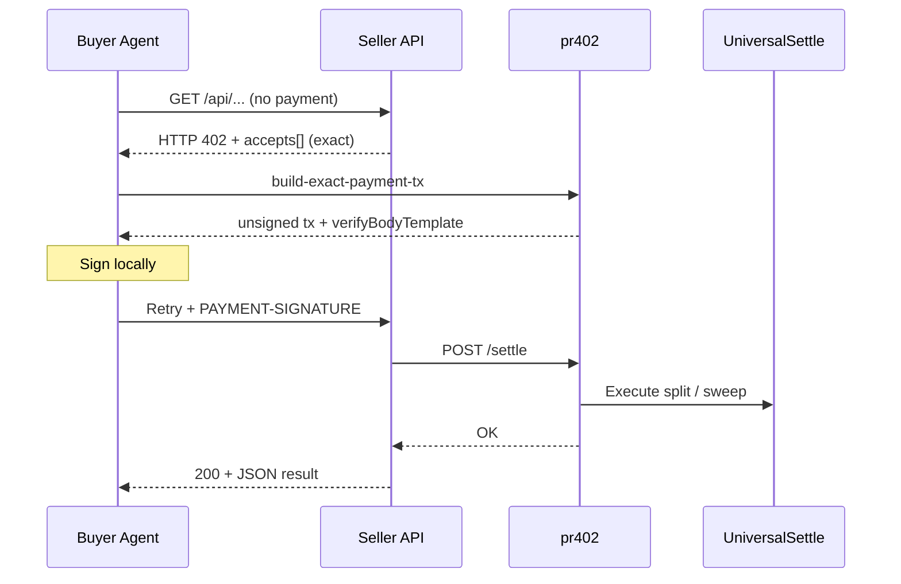
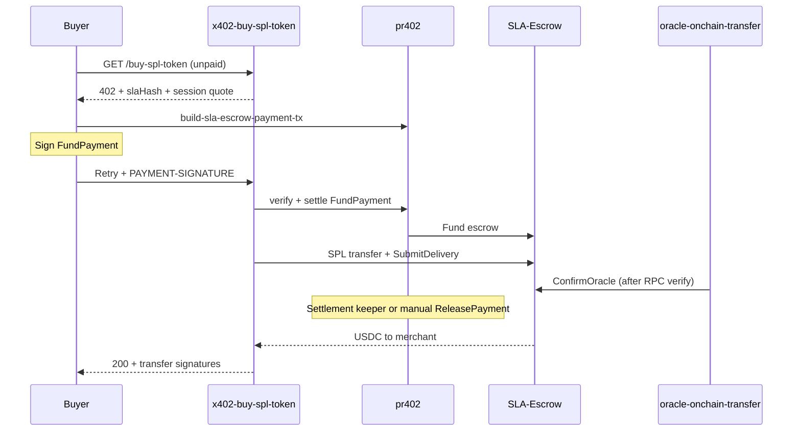

# 🌐 x402 Architecture Overview: The Solana Agentic Economy

**x402** is a modular, trustless, API-first financial stack built on the Solana blockchain. It provides the protocol and infrastructure needed for AI-to-AI resource settlement, enabling autonomous agents to trade compute, data, and services with cryptographic certainty.

> **Deployment status.** The **pr402 facilitator** and both on-chain programs (`universalsettle`, `sla-escrow`) are deployed on **Solana Mainnet** and **Solana Devnet**.
>
> **Recommended host:** `https://ipay.sh` (Mainnet) / `https://preview.ipay.sh` (Devnet).
> **Also served — same service, not deprecated:** `https://agent.pay402.me` / `https://preview.agent.pay402.me`.
>
> Confirm **`solanaNetwork`** with **`GET /api/v1/facilitator/health`** on the host you call. Human integration docs: [docs.ipay.sh](https://docs.ipay.sh).

---

## 🏗️ The Pillars of the x402 Ecosystem

The ecosystem consists of specialized components that work together to provide a seamless "Payment Required" (HTTP 402) experience for the autonomous machine age.

### 1. 🌉 The Bridge: `pr402` (The Facilitator)

- **Role**: REST-to-Blockchain Gateway.
- **Platform**: Vercel Serverless / Rust.
- **What it does**: Acts as the "Interpreter" between off-chain AI agents (speaking JSON/REST) and on-chain programs (speaking Solana instructions).
- **Key Features**:
  - **Zero-Signature Onboarding**: Agents discover their vault PDAs with zero initial friction.
  - **BYOG (Bring Your Own Gas)**: Default economic model where the Buyer Agent pays network fees, with optional facilitator sponsorship on supported paths.
  - **Math-as-Trust**: Every address is re-derivable via PDA seeds (`wallet + facilitator_id`), allowing agents to verify terms locally.
  - **Buyer-side tx assembly**: `/build-exact-payment-tx` and `/build-sla-escrow-payment-tx` return a ready-to-sign `VersionedTransaction` + pre-filled `verifyBodyTemplate`.
  - **Blockhash-safe `/settle`**: Verification runs inside `/settle` before broadcast (Solana blockhash lifetime ~60s).
  - **Scheme normalization**: HTTP `402 accepts[]` may use `v2:solana:exact` / `v2:solana:sla-escrow`; **`verifyBodyTemplate`** and **`/verify`/`/settle`** normalize to wire **`exact`** / **`sla-escrow`**.
  - **Settlement keeper** (optional): background vault sweep and sla-escrow release/refund/close candidates — see pr402 `settlement_keeper` and cron ops docs.
- **Agent reference**: **`GET /capabilities`** → **`agentManifest.payToSemantics`** (JSON).

### 2. ⚡ The Payout: `UniversalSettle` (SplitVault)

- **Role**: High-Velocity Direct Payment.
- **Scheme ID**: `exact` (x402 v2).
- **What it does**: Handles immediate settlements for low-latency tasks (pay-per-inference, API-call gating, wallet analytics).
- **SplitVault architecture**:
  - Uses a specialized **Triple-Vault** (Logic PDA + 0-Data SOL Storage + SPL ATA).
  - Revenue is instantly and immutably split between the **Resource Provider** and the **Facilitator** upon receipt.
- **Reference seller**: **[solrisk](https://github.com/miralandlabs/solrisk)** — [solrisk.signer-payer.me](https://solrisk.signer-payer.me/) · `GET /api/v1/wallet-risk`, $0.05 USDC per call, pr402 verify + settle on **`exact`**.

### 3. 🛡️ The Enforcer: `SLA-Escrow` (Escrow Scheme)

- **Role**: Service-Level Agreement (SLA) Trustee.
- **Scheme ID**: `sla-escrow` (x402 v2 extension).
- **What it does**: Holds funds in escrow until seller delivery and oracle verdict.
- **Security & agentic hardening**:
  - **Oracle-confirmed release**: Verdict only after on-chain delivery (`delivery_timestamp > 0`).
  - **Verdict-neutral tipping**: Oracle tip on release and refund paths — paid for adjudication, not outcome.
  - **Hardened routing**: Payouts/refunds to parties recorded on `Payment` at funding time.
  - **Refund safety**: Buyers cannot refund after seller delivery unless the oracle rejects (`CannotRefundDeliveredPayment`).
- **Reference seller**: **[x402-buy-spl-token](https://github.com/miralandlabs/x402-buy-spl-token)** — catalogued SPL purchase with **`FundPayment` → SPL `TransferChecked` → evidence registry → `SubmitDelivery` → [`oracle-onchain-transfer`](https://github.com/miralandlabs/oracles/tree/main/oracle-onchain-transfer)**.

### 4. 💎 Reference Resource Providers (Live on pr402)

Open-source references demonstrate **both rails** end-to-end. Closed-source services remain additional operated examples.

| Project | Rail | Endpoint / UX | Hosts |
|--------|------|---------------|-------|
| **[x402-buy-spl-token](https://github.com/miralandlabs/x402-buy-spl-token)** | **`sla-escrow`** | `GET /api/v1/buy-spl-token` (+ human storefront `/`) | [spl-token.hashspace.me](https://spl-token.hashspace.me) · [preview.spl-token.hashspace.me](https://preview.spl-token.hashspace.me) |
| **[solrisk](https://github.com/miralandlabs/solrisk)** | **`exact`** | `GET /api/v1/wallet-risk?wallet=` | [solrisk.signer-payer.me](https://solrisk.signer-payer.me/) |
| **spl-token balance** (closed) | **`exact`** | SPL balance verification | [spl-token.signer-payer.me](https://spl-token.signer-payer.me/) |
| **AetherVane** (closed) | **`exact`** | Multi-engine readings API | [aethervane.hashspace.me](https://aethervane.hashspace.me/) |

**x402-buy-spl-token design notes (v0.3):**

- **Seller-quoted session totals** — unpaid 402 returns one authoritative `accepts[].amount` (USDC session total) and matching `commitMaterial`; buyer agents must **not** multiply unit price × `quantity` client-side.
- **Role split** — escrow PDA (`X402_PAY_TO`), merchant wallet (`X402_MERCHANT_WALLET`), delivery signer (`SELLER_KEYPAIR_BASE58` for SPL transfer), merchant signer (`MERCHANT_SIGNER_KEYPAIR_BASE58` for `SubmitDelivery`).
- **Optional Postgres** — `purchase_orders` idempotency keyed on `payment_uid`; advisory locks for concurrent safety.
- **Normative stack** — `x402/delegated-authoring/v1`, binding `x402/informative/bindings/buy-spl-token/v1`, delivery profile `x402/oracles/onchain-transfer/v1`.

**solrisk design notes:**

- Rust serverless (Vercel), pr402 **`exact`** gate, versioned scoring formula (`scoring_version`), optional Supabase cache/log tables (`solrisk_*` prefix).
- Shares facilitator URL pattern with other sellers: `X402_FACILITATOR_URL` → `ipay.sh` / `preview.ipay.sh`.

### 5. ⚖️ The Oracle Family: `oracle-common` + Three Sibling Oracles

- **Role**: Reference oracle implementations for the `sla-escrow` rail.
- **Repository**: [`miraland-labs/oracles`](https://github.com/miralandlabs/oracles) — Open Source.
- **Architecture**: off-chain `profile_id`-dispatched evaluators; on-chain program stays category-agnostic.

| Crate | Profile | Delivery shape | Default port |
| ----- | ------- | -------------- | ------------ |
| `oracle-common` | _(library)_ | Shared chain monitor, registry, ledger, settler | — |
| `oracle-api-quality` | `x402/oracles/api-quality/v1` | JSON HTTP delivery quality | 4020 |
| `oracle-onchain-transfer` | `x402/oracles/onchain-transfer/v1` | SPL transfer re-derived from RPC | 4021 |
| `oracle-file-delivery` | `x402/oracles/file-delivery/attestation/v1` | Streaming file attestation | 4022 |

- **x402-buy-spl-token** uses **onchain-transfer** by default (`ORACLE_AUTHORITIES` in seller env).
- **Seller guide**: [`oracles/docs/SELLER_GUIDE.md`](https://github.com/miralandlabs/oracles/blob/main/docs/SELLER_GUIDE.md) · **Buyer guide**: [`oracles/docs/BUYER_GUIDE.md`](https://github.com/miralandlabs/oracles/blob/main/docs/BUYER_GUIDE.md).

### 6. 📚 The Seller Starter: `x402-seller-starter`

- Minimal open-source seller — 402 + forward proof (any language pattern documented in pr402 docs).

### 7. 🏦 RWA primary issuance vertical

Decoupled stack for regulated token subscription (primary issuance only):

| Component | Repo | Role |
| --------- | ---- | ---- |
| KYC portal | `rwa-issuer-portal` | Postgres system of record; **no signing** (Vercel) |
| Ops sync | `rwa-kyc-sync` | Drains `/sync/feed`, runs hook CLI, marks synced (VPS) |
| Compliance hook | `rwa-kyc-hook` | Multi-issuer Token-2022 Transfer Hook (on-chain) |
| Seller | `x402-buy-rwa-token` | `sla-escrow` primary issuance API (Vercel) |
| Delivery oracle | `oracle-rwa-transfer` | Verifies Token-2022 delivery + hook pin |

Binding: portal `issuers.id` (UUID) ↔ on-chain `issuer_id` (32-char hex). Ops runbook: [`RWA_OPS_RUNBOOK.md`](RWA_OPS_RUNBOOK.md).

### 8. 🏹 The Buyer Starter: `x402-buyer-starter`

- Open-source buyer lifecycle demos; production path via `@pr402/client` / `pr402-client`.

---

## 🤖 Why Two On-Chain Programs? (Decision Logic)

1. **`exact` (UniversalSettle)** — Instant micro-payments; best for pay-per-call APIs (**solrisk** is the reference).
   - Recommendation: payments from ~**$0.05 USDC** upward on pr402 (protocol fee floor math).
2. **`sla-escrow` (SLA-Escrow)** — Conditional delivery; best for fixed-price deliverables with oracle proof (**x402-buy-spl-token** is the reference).
   - Recommendation: higher-value tickets (e.g. **≥ ~$10 USDC** per escrow payment for oracle economics).

*(Both on-chain programs are **Planned Open Source**.)*

---

## 🔄 The Lifecycle of an x402 Transaction

### `exact` rail (instant — e.g. solrisk)

### `sla-escrow` rail (conditional — e.g. x402-buy-spl-token)

---

## 📜 Standardizing the SLA Hash & Delivery Hash

(See [oracles](https://github.com/miralandlabs/oracles) specs — unchanged core model.)

- **`sla_hash`**: SHA-256 of canonical SLA JSON bytes served by the registry.
- **`delivery_hash`**: hash of delivery artifact (or metadata pointer + checksum).
- **Oracle**: fetches SLA + delivery, verifies hashes, submits `ConfirmOracle`.

**x402-buy-spl-token** implements **`x402/informative/bindings/buy-spl-token/v1`** on top of this stack.

---

## 🛡️ Trust and Security Invariants

1. **Non-Custodial Design**: Facilitator and seller do not custodially hold buyer funds; escrow and SplitVault logic is on-chain.
2. **Deterministic Derivation**: Vault and escrow PDAs are seed-derived from documented inputs.
3. **Revenue Immutability**: Sweep/split rules are on-chain for **`exact`**.
4. **Verdict Integrity**: Oracle tipping is verdict-neutral; delivery must exist before confirmation.
5. **Idempotency (reference sellers)**: x402-buy-spl-token uses Postgres `purchase_orders` + advisory locks; solrisk can run stateless or with cache tables.

---

## ⚡ Deterministic Finality for the Machine Economy

- **`exact`**: pr402 **`/settle`** verifies then executes in one step — avoids blockhash expiry between verify and settle.
- **`sla-escrow`**: **Lock-then-work** — USDC escrowed before seller delivery; oracle + release completes the economic loop.

---

## 📂 The x402 Ecosystem Structure

- **[pr402 Facilitator](https://github.com/miralandlabs/pr402)** — REST-to-Solana gateway (Open Source).
- **UniversalSettle** · **SLA-Escrow** — on-chain rails (Planned Open Source).
- **[oracles/](https://github.com/miralandlabs/oracles)** — multi-category oracle workspace (Open Source).
- **[x402-buy-spl-token](https://github.com/miralandlabs/x402-buy-spl-token)** — **`sla-escrow`** reference seller (Open Source) ★
- **[solrisk](https://github.com/miralandlabs/solrisk)** — **`exact`** reference seller · [solrisk.signer-payer.me](https://solrisk.signer-payer.me/) (Open Source) ★
- **[x402-seller-starter](https://github.com/miralandlabs/x402-seller-starter)** · **[x402-buyer-starter](https://github.com/miralandlabs/x402-buyer-starter)** — minimal open examples.
- **spl-token balance** · **AetherVane** — additional operated services (closed source).

---

**Maintained by**: Miraland Labs
**Ecosystem Meta**: [The x402 Protocol](https://github.com/miraland-labs/x402)
