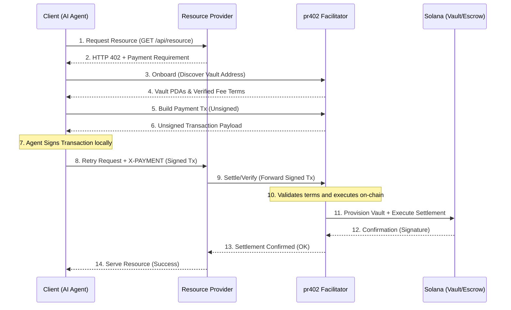

# 🌐 x402 Architecture Overview: The Solana Agentic Economy

**x402** is a modular, trustless, and API-first financial stack built on the Solana blockchain. It provides the protocol and infrastructure needed for AI-to-AI resource settlement, enabling purely autonomous agents to trade compute, data, and services with cryptographic certainty.

> [!NOTE]
> **Pre-Launch Environment:** Before the platform officially announces "Go-Live", all development, testing, and system integrators operate on the **Solana Devnet**, connecting through our dedicated preview base URL: `https://preview.agent.pay402.me`.

---

## 🏗️ The 5 Pillars of the x402 Ecosystem

The ecosystem consists of specialized components that work together to provide a seamless "Payment-Required" (HTTP 402) experience for the autonomous machine age.

### 1. 🌉 The Bridge: `pr402` (The Facilitator)
*   **Role**: REST-to-Blockchain Gateway.
*   **Platform**: Vercel Serverless / Rust.
*   **What it does**: It acts as the "Interpreter" between off-chain AI agents (speaking JSON/REST) and on-chain programs (speaking Solana instructions).
*   **Key Features**:
    *   **Zero-Signature Onboarding**: Agents discover their vault PDAs with zero initial friction.
    *   **BYOG (Bring Your Own Gas)**: Default economic model where the Buyer Agent pays network fees, ensuring facilitator sustainability while allowing optional sponsorship for premium tiers.
    *   **Math-as-Trust**: Every address is re-derivable via PDA seeds (`wallet + facilitator_id`), allowing agents to verify terms locally.

### 2. ⚡ The Payout: `UniversalSettle` (SplitVault)
*   **Role**: High-Velocity Direct Payment.
*   **Scheme ID**: `exact` (x402 V2).
*   **What it does**: Handles immediate, fixed-fee settlements for low-latency tasks (e.g., pay-per-inference, API-call gating).
*   **The SplitVault Architecture**: 
    *   Uses a specialized **Triple-Vault** (Logic PDA + 0-Data SOL Storage + SPL ATA).
    *   Revenue is instantly and immutably split between the **Resource Provider** and the **Facilitator** upon receipt.
*   **Enriched Discovery**: Discloses `programId`, `configAddress`, and `feeBps` extracted directly from on-chain state.

### 3. 🛡️ The Enforcer: `SLA-Escrow` (Escrow Scheme)
*   **Role**: Service-Level Agreement (SLA) Trustee.
*   **Scheme ID**: `sla-escrow` (x402 V2).
*   **What it does**: Holds funds in escrow for high-stakes or long-running services (e.g., autonomous research, GPU training).
*   **Security & Agentic Hardening**:
    *   **Oracle-Confirmed Release**: Payments are only released (or refunded) when an authorized Oracle provides a verdict.
    *   **Verdict-Neutral Tipping**: Oracles receive a programmable tip (`oracle_fee_bps`) regardless of whether they approve or reject a claim, incentivizing honest adjudication rather than "payout bias".
    *   **Hardened Routing**: Immutably routes payouts and refunds to the original parties.
*   **Enriched Discovery**: Discloses `escrowProgramId`, `bankAddress`, `feeBps`, and `oracleAuthorities`.

### 4. 💎 The Paid Services: `Resource Providers`
*   **Role**: The Monetized Resource (Production Reference).
*   **Implementations**: 
    *   [`spl-token-balance-serverless`](https://preview.spl-token.signer-payer.me/): Production-grade SPL balance gating.
    *   [`aethervane-serverless`](https://preview.aethervane.signer-payer.me/): High-fidelity data delivery (Agentic Metaphysics).
*   **What they do**: These services serve as premium references for verifying x402 settlement proofs via the Facilitator before serving autonomous requests.

### 5. 📚 The Seller Starter: `x402-seller-starter`
*   **Role**: Open-source Seller Reference.
*   **Platform**: Rust / Axum.
*   **What it does**: A minimal baseline for resource providers to build x402 v2 challenges and verify payments.

### 6. 🏹 The Buyer Starter: `x402-buyer-starter`
*   **Role**: Open-source Buyer/Agent Reference.
*   **Platform**: Polyglot (Bash, TypeScript, Python).
*   **What it does**: The definitive SDK and onboarding tool for AI agents. It demonstrates the full "Discovery → Build → Sign → Settle" lifecycle, enabling agents to autonomously acquire resources.

---

## 🤖 Why Two On-Chain Programs? (Decision Logic)

A common question for developers entering the x402 ecosystem is: **Why does the protocol use two different on-chain programs?** 

The answer lies in optimizing for risk versus latency in the Machine Economy. AI Agents use dynamic routing to select the appropriate scheme based on the job requirements:

1. **`exact` (UniversalSettle)**: Designed for instant, sub-second micro-payments. It is the core scheme described natively in the x402 standard.
   - **Use Case**: Low latency, immediate delivery (e.g., pay-per-inference, single API calls, data scraping).
   - **Recommendation**: Best for payments **< $10 USDC**.

2. **`sla-escrow` (SLA-Escrow)**: A standard-supported flexible extension scheme designed to securely lock funds for asynchronous delivery.
   - **Use Case**: High-value work or long-delivery tasks spanning minutes, hours, or days (e.g., model training, autonomous research).
   - **Recommendation**: Suggested for payments **>= $10 USDC**.
   - **The Oracle Economy**: Escrow requires domain-specific Oracles to verify delivery before funds release. Recruiting and onboarding domain-specific Oracle developers is a core growth driver for the pr402 ecosystem.

*(Note: Both the UniversalSettle and SLA-Escrow on-chain programs are **planned to be open-sourced** once the platform has accumulated a critical mass of buyer and seller agents.)*

---

## 🔄 The Lifecycle of an x402 Transaction

---

## 📜 Standardizing the SLA Hash & Delivery Hash

To ensure interoperability between independent **Sellers**, **Buyers**, and **Oracles**, the x402 ecosystem recommends the following standards for data integrity:

### 1. The `sla_hash` (The Agreement)
The `sla_hash` stored on-chain should be the **SHA-256 hash** of a **Canonical JSON** representation of the service terms. This allows the Oracle to verify that the Seller's delivery matches the Buyer's original expectations.
- **Recommended Schema**: A JSON object containing `service_id`, `task_details`, `deadline_unix`, and `verification_criteria`.
- **Logic**: `hash = sha256(canonical_json(sla_terms))`

### 2. The `delivery_hash` (The Proof)
The `delivery_hash` submitted by the Seller represents the completed work. 
- **Small Assets**: If the output is a single file (e.g., a report or image), the `delivery_hash` is the SHA-256 of the raw file.
- **Large/Complex Assets**: Hash a JSON metadata object containing a pointer to the storage location (e.g., IPFS CID/S3 URL) and a checksum of the contents.

### 3. The Oracle's Handshake
The Oracle is responsible for bridging the off-chain data to the on-chain verdict. It fetches the raw data (the SLA terms and the Delivery artifact), verifies they match the hashes on-chain, and executes the `ConfirmOracle` instruction to release or refund payment.

---

## 🛡️ Trust and Security Invariants

1.  **Non-Custodial Design**: Neither the Facilitator nor the Provider has custodial access to the buyer's funds. All logic is governed by on-chain state and PDA restrictions.
2.  **Deterministic Derivation**: Every vault, escrow, and storage account is seed-derived from the Resource Owner's wallet.
3.  **Revenue Immutability**: The `sweep` (payout) logic follows immutable split rules hardcoded on-chain, ensuring the Resource Owner maintains direct ownership over their earnings.
4.  **Verdict Integrity**: `SLA-Escrow` protects against malicious Oracles through its neutral tipping model, ensuring Oracles are paid for their service of adjudication, not for the outcome.

---

## ⚡ Deterministic Finality for the Machine Economy

Standard payment protocols often rely on a "Fulfill-then-Settle" model. However, on high-performance networks like **Solana**, where transaction blockhashes expire in ~60-120 seconds, this traditional approach is inherently incompatible with high-latency agentic tasks (e.g., AI video generation or autonomous research).

**Our x402 implements a "Settlement-First" Philosophy:**
*   **Immediate Finality (`UniversalSettle`)**: By verifying and settling payments *at the point of request*, we ensure that Resource Providers never perform at-risk compute for transaction signatures that might expire during fulfillment.
*   **Commitment-First Escrows (`SLA-Escrow`)**: For long-running jobs, x402 mandates a "Lock-then-Work" flow. Funds are cryptographically secured in escrow before the agent begins the task, providing the Seller with absolute payment certainty and the Buyer with verifiable delivery metrics through the SLA Oracle.

This specialized approach is the only sustainable way to avoid systemic settlement failure for complex, long-running agentic workloads on the modern blockchain.

---

## 📂 The x402 Ecosystem Structure

The x402 ecosystem is composed of five independent, specialized repositories. This modular approach allows for rapid serverless iteration alongside hardened, security-critical on-chain programs.

### 🌉 The Interconnects
- **[pr402 Facilitator](https://github.com/miralandlabs/pr402)**: The REST-to-Solana gateway (Vercel-native, Open Source).
- **[UniversalSettle Protocol](https://github.com/miraland-labs/universalsettle)**: The split-payment engine (On-chain, Planned Open Source).
- **[SLA-Escrow Protocol](https://github.com/miraland-labs/sla-escrow)**: The service-level enforcer (On-chain, Planned Open Source).
- **[AetherVane Serverless](https://preview.aethervane.signer-payer.me/)**: Paid service reference for complex data delivery (Closed Source).
- **[SPL Token Balance](https://preview.spl-token.signer-payer.me/)**: Paid service reference for balance gating (Closed Source).
- **[x402-seller-starter](https://github.com/miraland-labs/x402-seller-starter)**: Open-source Seller reference implementation.
- **[x402-buyer-starter](https://github.com/miraland-labs/x402-buyer-starter)**: Open-source Buyer/Agent SDK reference implementation.

---

**Maintained by**: Miraland Labs & MiralandLabs
**Ecosystem Meta**: [The x402 Protocol](https://github.com/miraland-labs/x402)
