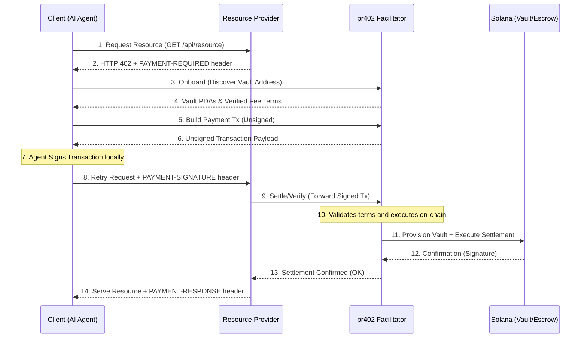

# 🌐 x402 Architecture Overview: The Solana Agentic Economy

**x402** is a modular, trustless, API-first financial stack built on the Solana blockchain. It provides the protocol and infrastructure needed for AI-to-AI resource settlement, enabling autonomous agents to trade compute, data, and services with cryptographic certainty.

> **Deployment status.** The **pr402 facilitator** and both on-chain programs (`universalsettle`, `sla-escrow`) are deployed on **Solana Mainnet** and **Solana Devnet**.
>
> **Recommended host:** `https://ipay.sh` (Mainnet) / `https://preview.ipay.sh` (Devnet).
> **Also served — same service, not deprecated:** `https://agent.pay402.me` / `https://preview.agent.pay402.me`.
>
> Confirm **`solanaNetwork`** with **`GET /api/v1/facilitator/health`** on the host you call. General availability of the `sla-escrow` scheme for sellers/buyers depends on a production-advertised default oracle — see [§ 5](#5--the-oracle-family-oracle-common--three-sibling-oracles).

---

## 🏗️ The Pillars of the x402 Ecosystem

The ecosystem consists of specialized components that work together to provide a seamless "Payment Required" (HTTP 402) experience for the autonomous machine age.

### 1. 🌉 The Bridge: `pr402` (The Facilitator)

- **Role**: REST-to-Blockchain Gateway.
- **Platform**: Vercel Serverless / Rust.
- **What it does**: It acts as the "Interpreter" between off-chain AI agents (speaking JSON/REST) and on-chain programs (speaking Solana instructions).
- **Key Features**:
  - **Zero-Signature Onboarding**: Agents discover their vault PDAs with zero initial friction.
  - **BYOG (Bring Your Own Gas)**: Default economic model where the Buyer Agent pays network fees, ensuring facilitator sustainability while allowing optional sponsorship for premium tiers.
  - **Math-as-Trust**: Every address is re-derivable via PDA seeds (`wallet + facilitator_id`), allowing agents to verify terms locally.
  - **Buyer-side tx assembly**: `/build-exact-payment-tx` and `/build-sla-escrow-payment-tx` return a ready-to-sign `VersionedTransaction` + pre-filled `verifyBodyTemplate`. Buyers sign once and settle; compute-budget policy, token-program branches, and vault PDAs are encoded by the facilitator, so buyer code stays forward-compatible across policy changes.
  - **Scheme normalization**: HTTP `402 accepts[]` may use `v2:solana:exact` / `v2:solana:sla-escrow`; the returned **`verifyBodyTemplate`** and **`/verify`/`/settle`** use x402 wire **`exact`** / **`sla-escrow`** (`openapi.json`, **`/agent-integration.md`**).
- **Agent reference**: **`GET /capabilities`** on the deployed facilitator → **`agentManifest.payToSemantics`** (JSON).

### 2. ⚡ The Payout: `UniversalSettle` (SplitVault)

- **Role**: High-Velocity Direct Payment.
- **Scheme ID**: `exact` (x402 v2).
- **What it does**: Handles immediate, fixed-fee settlements for low-latency tasks (e.g., pay-per-inference, API-call gating).
- **SplitVault architecture**:
  - Uses a specialized **Triple-Vault** (Logic PDA + 0-Data SOL Storage + SPL ATA).
  - Revenue is instantly and immutably split between the **Resource Provider** and the **Facilitator** upon receipt.
- **Enriched discovery**: Discloses `programId`, `configAddress`, and `feeBps` extracted directly from on-chain state.

### 3. 🛡️ The Enforcer: `SLA-Escrow` (Escrow Scheme)

- **Role**: Service-Level Agreement (SLA) Trustee.
- **Scheme ID**: `sla-escrow` (x402 v2 extension).
- **What it does**: Holds funds in escrow for high-stakes or long-running services (e.g., autonomous research, GPU training).
- **Security & agentic hardening**:
  - **Oracle-confirmed release**: Payments are only released (or refunded) when the authorized Oracle provides a verdict *after* delivery has been submitted on-chain (`delivery_timestamp > 0`).
  - **Verdict-neutral tipping**: Oracles receive a programmable tip (`oracle_fee_bps`) regardless of whether they approve or reject, incentivizing honest adjudication rather than "payout bias". The tip is actually transferred on-chain during release/refund.
  - **Hardened routing**: Immutably routes payouts and refunds to the parties recorded on `Payment` at funding time.
  - **Refund safety**: Buyers cannot refund after the seller submits delivery unless the oracle explicitly rejects it; the on-chain program encodes this as `CannotRefundDeliveredPayment`.
- **Enriched discovery**: Discloses `escrowProgramId`, `bankAddress`, `feeBps`, and `oracleAuthorities`.

### 4. 💎 The Paid Services: Reference Resource Providers

- **Role**: Production reference sellers operated by Miraland Labs (closed source; treat them as third-party-style ecosystem proof-points that bootstrap supply).
- **Implementations**:
  - **[spl-token balance verification](https://spl-token.signer-payer.me/)** — production-grade SPL balance gating over x402.
  - **[AetherVane](https://aethervane.hashspace.me/)** — multi-engine machine-consumable metaphysical readings; optional LLM interpretation; Postgres-backed quotas.
- **What they do**: Demonstrate premium APIs that verify x402 settlement proofs via the facilitator before serving requests.

### 5. ⚖️ The Oracle Family: `oracle-common` + Three Sibling Oracles

- **Role**: Reference oracle implementations for the `sla-escrow` rail, organized as a single Cargo workspace (`oracles/`) with one shared library and three independently-deployable binaries — one per delivery category.
- **Platform**: Rust / Axum / Tokio / Postgres (standalone services, designed for Ubuntu 24.04 + systemd).
- **Repository**: standalone repo at [`miraland-labs/oracles`](https://github.com/miraland-labs/oracles) — Open Source. Sits beside this hub locally; clone it next to `x402/` for in-tree development. Replaces the earlier single-binary deployment.
- **Architecture**: an off-chain `profile_id`-dispatched system. The on-chain `sla-escrow` program stays minimal and category-agnostic; complexity (delivery taxonomy, evidence shapes, evaluator logic) lives in the off-chain oracles. Each binary registers exactly one profile and serves one family.

| Crate                       | Profile                                  | Delivery shape                                                       | Default port |
| --------------------------- | ---------------------------------------- | -------------------------------------------------------------------- | ------------ |
| `oracle-common`             | _(library; no profile)_                  | Chain monitor, registry, ledger, settler, profile registry shared by all binaries | _(library)_  |
| `oracle-api-quality`        | `x402/oracles/api-quality/v1`                    | JSON response — status code, latency, schema, required-fields, body length | 4020         |
| `oracle-onchain-transfer`   | `x402/oracles/onchain-transfer/v1`               | On-chain SPL transfer / swap re-derived from `getTransaction(jsonParsed)` | 4021         |
| `oracle-file-delivery`      | `x402/oracles/file-delivery/attestation/v1`      | Streaming SHA-256 + MIME sniff over a registry-hosted blob (MinIO / S3-compatible) | 4022         |

- **Why three siblings**: a malformed evaluator in one family cannot regress another binary; each runs with its own oracle keypair and Postgres database (per-family blast-radius isolation); each can be upgraded independently. Buyers pick the right oracle by reading the seller's `accepts[].extra.oracleProfiles[]` advertisement at HTTP-402 time; pr402 enforces that the buyer-chosen `oracle_authority` matches the seller's advertised authority for the chosen profile (the [`oracle-common/docs/PR402_CONTRACT.md`](oracles/oracle-common/docs/PR402_CONTRACT.md) document is the normative spec for this discovery contract).
- **Sellers integrating with the oracles**: start at [`oracles/docs/SELLER_GUIDE.md`](oracles/docs/SELLER_GUIDE.md) — three copy-paste recipes plus a one-line seller-register helper. **Buyers** funding an SLA-escrow payment: [`oracles/docs/BUYER_GUIDE.md`](oracles/docs/BUYER_GUIDE.md). Operators deploying their own oracle: [`oracles/docs/DEPLOYMENT.md`](oracles/docs/DEPLOYMENT.md) and [`oracles/docs/OPERATIONS.md`](oracles/docs/OPERATIONS.md).
- **Resolution-reason codes**: standard codes 0..=255 are reserved for cross-family use; per-family `Custom(N)` codes live in disjoint ranges — `[256..=319]` for onchain-transfer, `[320..=383]` for file-delivery. `oracle-common::resolution_codes` is the canonical registry.
- **Operational story**: `oracles/scripts/install.sh <family> <binary-url> <env-file>` deploys any of the three binaries on Ubuntu 24.04 via the templated `oracle@.service` unit; `oracle.target` aggregates the three for single-command start/stop. `oracles/scripts/bootstrap-minio.sh` provisions the recommended self-hosted blob backend.

### 6. 📚 The Seller Starter: `x402-seller-starter`

- **Role**: Open-source seller reference.
- **Platform**: Rust / Axum.
- **What it does**: A minimal baseline for resource providers to build x402 v2 challenges and verify payments.

### 7. 🏹 The Buyer Starter: `x402-buyer-starter`

- **Role**: Open-source buyer/agent reference.
- **Platform**: Polyglot (Bash, TypeScript, Python).
- **What it does**: The definitive SDK and onboarding tool for AI agents. Demonstrates the full "Discovery → Build → Sign → Settle" lifecycle.
- **Installable packages**: `@pr402/client` (npm) and `pr402-client` (crates.io); both ship a `pr402-buy` CLI.

---

## 🤖 Why Two On-Chain Programs? (Decision Logic)

A common question for developers entering the x402 ecosystem is: **Why does the protocol use two different on-chain programs?**

The answer is about optimizing for risk versus latency in the machine economy. AI agents use dynamic routing to select the appropriate scheme based on job requirements:

1. **`exact` (UniversalSettle)** — Instant, sub-second micro-payments; the core scheme described natively in the x402 standard.
   - Use case: low latency, immediate delivery (pay-per-inference, single API calls, data scraping).
   - Recommendation: best for payments **< $10 USDC**.
2. **`sla-escrow` (SLA-Escrow)** — Flexible standard-supported extension scheme for asynchronous delivery.
   - Use case: high-value or long-delivery tasks spanning minutes, hours, or days (model training, autonomous research).
   - Recommendation: suggested for payments **>= $10 USDC**.
   - **Oracle economy**: Escrow requires domain-specific oracles to verify delivery before funds release. The open-source [`oracles/`](oracles/) workspace ships three reference oracles — `oracle-api-quality`, `oracle-onchain-transfer`, `oracle-file-delivery` — built on a shared `oracle-common` library. Each registers a single canonical profile, lowering the barrier for domain-specific oracle developers (clone the closest sibling, swap evaluator logic, deploy).

*(Both on-chain programs are **Planned Open Source**.)*

---

## 🔄 The Lifecycle of an x402 Transaction

---

## 📜 Standardizing the SLA Hash & Delivery Hash

To ensure interoperability between independent **sellers**, **buyers**, and **oracles**, the x402 ecosystem recommends the following standards for data integrity:

### 1. The `sla_hash` (The Agreement)

`sla_hash` stored on-chain is the **SHA-256** hash of the **exact UTF-8 octets** of the SLA JSON the registry serves. This lets the oracle verify that the seller's delivery matches the buyer's original expectations without serializer ambiguity.

- **Recommended schema**: a JSON object containing `service_id`, `task_details`, `deadline_unix`, and `verification_criteria`.
- **Reference profile (HTTP / JSON API quality)**: the [`oracles/oracle-api-quality`](oracles/oracle-api-quality/) crate publishes profile **`x402/oracles/api-quality/v1`** under `spec/api-quality-v1/` — JSON Schemas, normative evaluation semantics, and examples aligned with the `oracle-api-quality` reference oracle.
- **Reference profile (on-chain transfer)**: [`oracles/oracle-onchain-transfer`](oracles/oracle-onchain-transfer/) publishes profile **`x402/oracles/onchain-transfer/v1`** for SPL token transfer / swap delivery flows.
- **Reference profile (large file delivery)**: [`oracles/oracle-file-delivery`](oracles/oracle-file-delivery/) publishes profile **`x402/oracles/file-delivery/attestation/v1`** for streaming SHA-256 + MIME-sniff attestation against any S3-compatible (MinIO / R2 / B2 / Wasabi) blob backend.

### 2. The `delivery_hash` (The Proof)

The `delivery_hash` submitted by the seller represents the completed work.

- **Small assets**: if the output is a single file (report, image), `delivery_hash = SHA256(raw_file_bytes)`.
- **Large / complex assets**: hash a JSON metadata object containing a pointer to the storage location (IPFS CID, S3 URL) plus a checksum of the contents.

### 3. The Oracle's Handshake

The oracle bridges off-chain evidence to the on-chain verdict. It fetches the raw bytes for the SLA terms and the delivery artifact, verifies they hash to the values committed on-chain, and executes `ConfirmOracle` with a deterministic `resolution_hash` that fingerprints the evaluation.

---

## 🛡️ Trust and Security Invariants

1. **Non-Custodial Design**: Neither the facilitator nor the provider has custodial access to the buyer's funds. All logic is governed by on-chain state and PDA restrictions.
2. **Deterministic Derivation**: Every vault, escrow, and storage account is seed-derived from the Resource Owner's wallet.
3. **Revenue Immutability**: The `sweep` (payout) logic follows immutable split rules hardcoded on-chain, ensuring the Resource Owner maintains direct ownership over their earnings.
4. **Verdict Integrity**: `SLA-Escrow` protects against malicious oracles through its neutral tipping model and by requiring `delivery_timestamp > 0` before any oracle confirmation is accepted.
5. **Refund Safety**: Once delivery has been submitted, buyers cannot unilaterally refund until an oracle explicitly rejects the work (or the payment expires).

---

## ⚡ Deterministic Finality for the Machine Economy

Standard payment protocols often rely on a "Fulfill-then-Settle" model. On high-performance networks like **Solana**, where transaction blockhashes expire in ~60-120 seconds, this traditional approach is inherently incompatible with high-latency agentic tasks (AI video generation, autonomous research).

**Our x402 implements a "Settlement-First" philosophy:**

- **Immediate finality (`UniversalSettle`)** — By verifying and settling payments *at the point of request*, resource providers never perform at-risk compute for transaction signatures that might expire during fulfillment.
- **Commitment-first escrows (`SLA-Escrow`)** — For long-running jobs, x402 mandates a "Lock-then-Work" flow. Funds are cryptographically secured in escrow before the agent begins the task, providing the seller with absolute payment certainty and the buyer with verifiable delivery metrics through the oracle.

---

## 📂 The x402 Ecosystem Structure

- **[pr402 Facilitator](https://github.com/miralandlabs/pr402)** — The REST-to-Solana gateway (Vercel-native, Open Source).
- **UniversalSettle Protocol** — The split-payment engine. Planned Open Source; deployed on Mainnet and Devnet.
- **SLA-Escrow Protocol** — The service-level enforcer. Planned Open Source; deployed on Mainnet and Devnet.
- **[oracles/](oracles/)** — Multi-category oracle workspace. Shared library (`oracle-common`) plus three sibling binaries (`oracle-api-quality`, `oracle-onchain-transfer`, `oracle-file-delivery`). Open Source.
- **[x402-seller-starter](https://github.com/miraland-labs/x402-seller-starter)** — Open-source seller reference.
- **[x402-buyer-starter](https://github.com/miraland-labs/x402-buyer-starter)** — Open-source buyer/agent SDK reference.
- **[SPL Token Balance](https://spl-token.signer-payer.me/)** — Reference paid service; SPL balance gating (closed source).
- **[AetherVane](https://aethervane.hashspace.me/)** — Reference paid service; multi-engine metaphysical readings (closed source).

---

**Maintained by**: Miraland Labs
**Ecosystem Meta**: [The x402 Protocol](https://github.com/miraland-labs/x402)
